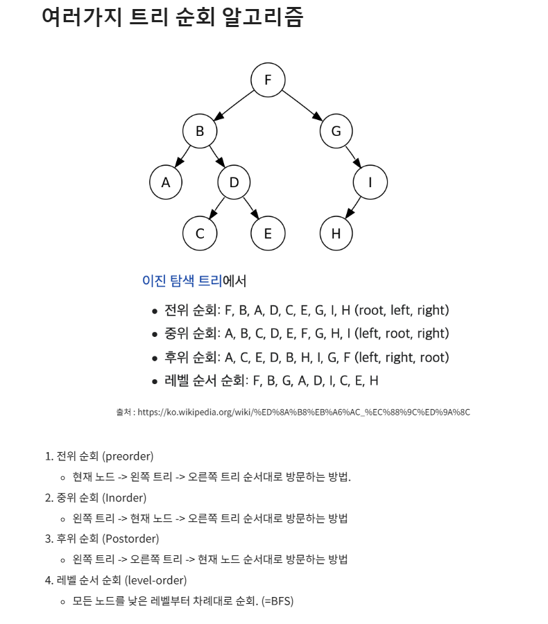

## DFS & BFS 

---------------------

<br />

### 그래프의 표현 방법

1. 인접 행렬 방식 
- 2차원 배열로 그래프의 연결관계를 표현

```python
INF = float('inf')

graph = [
    [0, 7, 5],
    [7, 0, INF],
    [5, INF, 0]
]
```

2. 인접 리스트 방식
- 리스트로 그래프의 연결관계를 표현하는 방식 
- Python 의 경우 Dictionary 혹은 collections에 있는 defaultdict를 사용
```python
graph = collections.defaultdict(list)
graph[0].append((i,j)) # 0 번 노드와 i 번 노드가 비용 혹은 거리 값이 j의 값으로 연결되어 있음.
```

=>  인접행렬로 풀면 시간제한 에러가 발생해 안풀리는 경우가 종종 있다.

### DFS

- 트리나 그래프에서 한 루트로 계속 탐색하다가 다시 돌아와 다른 루트로 탐색하는 방식
- 대표적으로 `백트래킹`에 사용 
- 일반적으로 재귀호출을 이용해 구현하나 단순 스택 배열로 구현하기도 함
- 구조상 스택 오버플로우를 조심해야한다는 특징이 있음 => 적당한 조건으로 재귀를 종료하거나 `Tail Recursion`을 이용
- 단순 검색 속도는 `BFS`에 비해 느리지만 검색이 아닌 순회를 할 경우에는 많이 사용함
- 특히 리프노드에만 데이터를 저장하는 정렬 트리 구조에서 항상 순서대로 데이터를 방문한다는 장점이 있음

<span align="center">



[트리순회 알고리즘 설명](출처 : https://butter-shower.tistory.com/223)

</span>

#### 동작 과정 

=> 스택 및 재귀로 직접 구현한것 추가하기 코드 


```python
def dfs(graph, v, visited):
    visited[v] = True
    for i in graph[v]:
        if not visited[i]:
            dfs(graph, i, visited)
```

[참고](https://butter-shower.tistory.com/223)