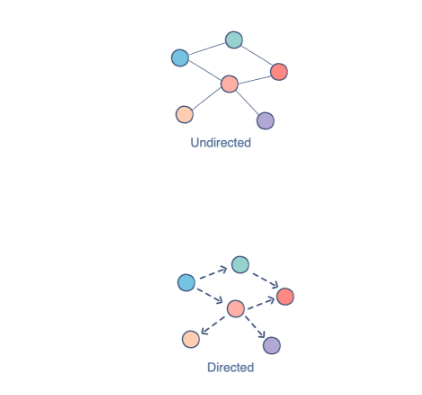

## Javascript 자료구조 및 메서드 정리

---

 

#### Array

[출처] : https://www.educative.io/blog/javascript-data-structures#questions]

 

#### Queue

[출처] : https://www.educative.io/blog/javascript-data-structures#questions]

 

#### Linked List

[출처] : https://www.educative.io/blog/javascript-data-structures#questions]

 

#### Tree

[출처] : https://www.educative.io/blog/javascript-data-structures#questions]

 

#### Graphs

[출처] : https://www.educative.io/blog/javascript-data-structures#questions]

 

#### Hashtable/map

[출처] : https://www.educative.io/blog/javascript-data-structures#questions]

 
