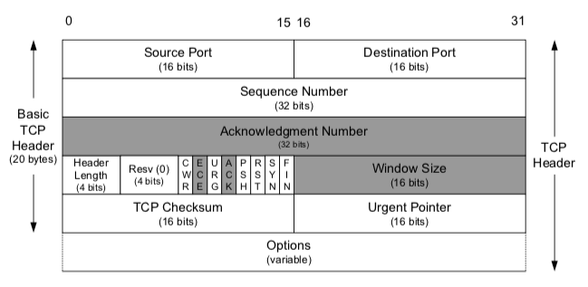

## TCP vs UDP 
---

<br />

### 전송 계층 (Transport Layer)
- `TCP`와 `UDP`는 TCP/IP의 `전송계층`에서 사용되는 프로토콜이다. 
- <strong>전송 계층은 IP에 의해 전달되는 패킷의 오류를 검사하고 재전송 요구 등의 제어를 담당</strong>하는 계층이다.
---
### TCP vs UDP
- `TCP` : Transmission Control Protocol의 약자
- `UDP` : User Datagram Protocol 의 약자
- 두 프로토콜은 모두 패킷을 한 컴퓨터에서 다른 컴퓨터로 전달해주는 `IP 프로토콜` 을 기반으로 구현되어 있지만 서로 다른 특징을 가진다.

---

### 그림으로 비교하는 TCP vs UDP

#### TCP 데이터 송수신 과정
<span align='center'>


[출처] : https://velog.io/@hidaehyunlee/TCP-%EC%99%80-UDP-%EC%9D%98-%EC%B0%A8%EC%9D%B4

</span>

<br />

- TCP는 상대방으로 부터의 수신 여부를 확인하는 반면 UDP는 일방적이다.

#### UDP 데이터 송수신 과정

<br />

<span align='center'>


[출처] : https://velog.io/@hidaehyunlee/TCP-%EC%99%80-UDP-%EC%9D%98-%EC%B0%A8%EC%9D%B4

</span>

- 즉, 신뢰성이 요구되는 애플리케이션에서는 `TCP`를 사용하고 간단한 데이터를 빠른 속도로 전송하고자 하는 애플리케이션에서는 `UDP`를 사용한다.

<br />

### 표로 비교하는 TCP vs UDP

|TCP|UDP|
|---|---|
|Connection-Oriented Protocol <br /> 연결지향형 프로토콜|Connection-less Protocol <br /> 비연결지향형 프로토콜|
|Connection by byte stream <br /> 바이트 스트림을 통한 연결| Connection by message stream <br /> 메세지 스트림을 통한 연결|
|Congestion / Flow Control <br /> 혼잡제어, 흐름제어|No Congestion / Flow Control <br /> 혼잡제어와 흐름제어 지원 X|
|Ordered, Lower Speed <br /> 순서 보장, 상대적으로 느림|Not Ordered, Higher Speed <br /> 순서 보장되지 않음, 상대적으로 빠름|
|Reliable data transmission <br /> 신뢰성있는 데이터 전송 - 안정적|Unreliable data transmission <br /> 데이터 전송 보장 X|
|TCP packet : Segment <br /> 세그먼트 TCP 패킷|UDP packet : Datagram <br /> 데이터그램 UDP 패킷|
|HTTP, Email, File Transfer <br /> 에서 사용|DNS, BroadCasting <br /> 도메인, 실시간 동영상 서비스에서 사용|

### TCP (Transmission Control Protocol)
- `TCP`는 네트워크 계층 중 전송 계층에서 사용하는 프로토콜로서, 장치들 사이에 논리적인 접속을 성립하기 위하여 연결을 설정하여 신뢰성을 보장하는 연결형 서비스이다. 
- TCP는 네트워크에 연결된 컴퓨터에서 실행되는 프로그램 간에 일련의 옥텟(데이터,메시지,세그먼트라는 블록단위)를 `안정적`으로, `순서대로`, `에러없이` 교환 할 수 있게한다.
  
#### TCP의 특징
- 연결형 서비스 
  - 연결형 서비스로 가상 회선 방식을 제공한다.
  - 3-way handshaking 과정을 통한 연결을 설정
  - 4-way handshaking 과정을 통해 연결을 해제

- 흐름제어(Flow Control)
  - 데이터 처리 속도를 조절하여 수신자의 버퍼 오버플로우를 방지
  - 송신하는 곳에서 감당이 안되게 많은 데이터를 빠르게 보내 수신하는 곳에서 분제가 일어나는 것을 막는다. 
  - 수신자가 `윈도우 크기(window size)`값을 통해 수신량을 정할 수 있다.

- 혼잡제어(Congestion Control)
  - 네트워크 내의 패킷 수가 넘치게 증가하지 않도록 방지한다.
  - 정보의 소통량이 과다하면 패킷을 조금만 전송하여 혼잡 붕괴 현상이 일어나는 것을 막는다.

- 신뢰성이 높은 전송(Reliable transmission)
  - Dupack-based retransmission
    - 정상적인 상황에서는 ACK 값이 연속적으로 전송되어야 한다.
    - 그러나 ACK값이 중복으로 올 경우 패킷 이상을 감지하고 패킷을 재전송한다.
  - Timeout-based retransmission
    - 일정 시간동안 ACK값이 수신을 못할 경우 패킷을 재전송한다.

- 전이중, 점재점 방식
  - 전이중(Full-Duplex)
    - 전송이 양방향으로 동시에 일어날 수 있다.
  - 점재점(Point to Point)
    - 각 연결이 정확히 2개의 종단점을 가지고 있다.

#### TCP Header 정보


<span align='center'>


[출처] : https://velog.io/@hidaehyunlee/TCP-%EC%99%80-UDP-%EC%9D%98-%EC%B0%A8%EC%9D%B4

</span>

- 응용 계층으로부터 데이터를 받은 TCP는 `헤더`를 추가한 후 IP로 보낸다. 

#### TCP 헤더 정보

|필드|내용|크기|
|---|---|---|
|송수신자의 포트 번호|TCP로 연결되는 가상 회선 양단의 송수신 프로세스에 할당되는 포트 주소|16|
|시퀀스 번호(Sequence Number)|송신자가 지정하는 순서 번호, 전송되는 바이트 수를 기준으로 증가. <br /> SYN = 1: 초기 시퀀스 번호가 된다. ACK 번호는 이값에 1을 더한 값 <br /> SYN = 0 : 현재 세션의 이 세그먼트 데이터의 최초 바이트 값의 누적 시퀀스 번호|32|
|응답 번호(ACK Number)|수신 프로세스가 제대로 수신한 바이트의 수를 응답하기 위해 사용|32|
|데이터 오프센(Data Offset)|TCP 세그먼트의 시작 위치를 기준으로 데이터의 시작 위치를 표현(TCP헤더의 크기)|4|
|예약 필드(Reserved)|사용을 하지 않지만 나중을 위한 예약 필드이며, 0으로 채워져야한다.|6|
|제어 비트(Flag Bit)|SYN, ACK, FIN 등의 제어번호 => 아래 추가 설명 참조|6|
|윈도우 크기(Window)|수신 윈도우의 버퍼 크기를 지정할 떄 사용. 0이면 송신 프로세스의 전송 중지|16|
|체크섬(Checksum)|TCP 세그먼트에 포함되는 프로토콜 헤더와 데이터에 대한 오류 검출 용도|16|
|긴급 위치(Urgent Pointer)|긴급 데이터를 처리하기 위함, URG 플래그 비트가 지정된 경우에만 유효|16|

#### 제어비트(Flag Bit) 정보
|종류|내용|
|---|---|
|URG|긴급 위치 필드가 유효한지 설정|
|ACK|응답 번호 필드가 유효한지 설정, 클라이언트가 보낸 최초의 SYN 패킷 이후에 전송되는 모든 패킷은 이 플래그가 설정되어야 한다. 자세한 내용은 아래 추가 설명 참조|
|PSH|수신 애플리케이션에 버퍼링된 데이터를 상위 계층에 즉시 전달할 때|
|RST|연결의 리셋이나, 유효하지 않은 세그먼트에 대한 응답용|
|SYN|연결 설정 요구. 동기화 시퀀스 번호. 양쪽이 보낸 최초의 패킷에만 이 플래그가 설정되어 있어야 한다. |
|FIN|더 이상 전송할 데이터가 없을 때 연결 종료 의사 표시|

#### ACK 제어 비트
- ACK는 송신측에 대하여 수신측에서 긍정 응답으로 보내지는 전송 제어용 캐릭터..(?)
- ACK 번호를 사용하여 패킷이 도착했는지 확인한다.
  - 송신한 패킷이 제대로 도착하지 않으면 이전과 같은 ACK Number를 보냄으로써 재송신을 요구한다.


<span align='center'>


[출처] : https://velog.io/@hidaehyunlee/TCP-%EC%99%80-UDP-%EC%9D%98-%EC%B0%A8%EC%9D%B4

</span>

#### TCP의 연결 및 해제 과정


<span align='center'>


[출처] : https://velog.io/@hidaehyunlee/TCP-%EC%99%80-UDP-%EC%9D%98-%EC%B0%A8%EC%9D%B4

</span>

<br />

- TCP Connection (3-way handshaking)
  - 먼저 `open()`을 실행한 클라이언트가 `SYN`을 보내고 `SYN_SENT` 상태로 대기한다.
  - 서버는 `SYN_RCVD` 상태로 바꾸고 `SYN` 과 응답 ACK를 보낸다.
  - `SYN`과 응답 `ACK`를 받은 클라이언트는 `ESTABLISHED` 상태로 변경하고 서버에게 응답 `ACK`를 보낸다.
  - 응답 `ACK`를 받은 서버는 `ESTABLISHED` 상태로 변경한다.

<br />

- TCP Disconnection (4-way handshaking)
  - 먼저 `close()`를 실행한 클라이언트가 `FIN`을 보내고 `FIN_WAIT1` 상태로 대기한다.
  - 서버는 `CLOSE_WAIT` 으로 상태를 바꾸고 응답 `ACK`를 전달한다. 동시에 해당 포트에 연결되어있는 어플리케이션에 `close()`를 요청한다.
  - `ACK`를 받은 클라이언트는 상태를 `FIN_WAIT2` 로 변경한다.
  - `close()` 요청을 받은 서버 어플리케이션은 종료 프로세스를 진행하고 `FIN`을 클라이언트에 보내 `LAST_ACK` 상태로 바꾼다.
  - `FIN`을 받은 클라이언트는 `ACK`를 서버에 다시 전송하고, `TIME_WAIT`으로 상태를 바꾼다.
  - 클라이언트는 `TIME_WAIT`에서 일정 시간이 지나면 `CLOSED` 된다. `ACK`를 받은 서버도 포트를 `CLOSED`로 닫는다.(즉 서버 어플리케이션이 종료됨을 기다리는 과정이라 할수도 있겠음)

```js
주의 사항

- 반드시 서버만 CLOSE_WAIT 상태를 가지는 것은 아니다.
- 서버가 먼저 종료하겠다고 FIN을 보낼 수 있고, 이런 경우 서버가 FIN_WAIT1상태가 된다.
- 누가 먼저 FIN 요청을 보내느냐에 따라 상태가 달라질 수 있는 것이다.(Cliner-Server Model)
```
- Client-Server Model에서는 먼저 요청을 보내는 쪽이 Client, 요청을 받는 쪽이 Server 라는 김상하 교수님의 가르침을 기억하자

#### UDP 헤더 정보

- 응용 계층으로부터 데이터를 받는 UDP 도 UDP 헤더를 추가한 후에 이를 IP 계층으로 보낸다.

|필드|내용|크기|
|---|---|---|
|송신자의 포트 번호|데이터를 보내는 애플리케이션의 포트번호|16|
|수신자의 포트 번호|데이터를 받을 애플리케이션의 포트번호|16|
|데이터의 길이|UDP헤더와 데이터의 총 길이|16|
|체크섬(Checksum)|데이터 오류 검사에 사용|16|

### 정리

#### TCP, UDP 공통점
- 포트번호를 이용하여 주소를 지정
- 데이터 오류 검사를 위한 체크섬(Checksum) 존재

#### TCP vs UDP 차이점
|TCP|UDP|
|---|---|
|연결이 성공해야 통신 가능(연결형 프로토콜)|비연결형 프로토콜(연결없이 통신이 가능)|
|데이터의 경계를 구분하지 않음(Byte-Stream Service)|데이터의 경계를 구분함(Datagram Service)|
|신뢰성 있는 데이터 전송(데이터의 재전송 존재)|비신뢰성 있는 데이터 전송(데이터의 재전송 없음)|
|일대일 통신(Unicast)|일대일(Unicast), 일대다(Broadcast), 다대다(Multicast) 통신|


<br /><br />

[참고] : https://velog.io/@hidaehyunlee/TCP-%EC%99%80-UDP-%EC%9D%98-%EC%B0%A8%EC%9D%B4

---