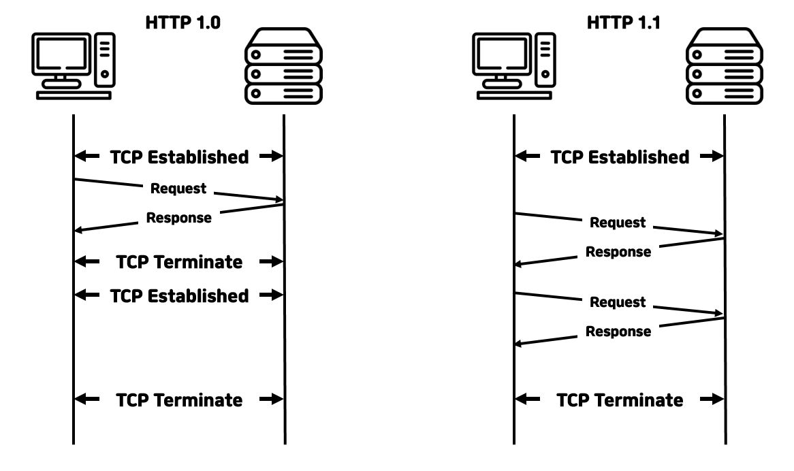
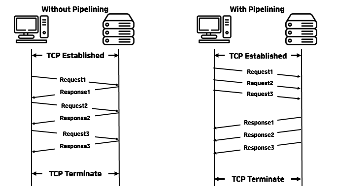
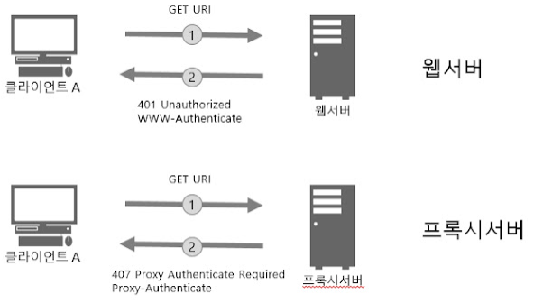

## HTTP란 무엇인가
---
### 내용 출처
 

본 글은 

- https://www.cloudflare.com/en-gb/learning/ddos/glossary/hypertext-transfer-protocol-http/
- https://developer.mozilla.org/en-US/docs/Web/HTTP/Overview
- https://kamranahmed.info/blog/2016/08/13/http-in-depth/
- https://www.smashingmagazine.com/2021/08/http3-core-concepts-part1/

페이지의 내용을 번역 및 정리한 글입니다.

---

### HTTP란?

- `Hypertext Transfer Protocol(이하 HTTP)`는 `World Wide Web(이하 WWW)`의 기초이며 하이퍼텍스트 링크를 사용하여 웹페이지를 로드하는데 사용된다.
- `HTTP`는 네트워크 장치간에 정보를 전송하도록 설계된 `응용 프로그램 계층` 프로토콜이며 네트워크 프로토콜 스택의 다른 계층위에서 실행된다. 
- `HTTP`를 통한 일반적인 흐름은 클라이언트 시스템이 서버에 요청한 다음 응답 메시지를 보내는 것을 포함한다.

---

### HTTP 요청에는 무엇이 있는가?
- `HTTP` 요청은 웹 브라우저와 같은 인터넷 통신 플랫폼이 웹사이트를 로드하는데 필요한 정보를 요청하는 방식이다.
- 인터넷을 통해 이루어진 각 HTTP 요청에는 다양한 유형의 정보를 전달하는 일련의 인코딩된 데이터가 포함된다. 
- 일반적인 HTTP 요청에는 다음이 포함된다.
    1. HTTP 버전 유형
    2. URL
    3. HTTP 메소드
    4. HTTP 요청 헤더
    5. 선택적 HTTP 본문
---

### HTTP 메소드란?
- HTTP 동사라고도 하는 HTTP 메서드는 HTTP 요청이 쿼리된 서버에서 예상하는 작업을 나타낸다. 
- 예를들어, 가장 일반적인 두가지 HTTP 메소드는 `GET` 과 `POST`이다. 
- `GET` 요청은 일반적으로 웹사이트의 형태로 정보가 반환될 것으로 예상하는 반면, `POST` 요청은 일반적으로 클라이언트가 웹서버에 정보를 제출하고 있음을 나타낸다. 

--- 
### HTTP 요청헤더란? 
- HTTP 헤더에는 Key-Value 형태로 저장된 텍스트 정보가 포함되어 있으며 모든 HTTP 요청(및 응답)에 포함된다. 
- 이러한 헤더는 클라이언트가 어떤 브라우저를 사용하고 있으며 어떤 데이터가 요청되고 있는지와 같은 핵심 정보를 전달한다.

- 아래 그림은 'Chrome' 브라우저의 네트워크 탭에서 HTTP 요청 헤더 예시를 확인한 그림이다.

[출처] : https://www.cloudflare.com/en-gb/learning/ddos/glossary/hypertext-transfer-protocol-http/

#### HTTP 요청 본문에는 무엇이 있을까?

- 요청 본문은 요청이 전송하는 정보의 '본문' 을 포함하는 부분이다. 
- HTTP 요청의 본문에는 사용자 이름 및 암호 또는 양식에 입력된 기타 데이터와 같이 웹 서버에 제출되는 모든 정보가 포함된다.

--- 
### HTTP 응답에는 무엇이 있을까?
- HTTP 응답은 웹 클라이언트(종종 브라우저)가 HTTP 요청에 대한 응답으로 인터넷 서버에서 받는 것이다. 
- 이러한 응답은 HTTP 요청에서 요청된 내용을 기반으로 중요한 정보를 전달하는데 아래의 내용을 포함한다.
    1. HTTP 상태 코드
    2. HTTP 응답 헤더
    3. 선택적 HTTP 본문

 

#### HTTP 상태 코드란?
- HTTP 상태 코드는 HTTP 요청이 성공적으로 완료되었는지 여부를 나타내는데 가장 자주 사용되는 3자리 코드이다. 
- 상태코드는 다음과 같이 5분류로 나뉜다.
    1. 1xx => 정보
    2. 2xx => 성공
    3. 3xx => 리디렉션
    4. 4xx => 클라이언트 오류
    5. 5xx => 서버 오류

- `xx`는 00 ~ 99 사이의 숫자가 들어간다.
- `2xx` 상태코드는 성공을 나타낸다. 예를들어, 클라이언트가 웹 페이지를 요청한 후 가장 흔히 볼 수 있는 응답은 요청이 제대로 완료되었음을 나타내는 `200 OK` 상태 코드를 가진다. 
- 응답이 `4xx` 또는 `5xx` 이면 오류가 있고 웹페이지가 표시되지 않음을 의미한다. `4`로 시작하는 상태코드는 클라이언트 측 오류를 나타낸다. (Ex : URL에 오타가 있으면 `404 NOT FOUND` 상태코드가 발생하는 것이 일반적) `5`로 시작하는 상태 코드는 서버 측에서 문제가 발생했음을 의미한다. 상태코드는 각각 정보 응답 및 리디렉션을 나타내는 `1`또는 `3`으로 시작할 수도 있다.

 

#### HTTP 응답 헤더란 무엇일까? 
- HTTP 요청과 마찬가지로 HTTP 응답은 응답 본문에서 전송되는 데이터의 언어 및 형식과 같은 중요한 정보를 전달하는 헤더와 함께 제공된다. 
- 아래 그림은 'Chrome' 브라우저의 네트워크 탭에서 HTTP 응답 헤더 예시를 확인한 그림이다.

[출처] : https://www.cloudflare.com/en-gb/learning/ddos/glossary/hypertext-transfer-protocol-http/

 

##### HTTP 응답 본문에는 무엇이 있을까?
- `GET` 요청에 대한 성공적인 HTTP 응답에는 일반적으로 요청된 정보가 포함된 본문이 있다.
- 대부분의 웹 요청에서 이것은 웹 브라우저가 웹 페이지로 번역할 HTML 데이터이다.

---

### (번외) HTTP를 통해 DDoS공격을 할 수 있을까? 
- HTTP 는 `상태 비저장` 프로토콜이며, 이는 각 명령이 다른 명령과 독립적으로 실행됨을 의미한다. 
- 원래 기존 사양에서 HTTP 요청은 각각 TCP 연결을 생성하고 종료되면 연결을 닫는 방식으로 저마다의 HTTP 요청마다 TCP를 연결하고 종료하였었다. 
- 최신버전의 HTTP 프로토콜(HTTP 1.1 이상)에서는 영구 연결을 사용하면 여러 HTTP 요청이 영구 TCP 연결을 통해 전달할 수 있어 리소스 소비가 향상된다. 
- DoS 혹은 DDoS 공격의 맥락에서 대량의 HTTP 요청은 대상 장치에 대한 공격을 시작하는데 사용될 수 있으며 애플리케이션 계층 공격 또는 계층 7 공격의 일부로 간주된다.

---

#### HTTP 1.0 vs HTTP 1.1 

- 이전 HTTP는 연결을 유지하지 않고 요청을 보낼때마다 TCP 연결을 새로 만들어야 했다. 
- `HTTP 1.1` 이 등장하면서 새로운 특징들이 나타났다.
    1. 커넥션 유지(Persistent Connection)
    2. 호스트 헤더(Host Header)
    3. 강력한 인증 절차(Improved Authentication Procedure)\

##### 1. 커넥션 유지 (Persistent Connection)
- HTTP 프로토콜은 클라이언트-서버간 데이터를 주고 받는 응용계층의 프로토콜이다.
- HTTP를 이용한 데이터 전달은 TCP 세션 기반으로 이루어 진다. 

- 즉 기존 HTTP 1.0 은 요청을 보낼때마다 TCP를 연결하고 응답을 받은뒤 연결을 종료한다. 이와 같은 과정이 매 요청마다 반복된다.(1 GET / 1 Connection)
- 반면, HTTP 1.1 에서는 Persistent 기능을 이용하여 한개의 TCP 세션을 통해 여러개의 컨텐츠 요청이 가능하다. (N GET/ 1 Connection)
- 이 차이점을 통해 서버는 TCP 세션 처리 부하를 줄일 수 있고, 그만큼 클라이언트는 응답속도가 개선되어 좋다.

###### 1-1. 파이프라이닝(Pipelining)

- Persistent 기능을 통한 커넥션 유지와 함께 `HTTP 1.1`에서 지원하는 기능이 하나 더 있다. 
- 이는 `파이프라인`기능이다.

- HTTP 요청은 순차적으로 이루어진다.
- 위의 왼쪽 그림과 같이 3개의 컨텐츠를 요청한다고 가정하면 파이프 라이닝 기능이 없는 경우 
- 각각의 요청에 대한 응답을 받으며 진행한다.
- 즉, 이전 요청에 대한 응답을 정상적으로 받아야만 이후 요청이 진행된다는 의미이다.
- 만일 문제가 생겨 응답1이 없는 경우라면 요청2, 요청3은 진행되지 못해 문제가 발생할 수 있고 이는 비효율적이다.
- `파이프라이닝`은 이를 해결하기 위한 기능이다. 
- 위 오른쪽 그림과 같이 동시에 모든 요청(1,2,3)을 보내고 이에 대한 각각의 응답을 받아 처리한다. (만일 응답이 제대로 안오는 경우는?)
- 결과적으로 HTTP에서는 응답 속도를 높혀 페이지 뷰의 속도를 빠르게 할 수 있는 기능이다.

 

##### 2. 호스트 헤더(Host Header)
- `버츄얼 호스팅(Virtual Hosting)`이라는 것이 있다.
- HTTP 1.1 로의 발전이 없었다면 불가능한 서비스이다.
- HTTP 1.0 환경에서는 하나의 IP에 여러개의 도메인을 운영할 수 없다.
- 도메인마다 IP를 구분해서 준비해야한다.
- 도메인만큼 서버의 개수도 늘어날 수 밖에 없는 구조이다.
- 이러한 상황속에서 `HTTP 1.1` 에서는 Host 헤더의 추가를 통해 비로소 `버츄얼 호스팅(Virtual Hosting)`이 가능해졌다.

 

##### 3. 강력한 인증 절차(Improved Authentication Procedure)

- HTTP 1.1 에서 다음 2개의 헤더가 추가되었다.
  - proxy-authentication
  - proxy-authorization

- 실제 서버에서 클라이언트 인증을 요구하는 www-authentication 헤더는 HTTP 1.0 에서부터 지원되어 왔으나, 클라이언트와 서버 사이에 프록시가 위치하는 경우 프록시가 사용자의 인증을 요구할 수 있는 방법이 없었다.

- 위 헤더에 대한 상세 내용은 [여기](https://withbundo.blogspot.com/2017/08/http-17-http-ii-set-cookie-age-www.html)를 참조하도록 하자.

--- 
### HTTP 응답헤더 두번째 파트

 

#### Set-Cookie
- `쿠키(Cookie)`는 서버에서 클라이언트에게 제공하는 작은 정보로, 상태연결 유지 프로토콜이 아닌 HTTP의 한계(Stateless Protocol)를 극복하게 해준다.
- 웹서버가 제공하는 쿠키 정보를 클라이언트(웹브라우저)는 자체적으로 저장하고 있다가 같은 웹사이트에 다른 요청을 하는 경우 이 쿠키 정보를 같이 제공하여 웹서버로 하여금 같은 클라이언트임을 확인할 수 있게 해준다. 
- `쿠키`가 있기 때문에 웹사이트에서 로그인을 하게 되면 이후 요청에 대해서 추가적인 로그인 절차 없이 로그인 정보를 유지할 수 있다.
- 웹서버가 클라이언트에게 교유한 정보등을 쿠키 정보로 전달하는데 바로 이때 사용되는 응답 헤더가 `Set-Cookie`인 것이다.

 

#### Age
- `Age 헤더`는 응답헤더이며, 캐시서버가 자신이 캐싱하고 있는 컨텐츠가 서비스 할 수 있는 상태인지 아닌지를 판단하는데 사용하는 정보이다. 
- `Age 헤더`는 값으로 숫자를 사용하며, 숫자의 단위는 초(second)이다.
- 캐시서버가 `컨텐츠를 저장(캐싱)한 이후 해당 컨텐츠가 캐시서버내에서 머무른 시간` 이라고 이해하는 것이 좋다.
- `Age 헤더`의 값이 작다는 것은 캐싱된 컨텐츠가 캐시서버에 저장된 후 오래되지 않았다는 것이고 크다는 것은 오래되었다는 것을 의미. 때문에 `Age` 값이 작은 컨텐츠는 실제 서버에서 여전히 사용하고 있을 확률이 높다는 것이고, 값이 큰 컨텐츠는 실제 사용되는 컨텐츠인지 확인이 필효한 것을 의미. => 단, `Age` 값이 크다고 무조건 부정적인 것은 아니다. 캐시서버에 오래 머물렀다해서 서비스하기 부적절한 컨텐츠라는 의미는 아니라는 뜻.
- `Age 헤더`의 최대값을 설정할 수 있다. 이 최대값은 `Age`가 가질 수 있는 최대값이고 이 최대값까지는 캐시서버가 직접 클라이언트에게 서비스해도 좋다 라는 것을 의미한다.
- 그렇기 때문에 빈번히 변경되는 이미지와 같은 컨텐츠들은 `Age`값을 작게 가지고, 변경이 많지 않은 성격의 정적인 컨텐츠들은 `Age`값을 크게 두어 캐시서버가 직접 응답할 수 있게 하는 것이 서버 성능 효율면에서 좋다.
- `Age 헤더`의 최대값은 웹서버가 `Age 헤더`의 최대값을 정해서 캐시서버에게 알려준다. 이때 사용되는 것이 `Cache-Control 헤더`이다.
- 예를 들자면 만일 `최대값이 600초`로 설정되었다면 응답과 함께 제공한 콘텐츠를 캐시서버가 클라이언트에게 600초 동안은 직접 제공해도 되는 것을 보장한다는 뜻이다.
- 즉, 이렇게 캐시서버를 활용함으로써 웹서버의 부하를 줄여준다.

 

#### WWW-Authenticate
- 웹서버의 서비스 목적에 따라 허가된 클라이언트에게만 서비스를 제공해야 하는 경우가 있다. 이런 경우 `WWW-Authenticate 헤더`가 사용된다.
- 로그인을 통해 사용자를 구분하는 로직은 웹어플리케이션 개발자가 ASP, PHP, JSP 등의 소스코드로 직접 구현할 수도 있지만 HTTP 프로토콜에서 제공하는 보안기능을 이용할 수도 있다.
- `WWW-Authenticate 헤더`에 대한 자세한 내용이 궁금하다면 [여기](https://withbundo.blogspot.com/2017/07/http-12-http-ii-authorization-cookie.html)를 확인하도록 하자.

 

#### Proxy-Authenticate
- `Proxy-Authenticate 헤더`는 `WWW-Authenticate 헤더`와 비슷하지만, 다른 점은 사용자를 인증하는 주체의 차이가 있다. 
    - `WWW-Authenticate` 헤더를 이용하는 쪽은 웹서버가 클라이언트를 인증하려 할때이고, 
    - `Proxy-Authenticate` 헤더는 프록시가 클라이언트를 인증할 필요가 있을때 사용된다.

- 클라이언트의 요청에 대하여 `Proxy-Authenticate` 헤더를 응답헤더에 추가하여 보내면 클라이언트는 사용자 인증을 해야한다. 
- 응답메시지면에서도 차이가 있는데 
    - `WWW-Authenticate` 헤더를 이용할 경우 `401 Unauthorized`라는 응답메시지를 보내서 인증을 유도하는 반면,
    - `Proxy-Authenticate` 헤더를 이용할 경우에는 `407 Proxy Authenticate Required`의 상태코드를 사용한다. 

[출처] : https://withbundo.blogspot.com/2017/08/http-17-http-ii-set-cookie-age-www.html

 

#### Authentication-Info
- 사용자 인증에 대한 메시지를 교환하는 마지막 단계에 인증이 완료되면, `Authentication-Info` 헤더에 내용을 담아 웹서버는 클라이언트에게 전달한다. 
- 성공적인 응답을 클라이언트에게 전달할 떄 사용되며, 내용에는 인증 교환에 관련된 추가적인 정보를 담는다.
-  `Authentication-Info`는 `Proxy-Authenticate 헤더`, `WWW-Authenticate 헤더`와 함께 HTTP 보안에 관련되어 사용되는 헤더이다.

---
---
---

## MDN WEB Docs 정리
=> https://developer.mozilla.org/ko/docs/Web/HTTP/Overview

 

---

### HTTP 개요 
- HTTP는 HTTP 문서와 같은 리소스들을 가져올 수 있도록 해주는 프로토콜이다. 
- HTTP는 웹에서 이루어지는 모든 데이터 교환의 기초이며, `클라이언트-서버 프로토콜`이다. 
- 클라이언트와 서버들은 (데이터 스트림과 대조적으로) 개별적인 메시지 교환에 의해 통신한다.

- 1990 년대 초에 설계된 HTTP는 거듭하여 진화해온 `확장 가능한` 프로토콜이다.
- HTTP는 애플리케이션 계층의 프로토콜로, 신뢰가능한 전송 프로토콜이라면 이론상으로는 무엇이든 사용할 수 있으나 TCP 혹은 암호화된 TCP연결인 TLS를 통해 전송된다.
- HTTP의 확장성 덕분에, 오늘날 하이퍼텍스트 문서 뿐만아니라 이미지와 비디오 혹은 HTML 폼 결과와 같은 내용을 서버로 포스트(POST)하기 위해서도 사용된다.
- HTTP는 또한 필요할 때마다 웹 페이지를 갱신하기 위해 문서의 일부를 가져오는데 사용될 수도 있다.

--- 

### HTTP 기반 시스템의 구성요소
- HTTP는 클라이언트 서버 프로토콜이다. 요청은 하나의 개체에 의해 전송되고, 각각의 개별적이 요청들은 서버로 보내지며, 서버는 요청을 처리하고 `response`라 불리는 응답을 제공한다. 이 요청과 응답사이에는 여러 개체들이 있는데, 그중에는 다양한 작업을 수행하는 `게이트웨이`와 캐시 역할을 수행하는 `Proxy`등이 있다.
- 실제로 브라우저와 요청을 처리하는 서버사이에는 더 많은 컴퓨터들이 존재한다. => 라우터, 모뎀 등
- 웹의 계층적인 설계 덕분에 이들은 네트워크와 전송계층 내로 숨겨진다. 

 

#### 클라이언트 : 사용자 에이전트 
- 사용자 에이전트는 사용자를 대신하여 동작하는 모든 도구이다. 
- 이 역할은 주로 브라우저에 의해 수행되고, 앤지니어들과 자신들의 애플리케이션을 디버그하는 웹개발자들이 사용하는 프로그램들은 예외이다.
- 브라우저는 항상 요청을 보내는 개체이며, 결코 서버가 될 수 없다.
- 웹페이지를 표시하기 위해 브라우저는 페이지의 HTML 문서를 가져오기 위한 요청을 전송한 뒤, 응답받은 파일을 구문 분석해야 할 스크립트 그리고 페이지 내 포함된 하위 리소스들(보통 이미지와 비디오)을 잘 표시하기 위한 레이아웃 정보(CSS)에 대응하는 추가적인 요청들을 가져온다. 그런 뒤 브라우저는 완전한 문서인 웹페이지를 표기하기 위해 그런 리소스들을 혼합하고, 브라우저에 의해 실행된 스크립트는 이후 단계에서 좀 더 많은 리소스를 가져올 수 있으며 브라우저는 그에따라 웹페이지를 갱신한다.
- 웹페이지는 하이퍼텍스트 문서로, 표시된 텍스트의 일부는 사용자가 사용자 에이전트를 제어하고 웹을 돌아다닐 수 있도록 새로운 웹 페이지를 가져오기 위해 실행(보통 마우스 클릭에 의해) 될 수 있는 링크임을 뜻한다. 브라우저는 HTTP 요청 내에서 이런 지시 사항들을 변환하고 HTTP 응답을 해석하여 사용자에게 명확한 응답을 표시한다.

 

#### 웹 서버
- 통신 채널의 반대편에는 클라이언트에 의한 요청에 대한 문서를 제공하는 서버가 존재한다. 
- 서버는 사실상 논리적으로 단일 기계이며 이는 로드(로드 밸런싱) 혹은 그때 그때 다른 컴퓨터(캐시, DB 서버, E-커머스 서버 등)들의 정보를 얻고 완전하게 혹은 부분적으로 문서를 생성하는 소프트웨어의 복잡한 부분을 공유하는 서버들의 집합일 수도 있다.
- 서버는 반드시 단일 머신일 필요는 없지만, 여러 개의 서버를 동일한 머신 위에서 호스팅할 수는 있다. 
- HTTP/1.1 과 `Host` 헤더를 이용하여 동일한 IP 주소를 공유할 수도 있다.

 

#### 프록시
- 웹 브라우저와 서버사이에서는 수많은 컴퓨터와 머신이 HTTP 메시지를 이어받고 전달한다.
- 여러 계층으로 이루어진 웹 스택 구조에서 이러한 컴퓨터/머신들은 대부분은 전송, 네트워크 혹은 물리 계층에서 동작하며, 성능에 상당히 큰 영향을 주지만 HTTP 계층에서는 이들이 어떻게 동작하는지 눈에 보이지 않는다. 
- 이러한 컴퓨터/머신 중에서도 애플리케이션 계층에서 동작하는 것들을 일반적으로 `프록시`라고 부른다. 프록시는 눈에 보이거나 그렇지 않을 수도 있으며(프록시를 통해 요청이 변경되거나 변경되지 않는 경우를 말함) 다양한 기능들을 수행할 수 있다.
    1. 캐싱(캐시는 공개 또는 비공개가 될 수 있다.)
    2. 필터링(바이러스 백신 스캔, 유해 컨텐츠 차단)
    3. 로드 밸런싱(여러 서버들이 서로 다른 요청을 처리하도록 허용)
    4. 인증(다양한 리소스에 대한 접근 제어)
    5. 로깅(이력정보를 저장)

---

### HTTP의 기초적인 측면

 

여기부터 => https://developer.mozilla.org/ko/docs/Web/HTTP/Overview
추가적으로 궁금증 부분 채우기
+ HTTP/2.0 & 3.0 도 비교해보기
---

---
  
---

### 공부하다 생긴 궁금증

 

#### HTTP 1.1 커넥션 유지 & 쿠키
- HTTP 1.1 에서의 커넥션 유지는 네트워크적인 동작이고, 쿠키는 웹 서비스에서 사용자의 정보를 유지하기 위해 데이터 헤더에 추가하여 사용하는 일종의 `정보` 이므로 커넥션과의 비교는 애초에 옳지 않다.

#### Proxy 서버란?

#### Proxy 서버 vs 웹 서버

#### 해람찡과 대화한것
- 클라이언트에서 알게모르게 URL을 통해 HTTP 혹은 HTTPS 프로토콜을 정해서 API 통신을 한것이다.
- 그런데 최근 프로젝트 진행중 서버에서 `set-Cookie`헤더를 채워 클라이언트로 날리면 크롬 자체(최근 업데이트)에서 `validation`을 진행하고 쿠키를 사용할 수 없는 경우가 발생했다.
- 이는 쿠키를 받아온 도메인(`WAS`)과 정적이 HTML 파일을 받아온 도메인(`웹서버`)이 다르기때문이였다.
- 최근 크롬 업데이트에서 해당 `validation`을 진행함에 있어 속성을 설정할 수 있는데 `same-site`라는 값을 `none`으로 설정할 경우 HTTP로 서로 다른 도메인에서 데이터를 받는 경우라면 쿠키 설정이 안된다는 것이다. => 단, HTTPS로 서버 프로토콜을 변경하면 가능케된다.
- 만일 `same-site`값이 `strict`라면 HTTP이던 HTTPS이던 상관없이 도메인이 같다면(WAS내에서 웹서버의 기능[정적인 파일전송]을 한다면) `validation`을 통과하게 된다.
- 추가적으로 `same-site` 값에는 `LAX`라는 값이 있는데 이는 좀 더 알아보자.
---

  

[참조] : https://withbundo.blogspot.com/2017/08/http-17-http-ii-set-cookie-age-www.html
[참조] : https://developer.mozilla.org/en-US/docs/Web/HTTP/Overview
[참조] : https://kamranahmed.info/blog/2016/08/13/http-in-depth/
[참조] : https://www.smashingmagazine.com/2021/08/http3-core-concepts-part1/
[참조] : https://www.daleseo.com/http-session/
