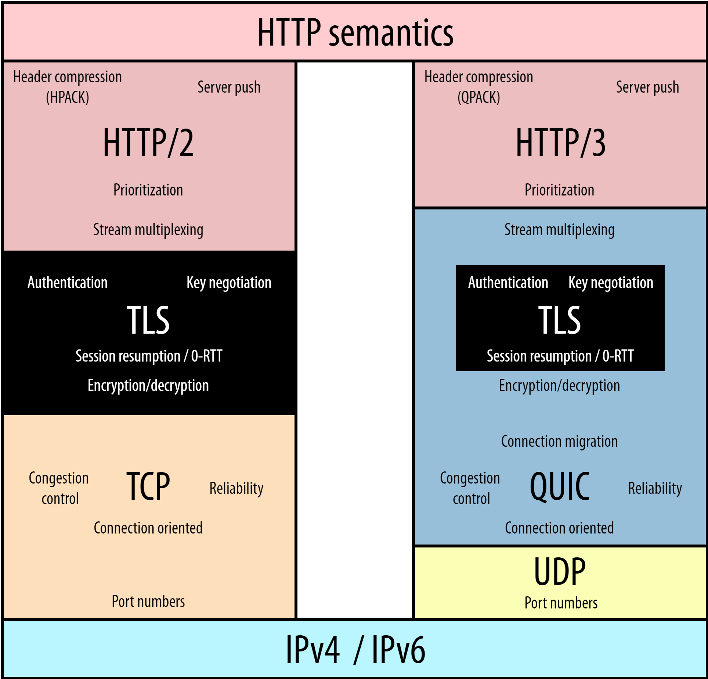

## HTTP란 무엇인가
---
### 내용 출처
<br />

본 글은 

- https://www.cloudflare.com/en-gb/learning/ddos/glossary/hypertext-transfer-protocol-http/
- https://developer.mozilla.org/en-US/docs/Web/HTTP/Overview
- https://kamranahmed.info/blog/2016/08/13/http-in-depth/
- https://www.smashingmagazine.com/2021/08/http3-core-concepts-part1/

페이지의 내용을 번역 및 정리한 글입니다.

---

### HTTP란?

- `Hypertext Transfer Protocol(이하 HTTP)`는 `World Wide Web(이하 WWW)`의 기초이며 하이퍼텍스트 링크를 사용하여 웹페이지를 로드하는데 사용된다.
- `HTTP`는 네트워크 장치간에 정보를 전송하도록 설계된 `응용 프로그램 계층` 프로토콜이며 네트워크 프로토콜 스택의 다른 계층위에서 실행된다. 
- `HTTP`를 통한 일반적인 흐름은 클라이언트 시스템이 서버에 요청한 다음 응답 메시지를 보내는 것을 포함한다.

---

### HTTP 요청에는 무엇이 있는가?
- `HTTP` 요청은 웹 브라우저와 같은 인터넷 통신 플랫폼이 웹사이트를 로드하는데 필요한 정보를 요청하는 방식이다.
- 인터넷을 통해 이루어진 각 HTTP 요청에는 다양한 유형의 정보를 전달하는 일련의 인코딩된 데이터가 포함된다. 
- 일반적인 HTTP 요청에는 다음이 포함된다.
    1. HTTP 버전 유형
    2. URL
    3. HTTP 메소드
    4. HTTP 요청 헤더
    5. 선택적 HTTP 본문
---

### HTTP 메소드란?
- HTTP 동사라고도 하는 HTTP 메서드는 HTTP 요청이 쿼리된 서버에서 예상하는 작업을 나타낸다. 
- 예를들어, 가장 일반적인 두가지 HTTP 메소드는 `GET` 과 `POST`이다. 
- `GET` 요청은 일반적으로 웹사이트의 형태로 정보가 반환될 것으로 예상하는 반면, `POST` 요청은 일반적으로 클라이언트가 웹서버에 정보를 제출하고 있음을 나타낸다. 

--- 
### HTTP 요청헤더란? 
- HTTP 헤더에는 Key-Value 형태로 저장된 텍스트 정보가 포함되어 있으며 모든 HTTP 요청(및 응답)에 포함된다. 
- 이러한 헤더는 클라이언트가 어떤 브라우저를 사용하고 있으며 어떤 데이터가 요청되고 있는지와 같은 핵심 정보를 전달한다.

- 아래 그림은 'Chrome' 브라우저의 네트워크 탭에서 HTTP 요청 헤더 예시를 확인한 그림이다.

<span align='center'>


[출처] : https://www.cloudflare.com/en-gb/learning/ddos/glossary/hypertext-transfer-protocol-http/

</span>

#### HTTP 요청 본문에는 무엇이 있을까?

- 요청 본문은 요청이 전송하는 정보의 '본문' 을 포함하는 부분이다. 
- HTTP 요청의 본문에는 사용자 이름 및 암호 또는 양식에 입력된 기타 데이터와 같이 웹 서버에 제출되는 모든 정보가 포함된다.

--- 
### HTTP 응답에는 무엇이 있을까?
- HTTP 응답은 웹 클라이언트(종종 브라우저)가 HTTP 요청에 대한 응답으로 인터넷 서버에서 받는 것이다. 
- 이러한 응답은 HTTP 요청에서 요청된 내용을 기반으로 중요한 정보를 전달하는데 아래의 내용을 포함한다.
    1. HTTP 상태 코드
    2. HTTP 응답 헤더
    3. 선택적 HTTP 본문

<br />

#### HTTP 상태 코드란?
- HTTP 상태 코드는 HTTP 요청이 성공적으로 완료되었는지 여부를 나타내는데 가장 자주 사용되는 3자리 코드이다. 
- 상태코드는 다음과 같이 5분류로 나뉜다.
    1. 1xx => 정보
    2. 2xx => 성공
    3. 3xx => 리디렉션
    4. 4xx => 클라이언트 오류
    5. 5xx => 서버 오류

- `xx`는 00 ~ 99 사이의 숫자가 들어간다.
- `2xx` 상태코드는 성공을 나타낸다. 예를들어, 클라이언트가 웹 페이지를 요청한 후 가장 흔히 볼 수 있는 응답은 요청이 제대로 완료되었음을 나타내는 `200 OK` 상태 코드를 가진다. 
- 응답이 `4xx` 또는 `5xx` 이면 오류가 있고 웹페이지가 표시되지 않음을 의미한다. `4`로 시작하는 상태코드는 클라이언트 측 오류를 나타낸다. (Ex : URL에 오타가 있으면 `404 NOT FOUND` 상태코드가 발생하는 것이 일반적) `5`로 시작하는 상태 코드는 서버 측에서 문제가 발생했음을 의미한다. 상태코드는 각각 정보 응답 및 리디렉션을 나타내는 `1`또는 `3`으로 시작할 수도 있다.

<br />

#### HTTP 응답 헤더란 무엇일까? 
- HTTP 요청과 마찬가지로 HTTP 응답은 응답 본문에서 전송되는 데이터의 언어 및 형식과 같은 중요한 정보를 전달하는 헤더와 함께 제공된다. 
- 아래 그림은 'Chrome' 브라우저의 네트워크 탭에서 HTTP 응답 헤더 예시를 확인한 그림이다.

<span align='center'>


[출처] : https://www.cloudflare.com/en-gb/learning/ddos/glossary/hypertext-transfer-protocol-http/

</span>

<br />

##### HTTP 응답 본문에는 무엇이 있을까?
- `GET` 요청에 대한 성공적인 HTTP 응답에는 일반적으로 요청된 정보가 포함된 본문이 있다.
- 대부분의 웹 요청에서 이것은 웹 브라우저가 웹 페이지로 번역할 HTML 데이터이다.

---

### (번외) HTTP를 통해 DDoS공격을 할 수 있을까? 
- HTTP 는 `상태 비저장` 프로토콜이며, 이는 각 명령이 다른 명령과 독립적으로 실행됨을 의미한다. 
- 원래 기존 사양에서 HTTP 요청은 각각 TCP 연결을 생성하고 종료되면 연결을 닫는 방식으로 저마다의 HTTP 요청마다 TCP를 연결하고 종료하였었다. 
- 최신버전의 HTTP 프로토콜(HTTP 1.1 이상)에서는 영구 연결을 사용하면 여러 HTTP 요청이 영구 TCP 연결을 통해 전달할 수 있어 리소스 소비가 향상된다. 
- DoS 혹은 DDoS 공격의 맥락에서 대량의 HTTP 요청은 대상 장치에 대한 공격을 시작하는데 사용될 수 있으며 애플리케이션 계층 공격 또는 계층 7 공격의 일부로 간주된다.

---

#### HTTP 1.0 vs HTTP 1.1 

- 이전 HTTP는 연결을 유지하지 않고 요청을 보낼때마다 TCP 연결을 새로 만들어야 했다. 
- `HTTP 1.1` 이 등장하면서 새로운 특징들이 나타났다.
    1. 커넥션 유지(Persistent Connection)
    2. 호스트 헤더(Host Header)
    3. 강력한 인증 절차(Improved Authentication Procedure)

##### 1. 커넥션 유지 (Persistent Connection)
- HTTP 프로토콜은 클라이언트-서버간 데이터를 주고 받는 응용계층의 프로토콜이다.
- HTTP를 이용한 데이터 전달은 TCP 세션 기반으로 이루어 진다. 

<span align='center'>


</span>

- 즉 기존 HTTP 1.0 은 요청을 보낼때마다 TCP를 연결하고 응답을 받은뒤 연결을 종료한다. 이와 같은 과정이 매 요청마다 반복된다.(1 GET / 1 Connection)
- 반면, HTTP 1.1 에서는 Persistent 기능을 이용하여 한개의 TCP 세션을 통해 여러개의 컨텐츠 요청이 가능하다. (N GET/ 1 Connection)
- 이 차이점을 통해 서버는 TCP 세션 처리 부하를 줄일 수 있고, 그만큼 클라이언트는 응답속도가 개선되어 좋다.

###### 1-1. 파이프라이닝(Pipelining)

- Persistent 기능을 통한 커넥션 유지와 함께 `HTTP 1.1`에서 지원하는 기능이 하나 더 있다. 
- 이는 `파이프라인`기능이다.

<span align='center'>


</span>

- HTTP 요청은 순차적으로 이루어진다.
- 위의 왼쪽 그림과 같이 3개의 컨텐츠를 요청한다고 가정하면 파이프 라이닝 기능이 없는 경우 
- 각각의 요청에 대한 응답을 받으며 진행한다.
- 즉, 이전 요청에 대한 응답을 정상적으로 받아야만 이후 요청이 진행된다는 의미이다.
- 만일 문제가 생겨 응답1이 없는 경우라면 요청2, 요청3은 진행되지 못해 문제가 발생할 수 있고 이는 비효율적이다.
- `파이프라이닝`은 이를 해결하기 위한 기능이다. 
- 위 오른쪽 그림과 같이 동시에 모든 요청(1,2,3)을 보내고 이에 대한 각각의 응답을 받아 처리한다. (만일 응답이 제대로 안오는 경우는?)
- 결과적으로 HTTP에서는 응답 속도를 높혀 페이지 뷰의 속도를 빠르게 할 수 있는 기능이다.

<br />

##### 2. 호스트 헤더(Host Header)
- `버츄얼 호스팅(Virtual Hosting)`이라는 것이 있다.
- HTTP 1.1 로의 발전이 없었다면 불가능한 서비스이다.
- HTTP 1.0 환경에서는 하나의 IP에 여러개의 도메인을 운영할 수 없다.
- 도메인마다 IP를 구분해서 준비해야한다.
- 도메인만큼 서버의 개수도 늘어날 수 밖에 없는 구조이다.
- 이러한 상황속에서 `HTTP 1.1` 에서는 Host 헤더의 추가를 통해 비로소 `버츄얼 호스팅(Virtual Hosting)`이 가능해졌다.

<span align='center'>


</span>

<br />

##### 3. 강력한 인증 절차(Improved Authentication Procedure)

- HTTP 1.1 에서 다음 2개의 헤더가 추가되었다.
  - proxy-authentication
  - proxy-authorization

- 실제 서버에서 클라이언트 인증을 요구하는 www-authentication 헤더는 HTTP 1.0 에서부터 지원되어 왔으나, 클라이언트와 서버 사이에 프록시가 위치하는 경우 프록시가 사용자의 인증을 요구할 수 있는 방법이 없었다.

- 위 헤더에 대한 상세 내용은 [여기](https://withbundo.blogspot.com/2017/08/http-17-http-ii-set-cookie-age-www.html)를 참조하도록 하자.

--- 
### HTTP 응답헤더 두번째 파트

<br />

#### Set-Cookie
- `쿠키(Cookie)`는 서버에서 클라이언트에게 제공하는 작은 정보로, 상태연결 유지 프로토콜이 아닌 HTTP의 한계(Stateless Protocol)를 극복하게 해준다.
- 웹서버가 제공하는 쿠키 정보를 클라이언트(웹브라우저)는 자체적으로 저장하고 있다가 같은 웹사이트에 다른 요청을 하는 경우 이 쿠키 정보를 같이 제공하여 웹서버로 하여금 같은 클라이언트임을 확인할 수 있게 해준다. 
- `쿠키`가 있기 때문에 웹사이트에서 로그인을 하게 되면 이후 요청에 대해서 추가적인 로그인 절차 없이 로그인 정보를 유지할 수 있다.
- 웹서버가 클라이언트에게 교유한 정보등을 쿠키 정보로 전달하는데 바로 이때 사용되는 응답 헤더가 `Set-Cookie`인 것이다.

<br />

#### Age
- `Age 헤더`는 응답헤더이며, 캐시서버가 자신이 캐싱하고 있는 컨텐츠가 서비스 할 수 있는 상태인지 아닌지를 판단하는데 사용하는 정보이다. 
- `Age 헤더`는 값으로 숫자를 사용하며, 숫자의 단위는 초(second)이다.
- 캐시서버가 `컨텐츠를 저장(캐싱)한 이후 해당 컨텐츠가 캐시서버내에서 머무른 시간` 이라고 이해하는 것이 좋다.
- `Age 헤더`의 값이 작다는 것은 캐싱된 컨텐츠가 캐시서버에 저장된 후 오래되지 않았다는 것이고 크다는 것은 오래되었다는 것을 의미. 때문에 `Age` 값이 작은 컨텐츠는 실제 서버에서 여전히 사용하고 있을 확률이 높다는 것이고, 값이 큰 컨텐츠는 실제 사용되는 컨텐츠인지 확인이 필효한 것을 의미. => 단, `Age` 값이 크다고 무조건 부정적인 것은 아니다. 캐시서버에 오래 머물렀다해서 서비스하기 부적절한 컨텐츠라는 의미는 아니라는 뜻.
- `Age 헤더`의 최대값을 설정할 수 있다. 이 최대값은 `Age`가 가질 수 있는 최대값이고 이 최대값까지는 캐시서버가 직접 클라이언트에게 서비스해도 좋다 라는 것을 의미한다.
- 그렇기 때문에 빈번히 변경되는 이미지와 같은 컨텐츠들은 `Age`값을 작게 가지고, 변경이 많지 않은 성격의 정적인 컨텐츠들은 `Age`값을 크게 두어 캐시서버가 직접 응답할 수 있게 하는 것이 서버 성능 효율면에서 좋다.
- `Age 헤더`의 최대값은 웹서버가 `Age 헤더`의 최대값을 정해서 캐시서버에게 알려준다. 이때 사용되는 것이 `Cache-Control 헤더`이다.
- 예를 들자면 만일 `최대값이 600초`로 설정되었다면 응답과 함께 제공한 콘텐츠를 캐시서버가 클라이언트에게 600초 동안은 직접 제공해도 되는 것을 보장한다는 뜻이다.
- 즉, 이렇게 캐시서버를 활용함으로써 웹서버의 부하를 줄여준다.

<br />

#### WWW-Authenticate
- 웹서버의 서비스 목적에 따라 허가된 클라이언트에게만 서비스를 제공해야 하는 경우가 있다. 이런 경우 `WWW-Authenticate 헤더`가 사용된다.
- 로그인을 통해 사용자를 구분하는 로직은 웹어플리케이션 개발자가 ASP, PHP, JSP 등의 소스코드로 직접 구현할 수도 있지만 HTTP 프로토콜에서 제공하는 보안기능을 이용할 수도 있다.
- `WWW-Authenticate 헤더`에 대한 자세한 내용이 궁금하다면 [여기](https://withbundo.blogspot.com/2017/07/http-12-http-ii-authorization-cookie.html)를 확인하도록 하자.

<br />

#### Proxy-Authenticate
- `Proxy-Authenticate 헤더`는 `WWW-Authenticate 헤더`와 비슷하지만, 다른 점은 사용자를 인증하는 주체의 차이가 있다. 
    - `WWW-Authenticate` 헤더를 이용하는 쪽은 웹서버가 클라이언트를 인증하려 할때이고, 
    - `Proxy-Authenticate` 헤더는 프록시가 클라이언트를 인증할 필요가 있을때 사용된다.

- 클라이언트의 요청에 대하여 `Proxy-Authenticate` 헤더를 응답헤더에 추가하여 보내면 클라이언트는 사용자 인증을 해야한다. 
- 응답메시지면에서도 차이가 있는데 
    - `WWW-Authenticate` 헤더를 이용할 경우 `401 Unauthorized`라는 응답메시지를 보내서 인증을 유도하는 반면,
    - `Proxy-Authenticate` 헤더를 이용할 경우에는 `407 Proxy Authenticate Required`의 상태코드를 사용한다. 

<span align='center'>


[출처] : https://withbundo.blogspot.com/2017/08/http-17-http-ii-set-cookie-age-www.html

</span>

<br />

#### Authentication-Info
- 사용자 인증에 대한 메시지를 교환하는 마지막 단계에 인증이 완료되면, `Authentication-Info` 헤더에 내용을 담아 웹서버는 클라이언트에게 전달한다. 
- 성공적인 응답을 클라이언트에게 전달할 떄 사용되며, 내용에는 인증 교환에 관련된 추가적인 정보를 담는다.
-  `Authentication-Info`는 `Proxy-Authenticate 헤더`, `WWW-Authenticate 헤더`와 함께 HTTP 보안에 관련되어 사용되는 헤더이다.

---
---
---

## MDN WEB Docs 정리
=> https://developer.mozilla.org/ko/docs/Web/HTTP/Overview

<br />

---

### HTTP 개요 
- HTTP는 HTTP 문서와 같은 리소스들을 가져올 수 있도록 해주는 프로토콜이다. 
- HTTP는 웹에서 이루어지는 모든 데이터 교환의 기초이며, `클라이언트-서버 프로토콜`이다. 
- 클라이언트와 서버들은 (데이터 스트림과 대조적으로) 개별적인 메시지 교환에 의해 통신한다.

- 1990 년대 초에 설계된 HTTP는 거듭하여 진화해온 `확장 가능한` 프로토콜이다.
- HTTP는 애플리케이션 계층의 프로토콜로, 신뢰가능한 전송 프로토콜이라면 이론상으로는 무엇이든 사용할 수 있으나 TCP 혹은 암호화된 TCP연결인 TLS를 통해 전송된다.
- HTTP의 확장성 덕분에, 오늘날 하이퍼텍스트 문서 뿐만아니라 이미지와 비디오 혹은 HTML 폼 결과와 같은 내용을 서버로 포스트(POST)하기 위해서도 사용된다.
- HTTP는 또한 필요할 때마다 웹 페이지를 갱신하기 위해 문서의 일부를 가져오는데 사용될 수도 있다.

--- 

### HTTP 기반 시스템의 구성요소
- HTTP는 클라이언트 서버 프로토콜이다. 요청은 하나의 개체에 의해 전송되고, 각각의 개별적이 요청들은 서버로 보내지며, 서버는 요청을 처리하고 `response`라 불리는 응답을 제공한다. 이 요청과 응답사이에는 여러 개체들이 있는데, 그중에는 다양한 작업을 수행하는 `게이트웨이`와 캐시 역할을 수행하는 `Proxy`등이 있다.
- 실제로 브라우저와 요청을 처리하는 서버사이에는 더 많은 컴퓨터들이 존재한다. => 라우터, 모뎀 등
- 웹의 계층적인 설계 덕분에 이들은 네트워크와 전송계층 내로 숨겨진다. 

<br />

#### 클라이언트 : 사용자 에이전트 
- 사용자 에이전트는 사용자를 대신하여 동작하는 모든 도구이다. 
- 이 역할은 주로 브라우저에 의해 수행되고, 앤지니어들과 자신들의 애플리케이션을 디버그하는 웹개발자들이 사용하는 프로그램들은 예외이다.
- 브라우저는 항상 요청을 보내는 개체이며, 결코 서버가 될 수 없다.
- 웹페이지를 표시하기 위해 브라우저는 페이지의 HTML 문서를 가져오기 위한 요청을 전송한 뒤, 응답받은 파일을 구문 분석해야 할 스크립트 그리고 페이지 내 포함된 하위 리소스들(보통 이미지와 비디오)을 잘 표시하기 위한 레이아웃 정보(CSS)에 대응하는 추가적인 요청들을 가져온다. 그런 뒤 브라우저는 완전한 문서인 웹페이지를 표기하기 위해 그런 리소스들을 혼합하고, 브라우저에 의해 실행된 스크립트는 이후 단계에서 좀 더 많은 리소스를 가져올 수 있으며 브라우저는 그에따라 웹페이지를 갱신한다.
- 웹페이지는 하이퍼텍스트 문서로, 표시된 텍스트의 일부는 사용자가 사용자 에이전트를 제어하고 웹을 돌아다닐 수 있도록 새로운 웹 페이지를 가져오기 위해 실행(보통 마우스 클릭에 의해) 될 수 있는 링크임을 뜻한다. 브라우저는 HTTP 요청 내에서 이런 지시 사항들을 변환하고 HTTP 응답을 해석하여 사용자에게 명확한 응답을 표시한다.

<br />

#### 웹 서버
- 통신 채널의 반대편에는 클라이언트에 의한 요청에 대한 문서를 제공하는 서버가 존재한다. 
- 서버는 사실상 논리적으로 단일 기계이며 이는 로드(로드 밸런싱) 혹은 그때 그때 다른 컴퓨터(캐시, DB 서버, E-커머스 서버 등)들의 정보를 얻고 완전하게 혹은 부분적으로 문서를 생성하는 소프트웨어의 복잡한 부분을 공유하는 서버들의 집합일 수도 있다.
- 서버는 반드시 단일 머신일 필요는 없지만, 여러 개의 서버를 동일한 머신 위에서 호스팅할 수는 있다. 
- HTTP/1.1 과 `Host` 헤더를 이용하여 동일한 IP 주소를 공유할 수도 있다.

<br />

#### 프록시
- 웹 브라우저와 서버사이에서는 수많은 컴퓨터와 머신이 HTTP 메시지를 이어받고 전달한다.
- 여러 계층으로 이루어진 웹 스택 구조에서 이러한 컴퓨터/머신들은 대부분은 전송, 네트워크 혹은 물리 계층에서 동작하며, 성능에 상당히 큰 영향을 주지만 HTTP 계층에서는 이들이 어떻게 동작하는지 눈에 보이지 않는다. 
- 이러한 컴퓨터/머신 중에서도 애플리케이션 계층에서 동작하는 것들을 일반적으로 `프록시`라고 부른다. 프록시는 눈에 보이거나 그렇지 않을 수도 있으며(프록시를 통해 요청이 변경되거나 변경되지 않는 경우를 말함) 다양한 기능들을 수행할 수 있다.
    1. 캐싱(캐시는 공개 또는 비공개가 될 수 있다.)
    2. 필터링(바이러스 백신 스캔, 유해 컨텐츠 차단)
    3. 로드 밸런싱(여러 서버들이 서로 다른 요청을 처리하도록 허용)
    4. 인증(다양한 리소스에 대한 접근 제어)
    5. 로깅(이력정보를 저장)

---

### HTTP 기초

<br />

#### HTTP는 간단하다.
- HTTP는 사람이 읽을 수 있으며 간단하게 고안되었다.
- 심지어 HTTP/2가 다소 더 복잡해졌지만 여전히 HTTP 메세지를 프레임별로 캡슐화하여 간결함을 유지하였다.

#### HTTP는 확장 가능
- HTTP/1.0 에서 소개된 HTTP 헤더는 HTTP를 확장하고 실험하기 쉽게 만들어 주었다.
- 클라이언트와 서버가 새로운 헤더의 시맨틱에 대해 간단한 합의만 한다면, 언제든지 새로운 기능을 추가할 수 있다.

#### HTTP는 상태가 없지만, 세션은 있다.
- HTTP는 상태를 저장하지 않는다.(Stateless)
- 동일한 연결 상에서 연속하여 전달된 두개의 요청 사이에는 연결고리가 없다. 
- 이는 e-커머스 쇼핑 바구니처럼 일관된 방식으로 사용자가 페이지와 상호작용하길 원할때 문제가 된다. 
- 하지만 HTTP의 핵심은 상태가 없는 것이지만 HTTP 쿠키는 상태가 있는 세션을 만들도록 도와준다. 
- 헤더 확장성을 사용하여, 동일한 컨텍스트 또는 동일한 상태를 공유하기 위해 각각의 요청들에 세션을 만들도록 HTTP 쿠키가 추가된다.

#### HTTP 와 연결
- 연결은 전송 계층에서 제어되므로 근본적으로 HTTP 영역 밖이다. 
- HTTP는 연결될 수 있도록 하는 근본적인 전송 프로토콜을 요구하지 않는다. 
- 다만 신뢰할 수 있거나 메시지 손실이 없는(최소한의 오류는 표시) 연결을 요구한다.
- 인터넷 상의 가장 일반적인 두개의 전송 프로토콜 중에서 TCP는 신뢰할 수 있으며, UDP는 그렇지 않다. 
- 그래서 HTTP 는 연결이 필수는 아니지만 연결 기반인 TCP 표준에 의존한다.

<br />

- 클라이언트와 서버가 HTTP를 요청/응답으로 교환하기 전에 여러 왕복이 필요한 프로세스인 TCP 연결을 설정해야한다. 
- HTTP/1.0 의 기본동작은 각 요청/응답에 대해 별도의 TCP 연결을 여는 것이다. 
- 이 동작은 여러 요청을 연속해서 보내는 경우에는 단일 TCP 연결을 공유하는 것보다 효율적이지 못하다. 
  
<br />

- 이러한 결함을 개선하기 위해 `HTTP/1.1`은 (구현하기 어렵다고 입증된) 파이프라이닝 개념과 지속적인 연결의 개념을 도입했다.
- 기본적인 TCP 연결은 `Connection`헤더를 사용해 부분적으로 제어할 수 있다.
- `HTTP/2` 는 연결을 좀 더 지속되고 효율적으로 유지하는데 도움이 되도록, 단일 연결 상에서 메시지를 다중 전송(multiplex)하는 방식을 채택하였다.

<br />

- HTTP에 더 알맞은 좀 더 나은 전송 프로토콜을 설계하는 실험들이 진행중에 있다. 
- 예를 들어, 구글은 좀 더 신뢰성 있고 효율적인 전송 프로토콜을 제공하기 위해 `UDP 기반의 QUIC`를 실험하는 중에 있다. 

### HTTP로 제어할 수 있는 것
- HTTP의 확장 가능한 특성은 수년 간에 걸쳐 웹의 점점 더 많은 기능들을 제어하도록 허용된다.
- 캐시 혹은 인증 메서드는 HTTP에 초기부터 제어해왔던 기능이며, 반면에 `origin` 제약사항을 완화시키는 조치는 2010년에 들어서 추가되었다. 
- HTTP를 사용해 제어 가능한 일반적인 기능은 다음과 같다.

<br />

#### `캐시` 
- HTTP로 문서가 캐시되는 방식을 제어할 수 있다.
- 서버는 캐시 대상과 기간을 프록시와 클라이언트에 지시할 수 있고, 클라이언트는 저장된 문서를 무시하라고 중간 캐시 프록시에게 지시할 수 있다. 

#### origin 제약사항을 완화하기
- 스누핑과 다른 프라이버시 침해를 막기 위해 브라우저는 웹사이트 간의 엄격한 분리를 강제한다.
- 동일한 `origin`으로부터 온 페이지만이 웹페이지의 전체 정보에 접근할 수 있다.
- 이러한 제약사항은 서버에 부담이 되지만, HTTP 헤더를 통해 그것을 완화시킬 수 있다. 
- 이 덕분에 문서에서는 다른 도메인으로부터 전달된 정보를 패치워크 할 수 있다.

#### 인증
- 어떤 페이지들은 보호되어 오로지 특정 사용자만이 그것에 접근할 수 있다.
- 기본인증은 HTTP를 통해 `WWW-Authenticate`또는 유사한 헤더를 사용해 제공되거나, `HTTP 쿠키`를 사용해 특정 세션을 설정하여 이루어질 수 도 있다.

#### 프록시와 터널링 
- 서버 혹은 클라이언트 혹은 그 둘 모두는 종종 인트라넷에 위치하며 다른 개채들에게 그들의 실제 주소를 숨기기도 한다. 
- HTTP 요청은 네트워크 장벽을 가로지르기 위해 프록시를 통해 나가게 된다. 
- 모든 프록시가 HTTP 프록시는 아니다. 

#### 세션 
- 쿠키 사용은 서버 상태를 요청과 연결하도록 한다.
- HTTP가 기본적으로 상태없는 프로토콜임에도 세션을 만들어주는 계기가 된다.

---
### HTTP 흐름
- 클라이언트가 서버와 통신하고자 할 때, 최종 서버가 됐던 중간 프록시가 됐던, 다음의 단계를 수행한다. 

1. TCP 연결을 연다. TCP 연결은 요청을 보내거나(혹은 여러개의 요청) 응답을 받는데 사용된다. 클라이언트는 새 연결을 열거나, 기존 연결을 재사용하거나, 서버에 대한 여러 TCP 연결을 열 수 있다.
2. HTTP 메세지를 전송한다. HTTP메세지(HTTP/2이전의)는 인간이 읽을 수 있다. HTTP/2에서는 이런 간단한 메세지가 프레임속으로 캡슐화되어 직접 읽는게 불가능하지만 원칙은 동일하다.

```js
GET / HTTP/1.1
Host: developer.mozilla.org
Accept-Language: fr
```

3. 서버에 의해 전송된 응답을 읽어 들인다. 

```js
HTTP/1.1 200 OK
Date: Sat, 09 Oct 2010 14:28:02 GMT
Server: Apache
Last-Modified: Tue, 01 Dec 2009 20:18:22 GMT
ETag: "51142bc1-7449-479b075b2891b"
Accept-Ranges: bytes
Content-Length: 29769
Content-Type: text/html

<!DOCTYPE html... (here comes the 29769 bytes of the requested web page)
```

4. 연결을 닫거나 다른 요청들을 위해 재사용한다.

- HTTP 파이프라이닝이 활성화 되면 첫번째 응답을 완전히 수신할때까지 기다리지 않고 여러 요청을 보낼 수 있다. 
- HTTP 파이프라이닝은 오래된 소프트웨어와 최신버전이 공존하고 있는, 기존의 네트워크 상에서 구현하기 어렵다는게 입증되었으며, 프레임안에서 보다 화발한 다중 요청을 보내는 HTTP/2로 교체되고 있다. 
---
### HTTP 메세지
- HTTP/1.1과 초기 HTTP 메세지는 사람이 읽을 수 있다.
- HTTP/2에서 이 메세지들은 새로운 이진 구조인 프레임안으로 임베드 되어, 헤더의 압축과 다중화 같은 최적화를 가능케한다. 
- 본래의 HTTP 메세지의 일부분만이 이 버전의 HTTP 내에서 전송된다고 할지라도, 각 메세지의 의미들은 변화하지 않으며 클라이언트는 본래의 HTTP/1.1 요청을(가상으로) 재구성한다. 
- 그러므로 HTTP/1.1 포맷내에서 HTTP/2를 이해하는 것은 여전히 유용하다. 

<span align='center'>


[출처] : https://developer.mozilla.org/ko/docs/Web/HTTP/Overview

</span>

- HTTP 메서드, 보통 클라이언트가 수행하고자 하는 동작을 정의한 GET, POST 같은 동사나 OPTION, HEAD와 같은 명사이다. 일반적으로 클라이언트는 리소스를 가져오거나 HTML 폼의 데이터를 전송하려고 하지만 다른 경우에는 다른 동작이 요구될 수 있다.
- 가져오려는 리소스의 경로: 예를 들어 프로토콜, 도메인, 또는 TCP인 요소들을 제거한 리소스의 url이다. 
- HTTP 프로토콜의 버전
- 서버에 대한 추가정보를 전달하는 선택적 헤더들
- POST와 같은 몇가지 메서드를 위한 전송된 리소스를 포함하는 응답의 본문과 유사한 본문

<span align='center'>


[출처] : https://developer.mozilla.org/ko/docs/Web/HTTP/Overview

</span>

- HTTP프로토콜의 버전
- 요청의 성공 여부와, 그 이유를 나타내는 상태코드
- 아무런 영향력이 없는 상태 코드의 짧은 설명을 나타내는 상태 메세지
- 요청 헤더와 비슷한, HTTP 헤더들
- 선택 사항으로 가져온 리소스가 포함되는 본문

---
### HTTP 기반의 API
- HTTP 기반으로 가장 일반적으로 사용된 API는 user agent와 서버간에 데이터를 교환하는데 사용될 수 있는 XMLHTTPRequest API 이다. 최신 Fetch API 는 보다 강력하고 유연한 기능을 제공한다.
- 또 다른 API인 서버-전송 이벤트 는 서버가 전송 메커니즘으로 HTTP를 사용하여 클라이언트로 이벤트를 보낼 수 있도록 하는 단방향 서비스이다.
- 클라이언트는 EventSource 인터페이스를 사용하여, 연결을 맺고 이벤트 핸들러를 설정한다. 
- 클라이언트 브라우저는 HTTP 스트림으로 도착한 메시지를 적절한 Event 객체로 자동 변환하여, 알려진 경우 해당 이벤트 type에 대해 등록된 이벤트 핸들러로 전달하거나 또는 특정 유형의 이벤트가 설정되지 않은 경우에는 onmessage 이벤트 핸들러로 전달한다.

---
---
---

### HTTP/2

- 우리는 HTTP/1.1 까지의 HTTP 프로토콜이 아닌 다른 HTTP 프로토콜이 필요하다고 확신할 수 있다.
- `HTTP/2`는 낮은 지연율의 컨텐츠 전송을 위해 설계되었다.
- `HTTP/1.1`과 비교했을 때 핵심적인 특징과 차이점으로는 아래의 것들이 있다.
    1. 텍스트 대신 Binary
    2. Multipexing => 단일 커넥션에서의 다중 비동기 HTTP 요청
    3. HPACK => Header의 압축
    4. Server Push => 단일 요청에 대한 다중 응답
    5. 요청에 우선순위 매기기(Request Prioritization)
    6. 보안(Security)

<span align='center'>


[출처] : https://kamranahmed.info/blog/2016/08/13/http-in-depth

</span>

<br />

#### Binary Protocol (이진 프로토콜)
- `HTTP/2`는 HTTP/1.x에 존재했던 지연율 증가 문제를 이진 프로토콜로 만드는 경향이 있다.
- `이진 프로토콜` 로 바뀌면서, 파싱(parsing)하기에는 더욱 쉬워졌지만 사람의 눈으로 읽기에는 더욱 어려워졌다.
- `HTTP/2`에서의 주요한 블록들로는 `프레임(Frames)`과 `스트림(Streams)`가 있다.

##### Frames & Streams
- `HTTP` 메세지들은 하나 이상의 프레임으로 구성된다. 
- 프레임들은 메타 데이터(데이터의 데이터)를 위한 `Headers`프레임, 페이로드(데이터)를 위한 `Data`프레임 그리고 몇몇 다른 프레임들로 구성된다.(HEADERS, DATA, RST_STREAM, SETTINGS, PRIORITY 등등) 

<br />

- 모든 `HTTP/2` 요청과 응답은 `유일한 stram ID`를 부여 받고, 이것은 프레임들에 나누어진다. 프레임들은 데이터의 조각에 불과하다. 프레임들의 집합을 스트림이라 부르며, 각 프레임은 `스트림 id`(프레임을 구별하는데 사용됨)를 가진다. 또한 각각의 프레임으로 나누어진 `스트림 id` 도 고유하다. 
- 클라이언트에서 시작된 요청에는 홀수번호의 id가 부여되고, 서버로부터 전송되는 응답에는 짝수 id가 부여된다.

<br />

- `RST_STREAM`도 알아두는 것이 좋다. 
- `RST_STREAM` 프레임은 특별한 프레임인데 이는 몇가지 스트림을 막는데 사용된다. (EX : 클라이언트에서 서버에 해당 스트림이 더이상 필요하지 않다는 의미로 던지는데 사용.)
- `HTTP/1.1`에서는 서버로부터의 응답을 멈추는 유일한 방법은 연결을 닫는 것이었다. 이렇게되면 연속된 요청에 대해 새 연결을 열어야 했기 떄문에 지연시간이 증가한다.
- 반면 `HTTP/2`에서는 클라이언트가 `RST_STREAM`을 사용해 연결은 유지시키고 특정 스트림(중지를 원하는)을 중지시킬 수 있다. 그 외의 다른 스트림들은 정상적으로 동작한다. 

<br />

#### Multiplexing(멀티플렉싱)
- `HTTP/2`는 이제 이진 프로토콜이고, 위에서 말했듯이 요청과 응답에 프레임과 스트림을 사용하기 때문에 TCP 연결이 열리면 모든 스트림은 추가 연결을 열지 않고, 동일한 연결을 통해 비동기적으로 전송된다. 
- 그리고 차례로 서버는 동일한 비동기 방식으로 응답한다. 
- 즉, 응답은 순서가 없으며 클라이언트는 지정된 스트림ID를 사용하여 특정 패킷이 속한 스트림을 식별한다.
- 이것은 또한 HTTP/1.x 에 존재했던 `헤드오브라인` 차단 문제를 해결한다. 즉, 클라이언트는 시간이 걸리는 요청을 기다릴 필요가 없고 다른 요청은 여전히 처리된다. 

<br />

#### HPACK Header Compression(헤더 압축)
- 전송된 헤더를 최적화하기 위한 별도의 `RFC`의 일부였다. 즉, 동일한 클라이언트에서 서버에 지속적으로 액세스할때 헤더를 통해 여러번 전송되는 많은 중복데이터가 존재하며, 때때로 쿠키가 헤더크기를 증가시켜 대역폭 사용 및 대기 시간이 증가할 수 있다.이를 극복하기 위해 `HTTP/2`에서는 `헤더 압축 방식`을 도입하였다.

<span align='center'>


[출처] : https://kamranahmed.info/blog/2016/08/13/http-in-depth

</span>

- 요청과 응답과는 달리, 헤더는 `gzip`이나 압축 등 형식으로 압축되지 않지만 헤더 압축을 위한 다른 매커니즘이 있다. 즉, 리터럴 값은 허프만 코드를 사용하여 인코딩되고 헤더 테이블은 클라이언트와 서버에 의해 유지되며 클라이언트와 서버 모두 반복적인 헤더(EX: 사용자 에이전트 등)를 생략한다. 다음 요청에서 모두 유지 관리하는 헤더 테이블을 사용하여 참조한다. 
- 기존 HTTP/1.1에서의 헤더에 있어서 일부 의사 헤더(Ex: :method, :scheme, :host 및 :path)를 추가하는 것을 제외하고는 동일하다.

<br />

#### Server Push
- `Server Push`는 클라이언트가 특정 리소스를 요청한다는 것을 알고 클라이언트가 요청하지 않아도 서버가 클라이언트에 푸시할 수 있는 `HTTP/2`의 또 다른 엄청난 기능이다.
- 예를 들어 브라우저가 웹페이지를 로드하고, 브라우저는 전체 페이지를 구문 분석하여 서버에서 로드해야 하는 원격 콘텐츠를 찾은 다음 해당 콘텐츠를 가져오기 위해 서버로 후속 요청을 보낸다. 
- 서버 푸시를 통해 서버는 클라이언트(브라우저)가 요구할 것으로 알고 있는 데이터를 푸시하여 왕복 이동량을 줄일 수 있다. 서버는 `PUSH_PROMISE`라는 특수 프레임을 전송하여 클라이언트(브라우저)에 `이 리소스를 보내려고 합니다! 나한테 부탁하지마` 라는 알림을 보낸다. 
- `PUSH_PROMISE` 프레임은 푸시를 발생시킨 스트림과 연결되며, 여기에는 약속된 스트림 ID, 즉, 서버가 푸시할 리소스를 보낼 스트림이 포함된다.

<br />

#### Request Prioritization(우선 순위 지정 요청)
- 클라이언트는 스트림이 열리는 헤더 프레임에 우선순위 정보를 포함함으로써 스트림에 우선순위를 할당할 수 있다. 클라언트는 언제든지 우선 순위 프레임을 전송하여 스트림의 우선 순위를 변경할 수 있다.
- 우선 순위 정보가 없으면 서버는 요청을 비동기적으로 처리한다. 즉, 순서없이 처리한다(이부분이 `UDP`개념을 사용한 맥락인걸까??). 스트림에 할당된 우선 순위가 있는 경우, 서버는 이 우선 순위 정보를 기반으로 요청을 처리하기 위해 얼마나 많은 리소스를 제공해야하는지 결정한다.

<br />

#### Security(보안)
- `TLS`를 통한 보안이 `HTTP/2`에 대해 의무화되어야 하는지에 대한 광범위한 논의가 있었다. 결국, 그것을 의무화하지 않기로 결정되었다. 그러나 대부분의 공급업체는 `HTTP/2`가 `TLS`를 통해 사용될 때만 지원할 것이라고 언급하였다. 따라서 `HTTP/2`사양에 따른 암호화를 요구하지 않지만 어쨌든 기본적으로 필수 항목이 되었다. `TLS`를 통해 구현되는 `HTTP/2`는 몇 가지 요구 사항을 부과한다. `TLS`버전 1.2이상을 사용해야하며, 특정 수준의 최소 키 크기가 있어야하고, 사용 후 삭제 키가 필요하다. 
---
---
---

## HTTP/3 정리

=> https://www.smashingmagazine.com/2021/08/http3-core-concepts-part1/

---
- 대다수의 사람들은 `HTTP/3`가 기술적인 혁신을 가져올 것처럼 말했다. 이는 `HTTP/2`가 나왔을때도 비슷하다. 
- 하지만 `HTTP/2`의 경우를 보면 `서버푸시`, `병렬스트림` 및 `우선순위 지정`과 같은 흥미로운 기능을 내며 혁신을 예고했지만 `서버 푸시`가 실제로 작동하지 않고 `스트림`과 `우선순위지정`이 제대로 구현되지 않는 경우가 많으며 결과적으로 리소스 번들링과 샤딩이 여전히 일부 상황에서 좋은 사례라는 것이 알려졌다. 
- 이번 장에서는 `HTTP/3`가 포함한 기능들이 얼마나 유용하고 앞으로 유망한지 혹은 그렇지 않을지에 대해 알아볼 것이다.

<br />

### 왜 HTTP/3 가 필요할까? 
- 애초에 새로운 HTTP버전이 필요했다기 보다는 `TCP의 업그레이드`가 필요했기에 등장했다. 
- `TCP`는 `HTTP`와 같은 다른 프로토콜에 신뢰성 및 순차적 전달과 같은 중요한 서비스를 제공하는 중요한 프로토콜이다. `TCP` 를 이용해 많은 동시 사용자들과 인터넷을 계속 사용할 수 있는 이유 중 하나인데, 그것은 각 사용자의 대역폭 사용을 그들의 공정한 몫으로 현명하게 제한하기 때문이다.

```js
(참고) TCP/IP 에서 각 계층별 역할 

- HTTP(S) => URL과 데이터 해석 담당
- TLS => 암호화를 통한 보안 보장
- TCP => 손실된 패킷을 재전송하여 신뢰성 있는 데이터 전송을 보장(프레세스 to 프로세스)
- IP => 패킷을 한 엔드포인트에서 다른 엔드포인트(호스트 to 호스트)로 중간(사이)에 있는 다른 장치를 통해 라우팅(Routing)한다.
```

- 프로토콜의 `레이어링(계층화)`은 프로콜의 기능을 쉽게 재사용할 수 있도록 하기 위해 수행된다.
- `HTTP`와 같은 상위 계층 프로토콜은 복잡한 기능(`암호화` 등)을 다시 구현할 필요가 없다. 다른예로 인터넷의 대부분의 응용 프로그램들은 모든 데이터가 완전히 전송되도록 내부적으로 TCP를 사용한다. 이러한 이유로 `TCP`는 인터넷에서 가장 널리 사용되는 프로토콜 중 하나인 것이다.


<span align='center'>


[출처] : https://www.smashingmagazine.com/2021/08/http3-core-concepts-part1/

</span>

- `TCP`는 수십년동안 웹의 초석이었지만 2000년대 후반부터 그 나이를 보여주기 시작했다. `TCP`의 의도된 대체물인 `QUIC`라는 이름의 새로운 전송 프로토콜은 `HTTP/2`를 직접 실행하는 것이 매우 어려울 수 있는 몇가지 중요한 면에서 `TCP`와는 다르다. 이와 같이 `HTTP/3`자체는 사람들이 흥분하는 대부분의 새로운 기능을 포함하는 새로운 `QUIC` 프로토콜과 호환되도록 하기 위해 `HTTP/2`를 상대적으로 작게 개조한 것이다.

<br/>

- `QUIC`가 필요한 이유는 인터넷 초창기부터 존재해 온 `TCP`가 최대한의 효율성을 염두에 두고 실제로 구축되지 않았기 때문이다. 예를들어 TCP는 새로운 연결을 설정하기 위해 `HandShake`를 요구한다. 이 작업은 클라이언트와 서버가 모두 존재하며 데이터를 교환할 의지와 능력이 있는지 확인하기 위해 수행된다. 그러나 연결에서 다른 작업을 수행하기 전에 완료하려면 전체 네트워크 왕복이 필요하다. 클라이언트와 서버가 지리적으로 멀리 떨어져 있는 경우 각 `왕복시간(RTT)`이 100 밀리초 이상 소요되어 현저한 지연이 발생할 수 있다.

<br/>

- 두번째 예로, TCP는 전송되는 모든 데이터를 단일 `파일` 또는 `바이트 스트림`으로 본다. 실제로는 단일 파일의 데이터를 포함하는 TCP 패킷이 손실되면 해당 패킷이 복구될 때까지 다른 모든 파일도 지연된다. 이를 `선두(HoL) 차단`이라고 한다. 이러한 비효율성은 실제로는 상당히 쉽게 관리할 수 있지만(그렇지 않았다면 30년이상 TCP를 사용하지 않았을 것이다.), HTTP와 같이 상위 수준의 프로토콜에 눈에 띄는 방식으로 영향을 미친다. 

<br/>

- 시간이 지남에 따라 이러한 문제 중 일부를 개선하고 새로운 성능 기능을 도입하기 위해 TCP를 발전시키고 업그레이드 하려고 노력했다. 예를 들어 `TCP Fast Open`은 상위 계층 프로토콜이 처음부터 데이터를 전송하도록 허용함으로써 핸드셰이크 오버헤드를 제거한다. 또 다른 노력을 `MultiPath TCP` 라고 한다. 만일 휴대전화에서 `wifi`와 `데이터` 두가지 휴대전화 연결을 모두 사용해 처리량과 견고성을 높이는 것은 어떨까? 이러한 TCP 확장을 구현하는 것은 어렵지 않다. 하지만 인터넷 규모로 실제로 배치하는 것은 매우 어렵다. TCP가 매우 대중적이기 때문에 거의 모든 연결된 장치는 자체적인 프로토콜 구현체를 가지고 있다. 이러한 구현이 너무 오래되었거나 업데이트가 없거나 버그가 있는 경우 확장을 실제로 사용할 수 없다. 달리 말하면 모든 구현은 확장을 유용하게 사용하기 위해 알아야한다.

<br/>

- 최종 사용자 장치(EX : 컴퓨터 혹은 웹 서버)는 비교적 수동으로 업데이트 할 수 있으므로 이러한 장치만 다루는 경우에는 큰 문제가 되지 않는다. 하지만 다른 장치들의 경우에는 클라이언트와 서버 사이에 위치하며, 여기에는 자체 TCP코드가 내장되어 있다. (EX: 방화벽, 로드밸런서, 라우터, 캐싱서버, 프록시 등) 이러한 중간 장치는 종종 업데이트 하기가 어렵고 때로는 수락하는 내용이 더 엄격하다. 예를들어 디바이스가 방화벽인 경우 확장 기능을 포함하는 모든 트래픽(알수없는)을 차단하도록 구성할 수 있다. 실제로, 수많은 액티브 미들 박스가 TCP에 대해 새로운 확장 기능을 더 이상 보유하지 않는 특정한 가정을 한다는 것이 밝혀졌다.

<br />

- 결과적으로 충분한 (중간 장치) TCP 구현이 실제로 대규모로 확장을 사용하기 위해 업데이트 되기까지는 수년에서 심지어 10년 이상이 걸릴 수 있다. TCP를 진화시키는 것이 실질적으로 불가능해졌다고 말할 수 있다. 
- 그 결과, 이러한 문제를 해결하기 위해서는 직접 업그레이드보다는 TCP를 위한 대체 프로토콜이 필요할 것이 분명하다. 그러나 TCP의 기능과 다양한 구현의 단순한 복잡성 때문에 처음부터 더 나은 새로운 것을 만드는 것은 기념비 적인 작업이 될것이기에 2010년대 초 이 작업을 연기하였다.
- 결국 TCP 뿐만 아니라 HTTP/1.1에도 문제가 있었다. 작업을 분할하여 HTTP/1.1을 먼저 수정하기로 했고, 이에따라 HTTP/2가 탄생하게된 것이다. 본래 QUIC위에서 실행할 수 있는 HTTP/2 를 기대했었지만 실제로는 구현이 너무 비효율적일 것으로 판단했다.(기능 중복으로 인해)
- 대신 HTTP/2는 QUIC와 호환되도록 몇가지 주요 영역에서 조정되었다. 이로 인해 HTTP/1.1과 HTTP/2의 차이는 HTTP/2와 HTTP/3의 차이보다 훨씬 크다.

--- 

### ** 중요한 점 **
- 여기서 중요한 점은 필요로 했던 것은 실제로 HTTP/3가 아니라 오히려 "TCP/2"였고, 우리는 그 과정에서 HTTP/3를 "무료로" 얻었다는 것이다. HTTP/3의 주요 기능(더 빠른 연결 설정, 더 적은 HoL 차단, 연결 마이그레이션 등)은 실제로 모두 `QUIC`에서 제공됩니다.

---
### QUIC 란 무엇인가?

=> [What Is QUIC? # 부터](https://www.smashingmagazine.com/2021/08/http3-core-concepts-part1/#what-is-quic)


---
<br /><br />
---

### 공부하다 생긴 궁금증

<br />

#### HTTP 1.1 커넥션 유지 & 쿠키
- HTTP 1.1 에서의 커넥션 유지는 네트워크적인 동작이고, 쿠키는 웹 서비스에서 사용자의 정보를 유지하기 위해 데이터 헤더에 추가하여 사용하는 일종의 `정보` 이므로 커넥션과의 비교는 애초에 옳지 않다.

#### Proxy 서버란?

#### Proxy 서버 vs 웹 서버

#### 해람찡과 대화한것
- 클라이언트에서 알게모르게 URL을 통해 HTTP 혹은 HTTPS 프로토콜을 정해서 API 통신을 한것이다.
- 그런데 최근 프로젝트 진행중 서버에서 `set-Cookie`헤더를 채워 클라이언트로 날리면 크롬 자체(최근 업데이트)에서 `validation`을 진행하고 쿠키를 사용할 수 없는 경우가 발생했다.
- 이는 쿠키를 받아온 도메인(`WAS`)과 정적이 HTML 파일을 받아온 도메인(`웹서버`)이 다르기때문이였다.
- 최근 크롬 업데이트에서 해당 `validation`을 진행함에 있어 속성을 설정할 수 있는데 `same-site`라는 값을 `none`으로 설정할 경우 HTTP로 서로 다른 도메인에서 데이터를 받는 경우라면 쿠키 설정이 안된다는 것이다. => 단, HTTPS로 서버 프로토콜을 변경하면 가능케된다.
- 만일 `same-site`값이 `strict`라면 HTTP이던 HTTPS이던 상관없이 도메인이 같다면(WAS내에서 웹서버의 기능[정적인 파일전송]을 한다면) `validation`을 통과하게 된다.
- 추가적으로 `same-site` 값에는 `LAX`라는 값이 있는데 이는 좀 더 알아보자.
---

<br /><br />

[참조] : https://withbundo.blogspot.com/2017/08/http-17-http-ii-set-cookie-age-www.html
[참조] : https://developer.mozilla.org/en-US/docs/Web/HTTP/Overview
[참조] : https://kamranahmed.info/blog/2016/08/13/http-in-depth => HTTP/2 부터 읽기.
[참조] : https://www.smashingmagazine.com/2021/08/http3-core-concepts-part1/
[참조] : https://www.daleseo.com/http-session/

[추가 참조] : https://itrepreneur.tistory.com/4