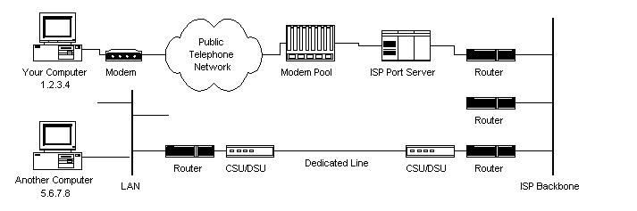
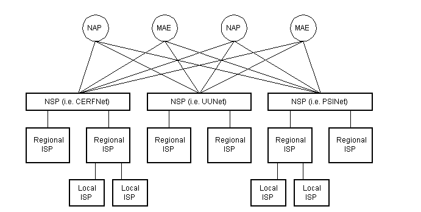
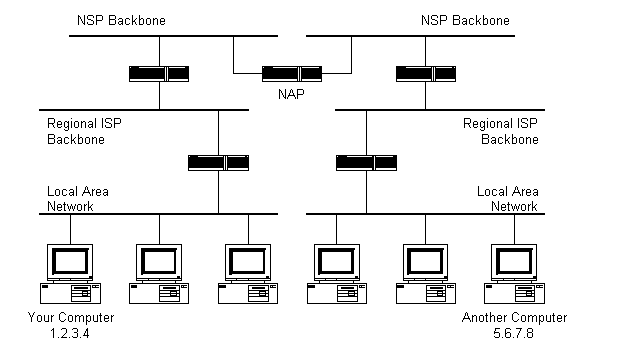
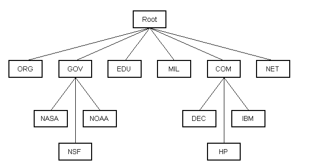

## 인터넷이 어떻게 작동할까
---
### 내용 출처
 

본 글은 

https://www.vox.com/2014/6/16/18076282/the-internet

http://web.stanford.edu/class/msande91si/www-spr04/readings/week1/InternetWhitepaper.htm

페이지의 내용을 번역 및 정리한 글입니다.

---
### 인터넷이란? 

- `인터넷`은 현재 세계에서 가장 유명한 컴퓨터 네트워크이다.
- 1969년 학술 연구 프로젝트로 시작해 1990년대에 이르러서는 국제 상업용 네트워크로 자리잡았다.
- 특히 `인터넷`의 분산시스템에 주목할만하다. 인터넷에 접속할 수 있는 그 누구도 인터넷을 소유하거나 통제하지 않는다. 대신에 수천개의 서로 다른 단체에서 그들만의 네트워크와 자체적인 상호 접속 합의(프로토콜?)를 규정한다.
- 거의 모든 사람들은 웹브라우저를 통해 인터넷 콘텐츠를 접할 수 있다. 웹이 유명해지면서 많은 사람들은 인터넷을 부정확하게 표현하고 웹또한 동일하다. 하지만 웹은 인터넷의 많은 어플리케이션 중 하나이다. 다른 인터넷 어플리케이션들 중 하나는 이메일과 비트토렌트가 있다.

--- 

### 인터넷은 어디에 있는가?

- 인터넷은 크게 3가지 구성요소로 이루어져 있다.

#### Last Mile
- `Last Mile`은 집과 작은 그룹들을 인터넷에 연결시키는 파트이다.
- 현재 약 60퍼센트의 미국 주거지 인터넷 연결이 Comcast와 Time Warner같은 케이블 TV회사로부터 공급된다. (구리케이블 : 느리다)
- 남은 40퍼센트는 광케이블을 통해서 공급된다.
- 마지막으로 줄어드는 추세인 전화선으로 공급받는 구식의 DSL 서비스가 있다.

#### Data centers
- `데이터 센터`는 유저정보와 호스트 온라인 앱 그리고 컨텐츠를 저장하는 서버 공간이다.
- 몇몇은 구글 혹은 페이스북과 같은 대기업에 의해 소유되고, 나머지는 작은 웹사이트들에 서비스를 공급하는 상업용 설비로 사용된다. 
- 데이터 센터는 많은 유저들에게 동시에 전송할 수 있도록 빠른 인터넷 연결을 가진다.
- 데이터 센터는 세계의 어느곳에나 위치할 수 있지만 주로 땅값과 전기세가 싼 곳에 위치한다.

#### Backbone
- `백본`은 거리가 먼 네트워크에서 주로 데이터 소비자와 데이터 센터간에 데이터를 전송하는 광케이블로 구성된다.
- 백본 시장은 경쟁력이 있다.
- 백본 공급자는 주로 그들의 네트워크를 `Internet Exchange Points`를 이용해 연결하며 `Internet Exchange Points`는 보통 주요도시에 위치한다. 
- `IEP`에서는 백본 공급자들이 다른 곳과 연결함에 있어 성능을 향상시키는데 쉽도록 한다.

---

### 누가 인터넷을 운영하는가?
- 결과적으로 아무도 운영하지 않는다.
- 분산된 네트워크 구조로 되어있기 때문이고, 수천개의 기관(회사, 학교, 정부 등등)세어 자체 네트워크를 운영하고 자발적인 상호 연결 계약에 기초하여 서로 트래픽을 교환한다.
  
--- 

### IP 주소란?
- 인터넷 프로토콜 주소는 컴퓨터가 인터넷에서 서로를 식별하는데 사용하는 숫자이다. 
- Internet Assigned Numbers Authority로 알려진 ICANN 부서는 두 개의 서로 다른 조직이 동일한 주소를 사용하지 않도록 IP 주소를 배포한다.

--- 

### IPv6란?
- IPv4로 알려진 현재의 인터넷 표준은 약 40억개의 IP주소만을 허용한다.
- 이는 1970년대에 매우 큰 숫자로 여겨졌으나, 오늘날 IPv4주소의 공급은 거의 소진되었다. 그래서 인터넷 기술자들은 IPv6라고 불리는 새로운 표준을 개발했고, 매우 큰 수의 고유 주소를 허용한다. 
- 초기 IPv6로의 전환은 매우 느렸지만 점차 IPv4 에서 IPv6로의 전환이 점차 늘어나고 있다.

---

### 무선 인터넷은 어떻게 작동하는가? 
- 초기에는 물리적 케이블을 통해 인터넷에 접속할 수 있었다. 하지만 최근 무선 인터넷이 점차 보편화되고 있고, 현재 그렇다.
- 무선 인터넷 접속에는 와이파이와 셀룰러라는 두가지 기본 유형이 있다. 
- `와이파이` 네트워크는 누구나 무료로 사용할 수 있는 전자 주파수인 무면허 주파수를 사용한다. 이웃의 네트워크가 서로 간섭하는 것을 방지하기 위해 와이파이 네트워크의 전력(범위)에 엄격한 제한이 있다.
- `셀룰러` 네트워크는 와이파이보다도 중앙 집중식이다. 이는 서비스 영역을 분할하여 작동한다. 가장 밀도가 높은 지역에서는 셀이 하나의 도시 블록만큼 작을 수 있고, 시골지역에서는 셀의 폭이 수 마일에 달할 수 있다. 각 셀의 중앙에는 장치에 서비스를 제공하는 타워가 있으며 장치가 한셀에서 다른 셀로 이동하면 네트워크가 자동으로 장치를 한 타워에서 다른 타워로 넘겨 사용자가 중단없이 통신을 계속할 수 있다.
- 셀이 너무 커서 와이파이 네트워크에서 사용하는 무면허 저전력 스펙트럼을 사용할 수 없는 대신 셀룰러 네트워크는 전용으로 허가된 주파수를 사용한다. 

---

### 클라우드란?
- 클라우드는 2000년대 초반에 대중화된 컴퓨팅에 대한 접근 방식을 설명한다. 
- 서버에 파일을 저장하고 인터넷을 통해 소프트웨어를 전송함으로써 클라우드 컴퓨팅은 사용자에게 더 단순하고 안정적인 컴퓨팅 경험을 제공한다. 
- 클라우드 컴퓨팅을 통해 소비자와 기업은 컴퓨팅을 유틸리티로 취급할 수 있으며, 기술 세부사항은 기술회사에 맡긴다. 

---

### 패킷이란? 
- 패킷은 인터넷을 통해 전송되는 정보의 기본 단위이다. 
- 정보를 작고 소화할 수 있는 조각으로 분할하면 네트워크의 용량을 더 효율적으로 사용할 수 있기 때문이다. 
- 패킷에는 두 부분이 있으며, 헤더에는 `패킷의 길이`, `소스 및 타켓` 그리고 수신자가 전송 중에 패켓이 손상되었는지 탐지하는데에 도움을 주는 `체크섬`값이 포함되어 있다. 그리고 이 헤더 뒤에 실제 데이터가 붙어있으며 패킷은 최대 64KB의 데이터를 포함할 수 있으며, 이는 대략 20페이지 분량의 일반 텍스트이다. 
- 인터넷 라우터가 트래픽이나 다른 기술적 문제를 겪는 경우, 단순히 패킷을 폐기함으로써 이를 해결할 수 있다. 
- 패킷이 대상에 도달하지 않았음을 감지하고 다른 복사본을 보내는 것은 컴퓨터의 책임이며, 이러한 접근법은 직관에 반하는 것처럼 보일지라도 인터넷의 핵심 기반 구조를 단순화하여 더 낮은 비용으로 더 높은 성능을 제공하는데 도움이된다.

---

### World Wide Web(WWW)란?
- `World Wide Web`(이하 WWWW)은 인터넷에 정보를 게시하는 가장 유명한 방법이다. 
- `WWW`에서는 다른 인터넷 어플리케이션 보다 강력하고 사용자 친화적인 인터페이스를 제공하며 웹은 하이퍼링크를 지원하여 사용자가 한번의 클릭으로 한 문서에서 다른 문서로 이동할 수 있게 한다. 
- 웹이 매우 유명해짐에 따라 많은 사람들이 웹을 인터넷 그 자체와 동의어로 간주하지만, 기술적으로 웹은 인터넷 어플리케이션의 응용 프로그램 중 하나일 뿐이고, 다른 응용 프로그램으로는 이메일과 비트토렌트가 존재한다.

---

### 웹 브라우저란?
- `웹 브라우저`는 사용자들이 웹사이트를 다운로드하고 볼 수 있도록 해주는 컴퓨터 프로그램이다. 
- `웹 브라우저`는 데스크톱 컴퓨터, 태블릿 및 휴대 전화에서도 사용할 수 있다.

---
### SSL(Secure Sockets Layer)란?
- `SSL`은 웹 사용자가 인터넷을 통해 전송하는 정보의 개인 정보를 보호할 수 있도록 하는 암호화 기술 제품군이다. 
- Gmail.com 과 같은 보안 웹사이트를 방문하면 URL 옆에 사이트와의 통신이 암호화 되어있음을 나타내는 잠금이 표시된다. (자물쇠 모양)
- 이 잠금 장치는 제 3자가 사용자가 보내거나 받는 정보를 읽을 수 없다는 신호를 보내는 것이다.
- `SSL`은 데이터를 수신자만이 해독할 수 있는 코드화된 메시지로 변환함으로써 이를 달성한다. 
- 만일 악의적인 당사자가 해당 데이터를 중간에 가로챈다면 무작위로 보이는(암호화된) 일련의 문자열만이 보일 것이다. 

---
### Domain Name System(도메인 이름 시스템)란?
- `도메인 이름 시스템(이하 DNS)` 이란 '216.165.46.10'과 같이 검색하기 어려운 숫자 주소가 아닌 브라우저에 vox.com을 입력하여 액세스하는 방식을 이야기한다. 
- 시스템은 계층적으로 이루어져 있다. 예를 들어 .com 도메인은 Verisign이라는 회사에서 관리합니다. Verisign은 google.com 및 vox.com과 같은 하위 그룹을 할당합니다. 이러한 2차 도메인 소유자는 mail.google.com 및 maps.google.com과 같은 하위 도메인을 생성할 수 있습니다.
- 인기있는 웹사이트는 도메인 이름을 사용하여 대중에게 자신을 식별시키기 떄문에 DNS의 보안은 점점 더 큰 관심사로 자리잡고 있다. 해커들은 인기있는 웹사이트들을 사칭해 그들의 비밀스러운 통신을 가로채기 위해 DNS를 조작하려했다. 
- DNSSEC라고 불리는 표준은 암호화를 통해 DNS 보안을 강화하려고 하지만 이를 채택한 곳은 거의 없다.

---
### 도메인이름이 존재하는지 어떻게 알고, 도메인이름은 어떻게 얻을 수 있나?
- `도메인 네임 시스템`은 캘리포니아에 기반을 둔 비영리 단체인 `ICANN`에 의해 관리된다. 
- 도메인 이름에는 두가지 유형이 있으며, 첫번째는 `.com, .edu, .org, .gov`와 같은 일반적인 최상위 도메인이다. 이러한 도메인에 대한 권한은 일반적으로 조직에 개인 조직에 위임된다. 
- 이외로는 국가 코드 최상위 도메인이 존재한다.
---
### Internet Address
- 인터넷은 컴퓨터의 글로벌 네트워크이기에 인터넷에 연결된 각 컴퓨터에는 고유한 주소가 있어야한다.
- 인터넷 주소는 `nnn.nnn.nnn.nnn`형식이다.
- 여기서 nnn은 `0 ~ 255` 사이의 숫자여야한다.
- 이 주소를 `IP주소`라고 한다.
- `ISP(인터넷 서비스 공급자)`를 통해 인터넷이 연결하는 경우 일반적으로 전화 접속 세션 동안 임시 IP주소가 할당된다. 
- LAN(Local Area Network)에서 인터넷에 연결하는 경우 컴퓨터에 영구 IP주소가 있거나 DHCP서버에서 임시 IP주소를 얻을 수 있다.
- 즉, 인터넷에 연결되어 있다면 컴퓨터에는 고유한 IP주소가 있다. 

---
### 프로토콜 스택 및 패킷
- 위에서 알 수 있듯이 컴퓨터는 인터넷에 연결되어 있으며, 고유한 주소를 가지고 있다. 
- 인터넷에 연결된 다른 컴퓨터와 어떻게 통신할까? 
- host1의 IP주소가 1.2.3.4 이고, 컴퓨터 5.6.7.8 에 메시지를 보내려고 한다고 가정해보자.
- 보내려는 메시지는 'Hello computer' 일때, 분명히 메시지는 컴퓨터를 인터넷에 연결하는 모든 종류의 전선을 통해 전송되어야 한다. 집에서 ISP에 전화를 걸어 메시지를 전화선을 통해 전송해야한다고 가정해보자.
- 따라서 메시지는 알파벳 텍스트에서 전자 신호로 번역되어 인터넷을 통해 전송된 다음 다시 알파벳 텍스트로 번역되어야 한다. 이러한 일련의 변환 과정은 어떻게 이루어질까?
- 이는 `프로토콜 스택`을 사용하여 가능케한다.
- 모든 컴퓨터는 인터넷에서 통신하기 위해 `프로토콜 스택`이 필요하며, 일반적으로 컴퓨터의 운영체제에 내장되어 있다.
- 인터넷에서 사용되는 프로토콜 스택은 사용되는 두가지 주요 통신 프로토콜 때문에 `TCP/IP 프로토콜 스택`이라고 한다. 

|프로토콜 계층|설명|
|:---:|---|
|Application Protocol Layer|WWW, 이메일, FTP등과 같은 애플리케이션에 특정한 프로토콜|
|Transmission Control Protocol Layer(TCP)|`TCP`는 포트 번호를 사용하여 컴퓨터의 특정 응용 프로그램에 패킷을 보낸다.(프로세스 to 프로세스)|
|Internet Protocol Layer(IP)|`IP`는 IP 주소를 사용해 패킷을 특정 컴퓨터로 보낸다. (호스트 to 호스트)|
|Hardware Layer|이진 패킷 데이터를 네트워크 신호로 변환하거나 그 반대로 변환한다.(EX : 이더넷 네트워크 카드, 전화선용 모뎀 등)|

 

- 프로토콜간에는 다음과 같은 과정이 발생한다.

 

1. 전송되는 메시지는 컴퓨터의 프로토콜 스택 맨 위에서 시작하여 아래쪽으로 전송된다. 
2. 보낼 메시지가 길면 메시지가 통과하는 각 스택계층에서 메시지를 더 작은 데이터 청크로 나눌 수 있다. 이는 인터넷(및 대부분의 컴퓨터 네트워크)을 통해 전송되는 데이터가 관리 가능한 청크로 전송되기 때문이다. 인터넷은 이러한 청크를 `패킷`이라고 부른다.
3. 패킷은 응용 프로그램 계층을 거쳐 TCP계층으로 계속된다. TCP 계층에서 각 패킷에는 `포트번호`가 할당된다. 대상 컴퓨터의 어떤 프로그램이 특정 포트에서 수신대기하고 있을 것이기 때문에 해당하는 포트번호를 알아야한다. 
4. TCP계층을 거친 후 패킷은 IP 계층으로 이동한다. 여기에서 각 패킷이 도달할 `IP주소`를 할당한다.(IP를 알아옴에 있어 ARP를 사용)
5. 이제 수신측에서 메시지 패킷에 포트 번호와 IP 주소가 있으므로 인터넷을 통해 보낼준비가 된 것이다. 하드웨어 계층은 메시지의 데이터를 전자신호로 변환하고 전송한다. 
6. 전송측의 반대편에는 ISP가 인터넷에 직접 연결되어 있다. `ISP 라우터`는 각 패킷의 대상 주소를 검사하고, 보낼 위치를 결정한다. 종종 패킷의 다음 다음 도착지는 다른 라우터일 수 있다. 
7. 결국 패킷은 라우터를 거쳐 목적지 컴퓨터에 도착하고, 여기에서 패킷은 대상 컴퓨터의 TCP/IP 스택 맨 아래에서 시작하여 윗쪽 응용 계층으로 전달된다.
8. 패킷이 스택을 통해 위쪽으로 이동하면 보내는 컴퓨터의 스택이 추가한 모든 라우팅 데이터(IP주소, 포트번호)가 패킷에서 제거된다.(헤더를 제거한다.)
9. 데이터가 스택의 맨위(응용 계층)에 도달하면 수신측에서 보낸 메시지의 형태로 재조립된다.

---

### 네트워킹 인프라
- 위까지의 과정을 통해 어떻게 한 컴퓨터에서 다른 컴퓨터로 패킷이 이동하는지 알게되었다. 
- 하지만 한컴퓨터에서 다른 컴퓨터까지 패킷이 전달되는 과정 사이에는 많은 네트워크 장비들이 존재한다.

- 인터넷의 구조는 사실 더 복잡하지만 그래도 기존 두 컴퓨터 사이의 경로를 조금 더 자세히 표현한 그림이다.
- `ISP`는 전화 접속 고객을 위해 모뎀 풀을 유지 관리한다. 이것은 모뎀 풀에서 백본 또는 전용 회선 라우터로의 데이터 흐름을 제어하는 일종의 컴퓨터(전용 컴퓨터)에 의해 관리된다. 이 설정은 네트워크에 대한 액세스를 제공하므로 포트 서버라고 할 수 있다. 

- 패킷이 전화 네트워크와 ISP의 로컬 장비를 통관한 후 ISP의 백본으로 라우팅된다. 여기에서 패킷은 목적지의 주소에 해당하는 컴퓨터를 찾을때까지 일반적으로 여러 라우터와 여러 백본, 전용 회선 및 기타 네트워크를 토해 이동한다. 이 경우 패킷이 정확한 경로를 알고 있다면 좋지 않을까?? 

- 인터넷 라우터를 사용하여 패킷을 보낼 위치를 결정할 수 있다. 

---

### 인터넷 인프라
- 인터넷 백본은 서로 상호 연결되는 많은 대규모 네트워크로 구성된다. 
- 이러한 대규모 네트워크를 `네트워크 서비스 공급자` 혹은 `NSP`라고 한다.
- 이러한 네트워크는 서로 `피어링하여 패킷 트래픽을 교환한다.` 
- 각 NSP는 3개의 `네트워크 액세스 포인트` 또는 `NAP`에 연결해야 한다. 
- NAP에서 패킷 트래픽은 한 NSP의 백본에서 다른 NSP의 백본으로 이동할 수 있다. 
- NSP는 또한 `MAE`와 상호연결된다. `MAE`는 NAP와 동일한 목적을 수행하지만 개인 소유이다. NAP는 원래 인터넷 상호 연결 지점이었다. NAP와 MAE는 모두 `Internet Exchange Point(IX)`라고 한다.
- 아래는 이러한 계층적 인프라를 보여주는 그림이다.
  

---

### 인터넷 라우팅 계층
- 그렇다면 패킷은 인터넷에서 어떻게 경로를 찾을까?
  - 질문1 : 인터넷에 연결된 모든 컴퓨터는 다른 컴퓨터의 위치를 알고 있나? 
  - 질문2 : 패킷은 단순히 인터넷의 모든 컴퓨터에 `브로드 캐스트` 되는가? 
  - 위의 두 질문에 대한 대답은 `아니오`이다.
  - 어떤 컴퓨터도 다른 컴퓨터가 어디에 있는지 알지 못하며 패킷이 모든 컴퓨터로 `브로드캐스트`되지도 않는다. 패킷을 목적지로 보내는데 사용되는 정보는 인터넷에 연결된 각 라우터가 보관하는 `라우팅 테이블`에 포함된다.
- `라우터는 패킷 스위치`이다. => 패킷의 경로를 이리저리 바꾼다는 의미 정도로 알고있자.
- 라우터는 일반적으로 네트워크 간에 연결되어 패킷을 라우팅(경로설정)한다.
- 각 라우터는 `하위` 네트워크가 사용하는 IP주소를 알고 있다. 
- 라우터는 일반적으로 라우터의 `상위` 계층에 있는 IP주소를 알지 못한다.
- 아래 그림을 보면 `백본`을 연결하는 검은 박스는 `라우터`이다. 상단에 있는 더 큰 `NSP` 백본은 `NAP(IX)`에서 연결된다. 그 아래에는 여러개의 하위 네트워크가 있고, 그 아래에는 더 많은 하위 네트워크가 존재한다. 맨아래에는 컴퓨터가 연결된 두 개의 근거리 통신망이 존재한다.

- 하위 계층에서 패킷에 라우터에 도착하면 라우터는 발신 컴퓨터의 IP프로토콜 계층에 의해 패킷에 할당된 IP주소를 검사한다. 이후 라우터는 라우팅 테이블을 확인하여 IP주소를 포함하는 네트워크가 발견되면 패킷이 해당 네트워크로 전송된다. 만일 IP 주소가 포함된 네트워크를 찾을 수 없다면 라우터는 기본경로로 패킷을 보낸다.(일반적으로 기본 경로라 함은 상위 계층의 다음 라우터로 패킷을 보낸다. 다음 라우터의 라우팅 테이블에는 존재하길 바라며...) 반복해서 다음 라우터에도 해당 IP주소가 포함된 네트워크정보가 없다면 계속해서 상위 라우터로 라우팅된다. 
- NSP 백본에 연결된 라우터는 가장 큰 라우팅 테이블을 보유하고 여기서 패킷은 올바른 백본으로 라우팅되어 목적지를 찾기위해 `하향`여행을 떠난다. 
  - 최상위 백본까지 올라가 네트워크를 찾으면 해당하는 백본으로 라우팅 되어 `목적지 IP 호스트`를 찾기 위해 계층 구조상 상위 백본에서 하위 컴퓨터까지 IP주소를 찾아 내려간다는 의미.

---
### 도메인 이름 및 주소 확인
- 하지만 이렇게 패킷이 전송된다더라도 연결하려는 컴퓨터의 IP 주소를 모른다면 어떻게 될까? 웹브라우저는 이 컴퓨터가 인터넷에서 어디에 위치하는지 알 수 있을까? 이 모든 질문에 대한 답변은 `도메인 이름 서비스(?시스템??)[이하 DNS]`이다. `DNS`는 인터넷에서 컴퓨터이름과 해당 IP주소를 추적하는 분산 데이터베이스이다.
- 인터넷에 연결된 많은 컴퓨터는 DNS 데이터베이스의 일부와 다른 사람이 액세스 할 수 있도록 하는 소프트웨어를 호스트한다. (이러한 컴퓨터를 `DNS서버`라고함.)
- DNS 서버가 존재하며, 해당 DNS DB 전체를 포함하는 DNS 서버는 존재하지 않는다. => 즉, DNS서버는 DNS DB의 일부만을 포함한다.
- DNS서버에 다른 컴퓨터에서 요청한 도메인 이름이 없으면 DNS 서버는 요청 컴퓨터를 다른 DNS 서버로 `redirection`해준다.

- 도메인 이름 서비스는 IP 라우팅 계층 구조와 유사한 계층 구조로 구성된다. 
- 이름 확인을 요청하는 컴퓨터는 요청에서 도메인 이름을 확인할 수 있는 DNS서버를 찾을때까지 상위 계층으로 `redirection`된다.
- 위의 그림은 계층구조의 일부를 보여준다. 트리의 맨 위에는 도메인 루트가 있다. 더 오래되고 더 일반적인 도메인 중 일부는 상단 근처에서 볼 수 있다. 표시되지않은 것은 나머지 계층 구조를 형성하는 전 세계의 수많은 DNS서버이다.
- 인터넷 연결이 설정되면 일반적으로 하나의 기본 DNS 서버와 하나 이상의 보조 DNS서버가 설치의 일부로 지정된다. 이렇게 하면 도메인 이름 확인이 필요한 모든 인터넷 응용 프로그램이 올바르게 작동할 수 있다. 
- 간략하게 예를들면 웹브라우저에서 웹 주소를 입력하면 브라우저는 먼저 `기본 DNS서버에 연결`한다. 입력한 도메인 이름에 대한 `IP주소`를 얻은 후 브라우저는 대상 컴퓨터에 연결하여 원하는 웹페이지를 요청한다. 

---

### 인터넷 프로토콜 재검토
- 프로토콜 스택 부분에서 암시했듯 인터넷에서 사용되는 많은 프로토콜이 있다.
- 인터넷이 작동하려면 많은 통신 프로토콜이 필요하고 여기에는 TCP 및 IP 프로토콜, 라우팅 프로토콜, 중간 액세스 제어 프로토콜, 응용 프로그램 수준 프로토콜 등이 포함된다. 

#### 애플리케이션 프로토콜 : HTTP 및 WWW(World Wide Web)

- 인터넷에서 가장 일반적으로 사용되는 서비스 중 하나는 WWW(월드 와이드 웹)이다.
- 웹을 작동시키는 응용 프로그램 프로토콜은 `HTTP(HyperText Transfer Protocol)`이다. `HTTP`는 웹 브라우저와 웹 서버가 인터넷을 통해 서로 통신하는데 사용하는 프로토콜이다. 프로토콜 스택의 TCP 계층 맨위에 있고, 특정 응용 프로그램이 서로 통신하는데 사용하기 때문에 응용 프로그램 수준 프로토콜이라 한다. => 이 경우 응용프로그램은 `웹브라우저`와 `웹서버`이다.
- `HTTP`는 비연결형 텍스트 기반 프로토콜이다. 
- 클라이언트(웹 브라우저)는 웹 페이지 및 이미지와 같은 웹 요소에 대한 요청을 웹서버로 보낸다. 
- 서버에서 요청을 처리한 후 인터넷을 통한 기존 연결 즉, 클라이언트와 서버 간의 연결이 끊어진다. (브라우저가 페이지를 수신하고)
- 이후 각 요청에 대해 새 연결을 만들어야한다. 
- 대부분의 프로토콜은 연결 지향적이다. 이는 서로 통신하는 두 컴퓨터가 인터넷을 통해 연결을 유지하는 것을 의미한다. 하지만 `HTTP`의 경우에는 그렇지 않음을 알 수 있다. 
- 즉, 클라이언트가 서버에 요청을 보낼때마다 서버에 새 연결을 만들어야한다.

 

- 웹 브라우저에 `URL`을 입력하면 다음과 같은 일이 일어난다.

    1. `URL`에 도메인 이름이 포함된 경우 브라우저는 먼저 `DNS 서버`에 연결하고 웹 서버에 해당하는 `IP 주소`를 검색한다. 
    2. 웹 브라우저는 웹 서버에 연결하고 원하는 웹페이지에 대한 HTTP 요청(프로토콜 스택을 통해)을 보낸다.
    3. 웹 서버는 요청을 수신하고 원하는 페이지를 확인한다. 페이지가 존재하면 웹서버가 페이지를 보낸다.(이후 페이지가 보내지면 여기서 Critical Rendering Path 과정이 일어나는 듯함) 서버가 요청된 페이지를 찾을 수 없으면 `HTTP 404` 오류 메시지를 보낸다.
    4. 웹 브라우저는 페이지를 다시 수신하고 연결이 닫힌다.
    5. 그런 다음 브라우저는(Critical Rendering Path=>) 페이지를 구문 분석하고 웹페이지를 완성하는데 필요한 다른 페이지 요소를 찾는다. 여기에는 일반적으로 이미지, 애플릿 등이 포함된다.
    6. 필요한 각 요소에 대해 브라우저는 서버에 추가 연결 및 HTTP 요청을 수행한다.(기존 페이지 접속시 초기 HTTP연결은 이미 끊어짐)
    7. 브라우저가 모든 이미지, 애플릿 등의 로드를 완료하면 페이지가 브라우저 창에 완전히 로드된다.

 

#### 애플리케이션 프로토콜 : SMTP 및 전자메일

- 일반적으로 사용되는 또 다른 인터넷 서비스는 전자메일이다. 
- 전자메일은 `SMTP(Simple Mail Transfer Protocol)`을 사용한다.
- SMTP도 텍스트 기반 프로토콜이지만 HTTP와 달리 SMTP는 연결 지향적이다. 또한 HTTP보다 더 복잡하며 더 많은 명령과 고려사항이 있다.

 

- 이메일을 읽기 위해 메일 클라이언트를 열면 다음과 같은 과정이 진행된다.
    1. 메일 클라이언트는 기본 메일 서버에 대한 연결을 연다. 메일 서버의 IP 주소 또는 도메인 이름은 일반적으로 메일 클라이언트가 설치될때 설정된다.
    2. 메일 서버는 항상 자신을 식별하기 위해 첫 번째 메시지를 전송한다.
    3. 클라이언트는 서버가 250 OK 메시지로 응답할 SMTP HELO 명령을 보낸다. 
    4. 클라이언트가 메일을 확인하는지, 메일을 보내는지 등에 따라 적절한 SMTP 명령이 서버로 보내지고 서버는 그에따라 응답한다.
    5. 이 요청/응답 트랜잭션은 클라이언트가 SMTP QUIT 명령을 보낼때까지 계속되고, 서버가 작별인사를 하고 연결이 닫힌다.

 

#### 전송 제어 프로토콜 : TCP (Transmission Control Protocol)

- 프로토콜 스택의 어플리케이션 계층 아래에는 `TCP 계층`이 있다. 
- 응용 프로그램이 인터넷의 다른 컴퓨터에 연결하면 특정 응용 프로그램 계층 프로토콜을 사용하여 보내는 메시지가 스택을 통해 TCP 계층으로 전해진다. 
- `TCP`는 응용 프로그램 프로토콜을 대상 컴퓨터의 올바른 응용 프로그램으로 라우팅하는 역할을 한다.
- 이를 수행하기 위해 포트번호가 사용된다. 포트는 각 컴퓨터에서 별도의 채널로 생각할 수 있다. 예를들어 이메일을 읽으면서 웹서핑을 할 수 있다. 이는 이 두 애플리케이션(웹브라우저와 메일 클라이언트)이 서로 다른 포트 번호를 사용했기 때문이다. 패킷이 컴퓨터에 도착하고 프로토콜 스택의 위로 올라갈 때 TCP 계층은 포트번호를 기반으로 패킷을 수신하는 응용 프로그램을 결정한다.

 

- TCP는 다음과 같이 작동한다.
    1. (데이터 송신시)TCP 계층은 상위 애플리케이션 계층 프로토콜 데이터를 수신하면 관리 가능한 `청크`로 분할한 다음 각 `청크`에 특정 TCP정보가 포함된 TCP헤더를 추가한다. TCP 헤더에 포함된 정보에는 데이터를 보내야 하는 응용 프로그램 포트 번호가 포함된다.
    2. (데이터 수신시)TCP 계층이 하위의 IP 계층에서 패킷을 수신하면 TCP 계층은 패킷에서 TCP 헤더 데이터를 제거하고 필요한 경우 일부 데이터를 재구성한다음 TCP에서 가져온 포트 번호를 사용해 데이터를 올바른 응용 프로그램으로 보낸다.

- 이것이 TCP 가 프로토콜 스택을 통해 올바른 애플리케이션으로 이동하는 데이터를 라우팅 하는 방법이다.
- TCP는 텍스트 프로토콜이 아니다. `TCP는 연결 지향적이고 안정적인 바이트 스트림 서비스`이다. 연결 지향은 TCP를 사용하는 두 응용 프로그램이 데이터를 교환하기전에 먼저 연결을 설정해야함을 의미한다.(HTTP에서의 비연결성이랑 헷갈리지 말것. 서로 반대개념이 아니라 아예 다른 개념임)
- TCP는 수신된 각 패킷에 대해 전송을 확인하기 위해 발신자에게 확인(ACK)을 보내므로 신뢰할 수 있다.
- 또한 TCP는 수신된 데이터의 오류 검사를 위해 헤더에 `체크섬`을 포함한다.
- 다음은 TCP 헤더의 모습이다.

- TCP헤더에는 IP주소를 위한 자리가 없다. 당연한 말이다. IP주소는 IP 계층에서 IP헤더에 할당한다. 
- TCP 계층의 역할은 응용 프로그램 수준 데이터를 응용 프로그램에서 응용 프로그램(프로세스 to 프로세스)로 안정적으로 가져오는 것이다.
- 더 큰 범주의 `컴퓨터 to 컴퓨터`는 IP 계층에서의 역할이다.

 

#### 인터넷 프로토콜 : IP (Internet Protocol)

- TCP와 달리 IP는 신뢰할 수 없고 연결이 없는 프로토콜이다. IP는 패킷이 목적지에 도달하는지 여부를 신경쓰지 않는다. 또한 IP는 연결 및 포트번호에 대해서도 알지 못한다. (TCP가 IP주소를 모르듯이)
- `IP의 역할은 패킷을 다른 컴퓨터로 보내고 라우팅하는 것`이다.
- IP 패킷은 독립적인 엔터티이며 순서가 맞지 않거나 전혀 도착하지 않을 수 있다. 
- 패킷이 도착하고 올바른 순서로 있는지 확인하는 것은 TCP의 작업이다.
- IP와 TCP의 공통점은 데이터를 수신하고 자신의 IP헤더 정보를 TCP데이터에 추가하는 방식뿐이다. => 작업이 같은것도 아니고 `방식`이 같은것. 그냥 다르다는 거잖아 
- 다음은 IP헤더의 모습이다.

- 위의 사진에서 IP헤더에 보내는 컴퓨터와 받는 컴퓨터의 IP주소를 포함한 것을 확인할 수 있다.

 

- 다음은 애플리케이션 계층에서부터 TCP 계층, IP 계층을 거친 패킷의 모습이다. 
- 응용 계층 데이터는 TCP 계층에서 분할되고, TCP헤더가 추가되고, 패킷은 IP계층으로 계속되고, IP헤더가 추가된 다음 패킷이 인터넷을 통해 전송된다.

---

### 마무리
- 언제까지 같은 방식으로 동작할지 모른다. 현재 인터넷에서 가장 많이 사용되는 버전은 IPv4로 2의 32승 개의 주소만을 허용한다. 
- 결국에는 무료 IP 주소가 얼마 남지 않았다는 말이다. 이를 위해 IPv6가 나왔으며 점차 점유율을 늘려가고 있다. 
---
[참고] : https://www.vox.com/2014/6/16/18076282/the-internet
[참고] : http://web.stanford.edu/class/msande91si/www-spr04/readings/week1/InternetWhitepaper.htm
