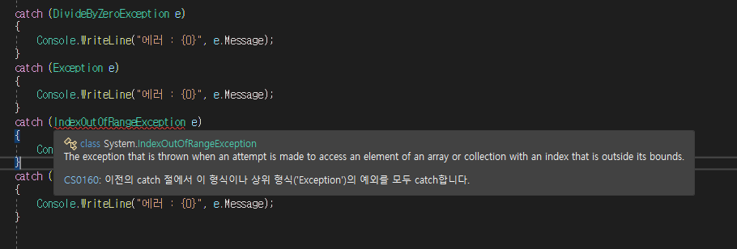
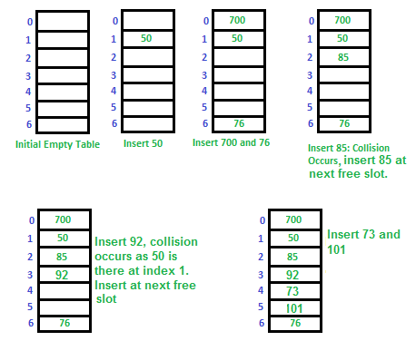

## 4번째 스터디 이후 정리
----------------

<br />

### catch 순서 뒤죽박죽해서 확인

```csharp
class Program
{
    class A
    {
        public int field;
        public static int getField(A obj)
        {
            return obj.field;
        }
    }

    static void Main(string[] args)
    {
        try
        {
            // DivideByZeroException
            int a = 10;
            int b = 0;
            Console.WriteLine(a / b);

            // NullReferenceException
            A obj = null;
            Console.WriteLine(A.getField(obj));

            // IndexOutOfRangeException            
            int[] arr = { 1, 2, 3 };
            for (int i = 0; i < 4; i++)
            {
                Console.WriteLine(arr[i]);
            }
        }

        catch (DivideByZeroException e)
        {
            Console.WriteLine("에러 : {0}", e.Message);
        }
        catch (Exception e)
        {
            Console.WriteLine("에러 : {0}", e.Message);
        }
        catch (IndexOutOfRangeException e)
        {
            Console.WriteLine("에러 : {0}", e.Message);
        }
        catch (NullReferenceException e)
        {
            Console.WriteLine("에러 : {0}", e.Message);
        }
        finally
        {
            Console.WriteLine("프로그램 종료");
        }
    }
}
```

`Output`




<br />

### 배열에 대한 시간복잡도 => 해싱과 비교

<br />

#### 배열

- `배열(array)`은 연관된 데이터를 모아서 한 번에 관리하기 위해 사용하는 데이터 타입
- 배열은 논리적인 저장순서와 물리적인 저장순서가 일치
- 따라서 `인덱스(index)`를 사용하여 해당 원소에 접근할 수가 있다.
- 인덱스를 알고 있다면 각각의 원소를 바로 찾아갈 수 있게 되므로 원소를 찾는데 걸리는 시간복잡도는 `O(1)` 이라고 볼 수 있고, 이를 `임의 접근(random access)이 가능`하다고 말한다.

- 반면에 새로운 데이터를 삭제하거나 삽입을 하게 되면 조금 복잡해진다.
- 삭제의 경우 먼저 해당 원소에 접근을 해서 작업을 완료하는데 `(O(1))`, 이 상태는 배열의 연속적인 특성이 깨지게 된다. 
- 따라서 이러한 빈 공간을 메꿔주기 위해서 삭제한 원소보다 더 큰 인덱스를 갖는 원소들을 shift 해주어야 하며, 이 때 비용이 발생하고 결과적으로 시간복잡도는 `O(n)`이 된다. 삽입의 경우도 비슷하게 생각해 볼 수 있다.

- 또한 메모리 주소가 연속되야 하기 때문에, 배열의 크기를 늘리는 것은 불가능하다.
- 만약 배열의 크기를 늘려야 할 필요가 있다면, 크기가 큰 배열을 만들어서 `기존 내용을 복사`하거나, `연결 리스트(LinkedList)`를 사용하는 방법을 생각해 보아야 한다.

<br />

#### 해시테이블

- `해시테이블(HashTable)`은 해시 함수를 사용하여 키를 해시값으로 매핑하고, 이 해시값을 인덱스 혹은 주소로 삼아서 데이터의 값을 키와 함께 저장하는 자료구조이다. 

<br />

- `해시 함수`란 데이터의 효율적 관리를 목적으로 임의의 길이 데이터를 고정된 길이 데이터로 매핑하는 함수이다.
- 이 때 매핑 전 원래 데이터 값을 `키(key)`, 매핑 후 데이터 값을 `해시값(hash value)`, 매핑하는 과정 자체를 `해싱(hashing)`이라고 한다. 
- 이와 같이 해싱을 하게 되면, 적은 리소스를 가지고 많은 데이터를 효율적으로 관리할 수 있게 된다. 
  - 예를 들면 해시 함수를 통해 하드디스크나 클라우드에 존재하는 무한에 가까운 데이터(키)들을 유한한 개수의 해시값으로 매핑함으로써 작은 크기의 캐쉬 메모리로 프로세스를 관리할 수 있다.
- `해시 함수`는 언제나 동일한 해시값을 리턴하고, 인덱스만 알면 해시 테이블이 아무리 커도 데이터에 빠르게 접근할 수 있다.(배열과 유사) 
- 따라서 데이터에 접근하는 경우 시간복잡도는 `O(1)`을 지향하는 상수에 가까운 값이 나오게 된다. 
- `배열`의 경우 탐색시 시간복잡도는 `O(1)`이지만, `메모리를 미리 많이 할당해 두어야 하기 때문에 공간효율적이라고 보기가 어렵다.`

- 이런 해시 테이블에도 단점이 있는데, 바로 해시 함수가 서로 다른 두 개의 키에 대해 동일한 해시값을 나타내는 `충돌(collision)현상`이 일어난다는 것이다. 
- 보통 해시 테이블을 사용하면, *** 해시 테이블의 크기(m)가 실제 사용하는 키 개수(n)보다 적어야 하는데(메모리 리소스 문제 등), 이 때 `n/m`을 `load factor(α)`라고 부른다. `load factor`가 클 수록 해시 충돌 문제가 발생할 가능성이 높아진다.

<br />

- `충돌 문제를 해결하기 위해 나온 방법`들이 여러가지가 있는데, 대표적인 두 가지 아이디어는 `분리 연결법(seperate chaining)`과 `개방 주소법(open addressing)`이다. 

<span align="center">


[Serparate_Chaining](출처 : ratsgo 깃헙 블로그)

</span>


- 먼저 `분리 연결법`을 살펴보면 하나의 버킷당 들어갈 수 있는 엔트리의 수에 제한을 두지 않음으로서, 모든 자료를 해시테이블에 담는 것이다. 해당 버킷에 이미 데이터가 있다면 연결 리스트 방식을 사용하여 노드와 노드를 체인처럼 연결한다는 의미에서 chaining이라는 용어가 붙은 것으로 보인다. 이 방법의 장점은 유연하며, 삭제 및 삽입의 시간복잡도가 `O(1)`으로 빠르다는 점이 있다. 반면, 단점은 연결 리스트 자체의 제한이 없다보니 오버헤드가 부담이 되고 메모리 문제를 야기할 수 있다는 점이다.

:::tip
오버헤드(overhead)는 어떤 처리를 하기 위해 들어가는 간접적인 처리 시간 · 메모리 등을 말한다.
:::

<br />


<span align="center">



[Open_Addressing](출처 : ratsgo 깃헙 블로그)

</span>

- `개방 주소법`은 한 버킷당 들어갈 수 있는 엔트리가 하나뿐인 해시 테이블이다.
- 해시함수로 얻은 주소가 아닌, 다른 주소에 데이터를 저장할 수 있도록 허용한다는 취지에서 `open addressing`이라는 이름이 붙은 것으로 보인다. 
- 이 방법의 경우, 해시 충돌이 발생하면 (삽입하려는 해시 버킷이 이미 사용중인 경우) 다른 해시 버킷에 해당 자료를 삽입한다.
- 이 때 다른 해시 버킷을 찾는 탐사 과정을 `probing`이라고 한다. 
- 분리 연결법의 장점은 캐시 효율이 높고 메모리 문제가 발생할 가능성은 적지만, 해시 충돌이 발생할 가능성이 분리 연결법에 비해서 높으며 특정 해시값이 키가 몰리게 되면 효율성이 급격하게 떨어진다는 단점이 있다.

[참고 => https://devowen.com/209](https://devowen.com/209) 

<br />

### 기존 인덱서 코드에서 `Resize`를 할때 `ref` 키워드사용
- `ref` 키워드를 통해 중간에서 배열을 복사하는 메모리 낭비를 줄이고자 사용을 했지만 유지보수 측면에서 어떤것이 인자로 들어와 어떤것이 나가는지 확인이 어렵기 때문에 유지보수상 좋지 않다. 따라서 정적시험에서는 `ref`키워드를 사용하지 않도록 할것! => 매뉴얼에서도 그렇게 나와 있다고 하심.

<br />


### for{...} 내부 변수 선언 - 스코프 관련

<br />

### 코드 중간에 같은 이름의 매개변수를 활용할 시 `{}` 를 잘 활용하면 편할 수 있다.

<br />

### 박싱 & 언박싱

<br />

### Conqurent Queue

<br />


```csharp
public class ConcurrentQueue<T> : System.Collections.Concurrent.IProducerConsumerCollection<T>, System.Collections.Generic.IEnumerable<T>, System.Collections.Generic.IReadOnlyCollection<T>, System.Collections.ICollection
```
- 스레드로부터 안전한 FIFO(선입선출) 방식의 컬렉션이다.

<br />

##### 사용 예제 코드

```csharp
using System;
using System.Collections.Concurrent;
using System.Threading;
using System.Threading.Tasks;

class CQ_EnqueueDequeuePeek
{
   // Demonstrates:
   // ConcurrentQueue<T>.Enqueue()
   // ConcurrentQueue<T>.TryPeek()
   // ConcurrentQueue<T>.TryDequeue()
   static void Main ()
   {
      // Construct a ConcurrentQueue.
      ConcurrentQueue<int> cq = new ConcurrentQueue<int>();

      // Populate the queue.
      for (int i = 0; i < 10000; i++)
      {
          cq.Enqueue(i);
      }

      // Peek at the first element.
      int result;
      if (!cq.TryPeek(out result))
      {
         Console.WriteLine("CQ: TryPeek failed when it should have succeeded");
      }
      else if (result != 0)
      {
         Console.WriteLine("CQ: Expected TryPeek result of 0, got {0}", result);
      }

      int outerSum = 0;
      // An action to consume the ConcurrentQueue.
      Action action = () =>
      {
         int localSum = 0;
         int localValue;
         while (cq.TryDequeue(out localValue)) localSum += localValue;
         Interlocked.Add(ref outerSum, localSum);
      };

      // Start 4 concurrent consuming actions.
      Parallel.Invoke(action, action, action, action);

      Console.WriteLine("outerSum = {0}, should be 49995000", outerSum);
   }
}
```

<br />

### 나중에 스레드 & 태스크에서 책에 오류가 있다. 예제를 통해 학습한 뒤 에러를 잡아보자  

<br />

### yield 키워드를 사용했을때 Interface를 구현하지 않아도 되는이유에 대해서..
- `Program Counter(PC)` 개념이 들어가는 것 같은데 한번 찾아보자
- 반환 형식이 `IEnumerable` , `IEnumerable<T>` , `IEnumerator` 또는 `IEnumerator<T`> 메서드에 `yield` 키워드를 넣으면 반환 형식 ( `IEnumerable` 또는 `IEnumerator` )의 구현을 생성하도록 컴파일러에 지시한다. 

- `yield` 키워드는 이론적으로 무제한 시퀀스의 `"다음"`요소를 반환하려는 경우에 유용하므로 사전에 전체 시퀀스를 계산할 수 없거나 반환하기 전에 전체 값 시퀀스를 계산할 경우 사용자에게 바람직하지 않은 일시 중지가 발생할 수 있다.

- `yield break` 는 또한 언제든지 서열을 종결하는데 사용될 수 있다.

- `yield` 키워드는 `IEnumerable<T>` 와 같은 반환 유형으로 반복기 인터페이스 유형을 요구하기 때문에 `Task<IEnumerable<T>>` 객체를 반환하므로 비동기 메서드에서는 이를 사용할 수 없다.
