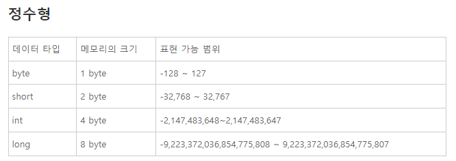
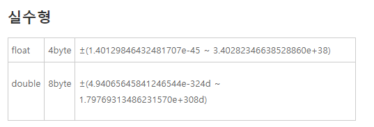
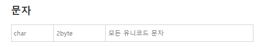
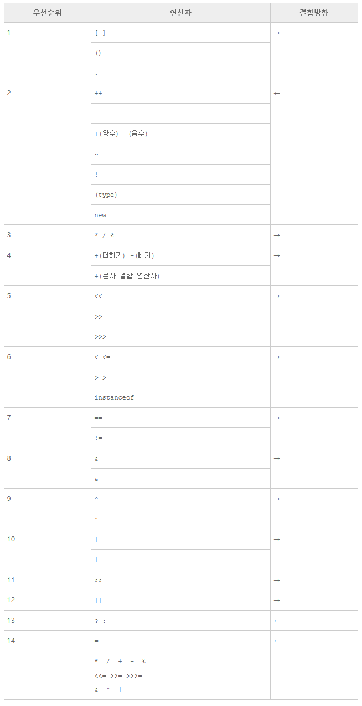

### 이클립스의 기능과 사용법

package explorer => 프로젝트를 관리하는 부분
outline => 소스코드 내에서 문법적인 요소들을 시각화하여 어떤 명령어, 어떤 요소들로 프로그램이 구성되어 있는지 보여주고, 필요한 것을 빠르게 찾을 수 있는 기능을 제공
Problem => 프로그램 내 문제점들을 나타냄
Console => 출력된 결과를 나타냄
Debug => 디버깅을 할때 효율적으로 뷰들을 배치한것
Debugger => 버그를 잡을때 도움을 주는 도구들 

- 우리가 작성한 코드는 .java 확장자를 가지고 src 폴더에 저장이되고, 이후 eclipse에 의해 컴파일된 binary 코드는 bin 폴더에 저장이 된다. 즉, 소스와 애플리케이션(실행파일)이 분산되어 저장되는 형태이다.

- package 명에서의 `.` 은 디렉토리를 구분하는데 사용할 수 있다. => 즉, 패키지는 디렉토리와 밀접한 관련이 있음.

- eclipse에서 코드를 작성한 후 저장하면 eclipse에 의해 컴파일 후 bin폴더 하위 해당하는 디렉토리에 .class 확장자를 가진 파일이 생겨난다. (즉, 저장하기만하면 알아서 컴파일 후 실행파일을 생성) => 그래서 작성중인 코드를 저장하지 않고 실행하면 이전 코드가 실행되는 거였군..

---

### 숫자와 문자열

- 특수문자 사용시 `\` 이스케이프 문자 사용 
- 문자열 연결시 + 연산자 사용 가능 .

---

### 변수 (Variable)

강의 등장 데이터 타입 : 
- int
- double
- String


- 정적 타입 언어이기 때문에 변수 선언시 타입을 명시해야함 
- double은 int형을 포함할 수 있다. 그러면 int형은 왜 쓸까? 만일 실수를 사용하지 않는 경우 정수만 필요로하는데 데이터 타입을 미리 정의함으로써 메모리낭비를 줄일 수 있고, 타 개발자와 개발함에 있어 타입을 명시하는 것은 서로의 혼동을 줄일 수 있기에 이러한 면에서는 정적타입언어의 장점을 확인할 수 있다.
- 변수는 왜 사용할까? => 변수는 코드의 재활용성을 높여준다. 즉 변수로 선언하여 코드를 작성하다보면 변수의 값이 변하길 원할때 기존 선언한 변수의 값을 수정해주면 끝난다. 만일 변수를 사용하지 않고 값을 사용했다면 해당하는 값들을 모두 수정해야하면서 식별자도 없는 값을 구별하고 판단하기는 어렵기에 변수를 사용한다. 즉, 수정해야할 코드가 적다는 것은 그만큼 해야할 일이 줄어든다는 의미이고, 그 과정에서 버그가 발생할 가능성을 낮춰주기도 한다. 

---

### 주석과 세미콜론
- 기존에 주석에 대한 내용은 알잖아? 모르는 것만 짚어 

#### JavaDoc 주석
- `/**` 의 형태로 시작하는 주석은 JavaDoc 주석이라고해서 자바의 문서를 만들때사용한다. 

<br />

#### 세미콜론
- 세미콜론(;)은 문장(statement)의 끝을 의미한다. 자바에서는 문장의 끝에 세미콜론을 사용하지 않으면 컴파일 에러가 발생한다.

- 세미콜론을 이용하면 여러개의 문장을 한줄에 표현할 수 있다.

---

### 데이터 타입

1byte = 8bit

<span align='center'>


[출처] : https://opentutorials.org/course/1335/5375

</span>

- 각각의 타입에는 범위가 존재하고 표현할 수 있는 경우에 대해 한정된 경우에 맞추어 효율적으로 할 수도 있다.
- 모르겠다면 그냥 int형 써라

<span align='center'>


[출처] : https://opentutorials.org/course/1335/5375

</span>

- 실수형에도 존재하는데 float보다는 double형이 표현범위가 더 크다.

<span align='center'>


[출처] : https://opentutorials.org/course/1335/5375

</span>

- 문자형은 char형이 2byte의 크기를 가진다. (2byte = 16bit)

<br />

- 결과적으로 각각의 타입은 저마다의 메모리 크기를 가진다. 사용하고자 하는 데이터의 범위에 맞추어 적절한 메모리크기를 할당한다면 효율적으로 프로그래밍을 할 수 있을 것이다.

---

### 상수의 데이터 타입

- 변수는 변하는 값을 의미한다. 그 대척점에 있는 것이 `상수(constant)`인데 상수란 변하지 않는 값을 의미한다. 즉, 변경할 수 없는 데이터 타입을 `상수`라고 한다.

```java

float num = 2.2; 
// 에러발생 => 실수는 기본적으로 데이터타입이 double이기 때문에 f를 붙여 명시적으로 float형임을 알려줘야한다.

long num = 2147583648; 
// 에러발생 => 정수는 기본적으로 데이터타입이 int형이기 때문에 L를 붙여 명시적으로 long형임을 알려줘야한다.

byte num = 100; 
// 에러가 발생하지 않음 기본적으로 int형이지만 byte와 short 의 데이터 범위내에서 명시적으로 변환해주지 않더라도 에러가 발생하지 않는다. 

//에러 발생한 코드를 수정해보면

float num = 2.2F; // 2.2
long num = 2147583648L;  // 2147583648

```

- 오랜만에 보는 것이니 기억해두자..ㅇㅇ

--- 

### 형변환

- `형변환`이란 데이터의 타입을 변경하는 것이다.
- 200과 200.0은 bit로 표현한다면 전혀 다른 비트로 표현하게 된다. 
- 이처럼 정수와 실수 같이 서로 다른 데이터 타입을 변환하려면 `형변환`이 필요하다.

<br />

#### 자동 형변환  
- `자동형변환`은 말그대로 자동으로 형을 변환해주는 작업

```java
double a = 3.0f; // 이 경우 float타입에서 double형으로 형변환이 일어난다.
```

- 위의 코드가 정상적으로 작동하는 이유는 double타입이 float 타입보다 더 많은 수를 표현할 수 있기 때문이다.
- 타입을 변경해도 정보의 손실이 일어나지 않는 경우에는 `자동 형 변환`이 일어난다.

```java
float a = 3.0; // 에러발생
```

- 반대로 위의 예제는 오류가 발생한다. 상수 3.0은 상수인데, 이 상수는 double형이다. 이 값을 표현 범위가 더 좁은 `float`형에 넣으려고 하기 때문에 오류가 발생한다. 

- 즉, `자동 형 변환`의 원칙은 표현범위가 좁은 데이터 타입에서 넓은 데이터 타입으로의 변환만 허용된다는 것이다.

<span align="center">


[출처] : https://opentutorials.org/course/1335/5330

</span>

- 위의 경우 `char`의 경우 `int`로 형변환을 할 수 있는데 해당 문자의 `유니코드 값`으로 형변환 된다.

<br />

#### 명시적 형 변환
- 자동 형 변환이 적용되지 않는 경우 수동으로 형 변환을 해주어야 한다. 이를 `명시적 형변환`이라고 한다.

```java
// 에러 발생 코드
float a = 100.0;
int b = 100.0F;

// 에러 수정 코드
float a = (float)100.0;
int b = (int)100.0F;
```

- 위와 같이 `()` 내에 데이터 타입을 지정해서 값 앞에 위치시키는 것을 `명시적인 형 변환`이라고 한다.

---

### 연산자

- `연산자` => 특정한 작업을 위해 사용하는 기호

<br />

#### 산술 연산자

- `산술연산자`는 수학적인 계산에 사용되는 연산자이다.
- `+`, `-`, `*`, `/`, `%` 등의 산술 연산자가 있다.
  - 특히 `+`연산자는 문자열을 합칠때에도 사용하는 것은 `python`랑 비슷하다.

<br />

#### 연산자와 형변환

```java
int a = 10;
int b = 3;

float c = 10.0F;
float d = 3.0F;

System.out.println(a/b);
System.out.println(c/d);
System.out.println(a/d);
```
```java
Output

3
3.3333333
3.3333333
```

- 위와 같이 정수와 정수 연산은 정수를 뱉고, 실수와 실수연산은 실수를 뱉는다.
- 정수간 연산에서는 정수로 표현되어 소수점의 값들은 버리고 출력되는것 또한 확인할 수 있다.
- 3번째 출력문의 경우 정수를 실수로 나누었을때 암시적으로 형 변환이 일어나기 때문에 정수가 실수가 된다.

<br />

#### 단항 연산자

- 단항 연산자는 피연산자가 하나로 이루어지는 연산자이다.

|종류|의미|
|---|---|
|+|양수를 표현한다. 실제로 거의 사용되지 않는다.|
|-|음수를 표현한다.|
|++|증가 연산자로 항의 값을 1씩 증가시킨다.|
|--|감소 연산자로 항의 값을 1씩 감소시킨다.|

<br />

---

#### 연산의 우선순위
- 연산자의 우선순위를 외우지 않아도 된다. 다만, 헷갈리는 경우에는 표를 참고하자 


<span align="center">


[출처] : https://opentutorials.org/course/1335/5330

</span>

---

### 비교와 Boolean

- `==` : 동등 비교 연산자
- `!=` , `>`, `>=` => 다 알잖아?
- `.equals()` 메소드는 문자열간 비교를 할때 사용된다. 옛날에 코테풀다가 이거 몰라서 엄청 고생했던 기억에 머릿속에 박혀있다. 경험에 감사한다.

---
### 조건문
- `if`, `else if`, `else` 지겹도록 해왔다. 상기시키는 용도로 강의를 듣자.

#### 조건문의 중첩
#### 다양한 제어문
이미 체득했다.


#### switch문 

```java
 switch(4){
        case 1:
            System.out.println("one");
            break;
        case 2:
            System.out.println("two");
            break;
        case 3:
            System.out.println("three");
            break;
        default:
            System.out.println("default");
            break;
        }
```
- `case`에는 `break` 문이 붙어야 다음 케이스를 실행하지 않는다.
- 일치하는 `case`가 없다면 `default`문을 실행한다.

---

### 논리 연산자

|종류|의미|
|:--:|:--:|
|&&| `and` 연산 : 두값이 참일때 참|
|\|\||`or` 연산 : 하나라도 참일때 참 |
|!| `not` 연산 : 기존 값의 부정|


---

### 반복문

#### while문
#### for문
#### 중첩 for문
#### 반복문 제어 => break, continue 
진짜 제일 많이 사용했다. 상시시키자.

---

### 배열

- `배열` : 연관된 데이터(같은 타입의 데이터)를 모아서 관리하기 위한 자료구조.

```java
String[] classGroup = new String[4];
```
- 위와 같이 선언
- `for`문을 통해 순회할 수 있다.

#### for-each문

```java
package org.opentutorials.javatutorials.array;
 
public class ForeachDemo {
 
    public static void main(String[] args) {
        String[] members = { "최진혁", "최유빈", "한이람" };
        for (String e : members) {
            System.out.println(e + "이 상담을 받았습니다");
        }
    }
}
```

- `members` 내의 `String` 타입인 `e(원소들)`을 뽑아 for문 내에서 사용한다.(위와 같이)
- JS, Python에서 사용해 왔잖아 
- 사용 형태만 알아두자.

#### 자주 발생하는 에러
- 강의에서는 `ArrayIndexOutOfBoundsException`에러를 보여준다. 많이 경험했으니 참고만하자.

#### 배열의 한계
- 배열은 초기화할 때 그 크기가 정해진다. 그래서 정해진 크기 이상의 값을 넣을 수 없다.물론 방법이 있다. 자바에는 컬렉션 Collection이라는 기능이 있다. Container라고도 부르는 이 기능을 이용하면 JavaScript의 배열과 같이 유연하게 배열을 사용할 수 있다.
- 다른 자료구조를 사용할 수 있다는 말이지 뭐


--- 

### 메소드(method)

- `메소드`를 활용하는 것의 가장 큰 가치는 `코드(즉, 같은 로직)의 재활용`에 있다.
- `매개변수(parameter)` : 함수에 명시된 입력을 담당하는 변수
- `인자(argument)` : 함수호출시 넘겨주는 값


---

### 입력과 출력
- 