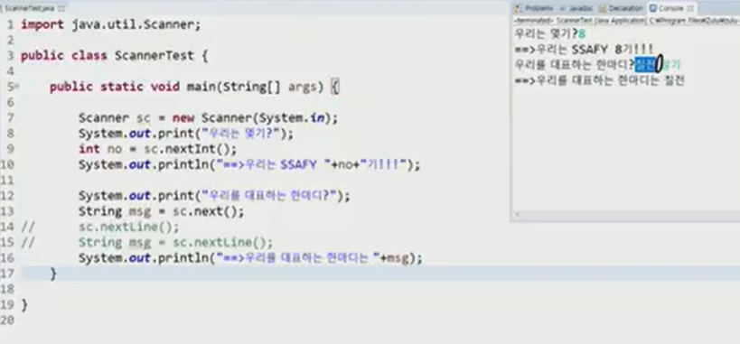
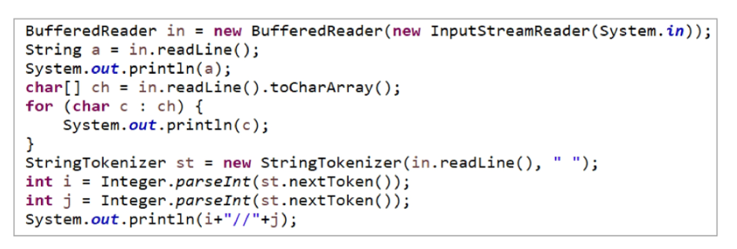
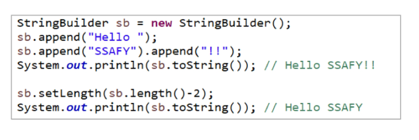
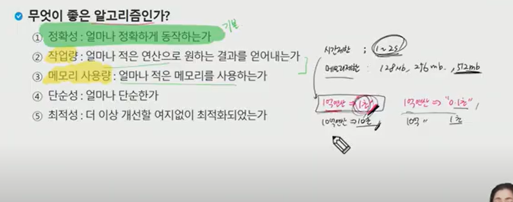
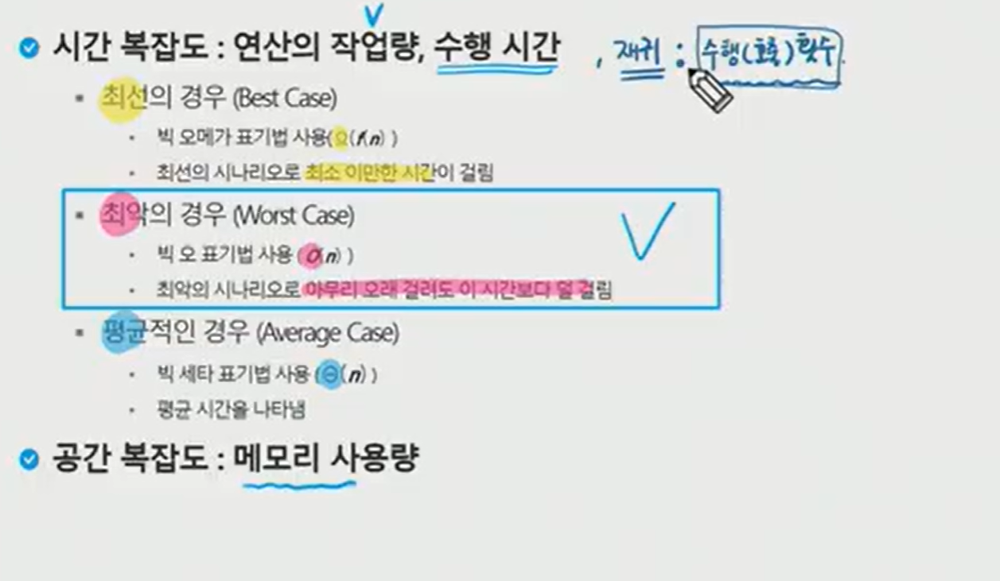
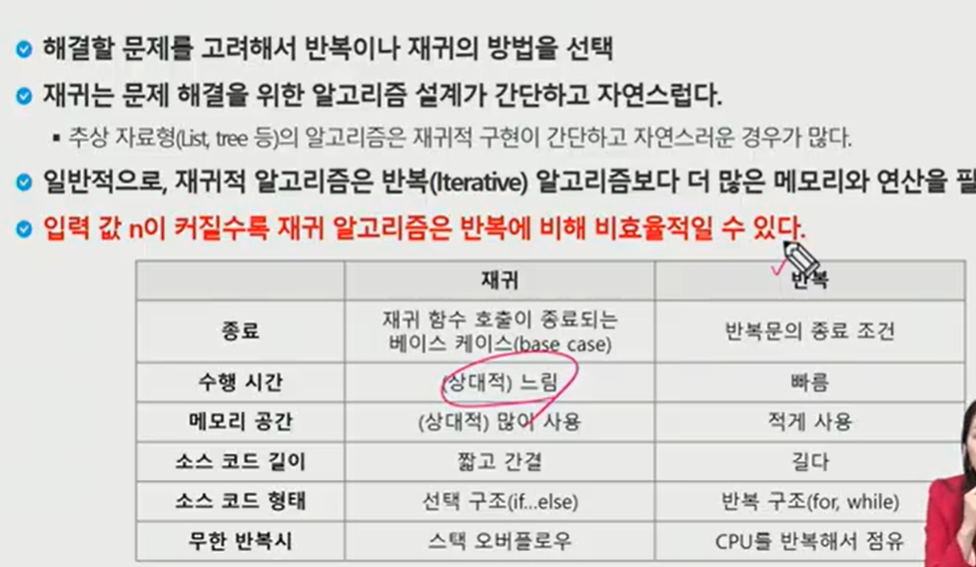

## 08/01 기록 - 알고리즘1

--- 

 

### 표준 입출력

 

#### 표준 입출력
- System.in
- System.out
- System.err

 

#### 표준 입출력의 대상변경
- System.setOut()
- System.setErr()
- System.setIn()

 

#### Scanner 
- 파일, 입력 스트림등에서 데이터를 읽어 구분자로 토큰화하고 다양한 타입으로 형현환하여 리턴해주는 클래스
- Scanner(File source)
- Scanner(InputStream source)
- Scanner(String source)
- 입력 스트림을 다루는 방법을 몰라도 손쉽게 입력처리 가능
- 데이터 형변환으로 인한 편리함
- 대량의 데이터 처리 시 수행시간이 비효율적임

 

|메소드 명|특징|
|:--:|:--|
|nextInt()|int 타입 반환 유효 문자열 후 White space 문자를 만나면 처리|
|nextDouble()|double 타입 반환 유효 문자열 후 White space 문자를 만나면 처리|
|next()|문자열 반환 유효 문자열 후 White space 문자를 만나면 처리|
|nextLine()|문자열 반환  개행(Enter) 문자를 만나면 처리  next()와 달리 문자열 안에 띄어쓰기를 할 수 있음(space, tab을 포함할 수 있다.)|

-`next()`의 경우 ` (띄어쓰기)`가 공백이 구분자가 되어 `칠전`만 결과에 출력된다.

 

#### BufferedReader
- 필터 스트림 유형
- 줄(line)단위로 문자열 처리기능제공 => readLine()
- 대량의 데이터 처리 시 수행시간이 효율적임

 

#### StringBuilder

- 문자열의 조작을 지원하는 클래스
- 자바에서 상수로 취급되는 문자열을 조작 시마다 새로운 문자열이 생성되는 것을 방지해줌
- append()
- toString()

 

#### 보통 1억번연산에 1초라고 생각하면된다.

 

#### 메모리 사용량 및 시간 복잡도 관련

 

#### 재귀함수(Recursive Function)
- 함수 내부에서 직접 혹은 간접적으로 자기 자신을 호출하는 함수
- 일반적으로 재귀적 정의를 이용해서 재귀 함수를 구현한다.
- 따라서, 기본 부분(basic part)와 유도 부분(inductive part)로 구성된다.
- 재귀적 프로그램을 작성하는 것은 반복 구조에 비해 간결하고 이해하기 쉽다.
- 함수 호출은 프로그램 메모리 구조에서 스택을 사용한다.
- 따라서 재귀 호출은 반복적인 스택의 사용을 의미하며 메모리 및 속도에서 성능저하가 발생한다.

 

##### 강사님 정리

1. 함수에 대한 정의를 명확히 해라(what)
2. 평평하게 로직을 바라보기
3. 각 재귀의 실행을 결정하는 결정적인 값은 매개변수로 선언!

##### 하노이탑 문제 풀이해보기