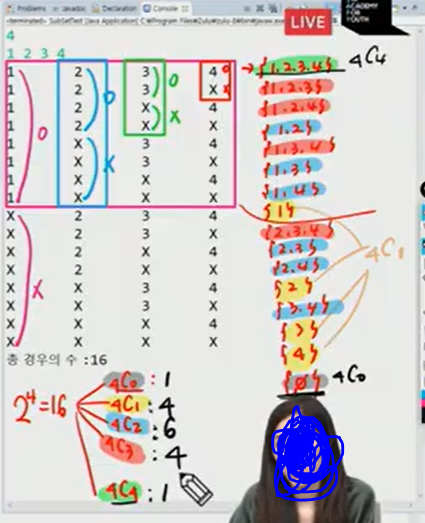

## 0804 내용 기록 - 슨열, 조합, 부분집합 part 1

---

<br />

### 순열 
- 서로 다른 것들 중 몇개를 뽑아서 한 줄로 나열한 것
- 서로 다른 n개 중 r개를 택하는 순열은 아래와 같이 표현한다. 

```java
nPr

nPr = n * (n-1) * (n-2) * ... * (n - r + 1)

nPn = n! 이라고 표기하며 Factorial 이라 부른다.

n! = n * (n-1) * (n-2) * ... 2 * 1
```

- 순열의 크기가 고정되어있을땐 반복문으로도 구현할 수 있다.
- 순열의 크기가 고정되어 있지 않다면 재귀로 구현할 수 있다.


#### nPn 의 경우 예제 코드
```java
package day0804;

import java.util.Arrays;
import java.util.Scanner;

public class PermutationTest {

	static int N, totalCount;
	static int[] numbers;
	static boolean[] isSelected;

	// nPn : 1부터 n까지의 수중 n개를 모두 뽑아 순서대로 나열한 것.
	public static void main(String[] args) {
		Scanner sc = new Scanner(System.in);
		N = sc.nextInt();
		numbers = new int[N];
		isSelected = new boolean[N+1];	// 수가 1부터 시작해서 인덱스도 1부터 논리적으로 매칭해서 사용

		permutation(0);

	}

	private static void permutation(int cnt){ //cnt : 직전까지 뽑은 순열에 포함된 수의 개수, cnt + 1 번째에 해당하는 순열에 포함될 수를 뽑기
		if(cnt == N) {
			totalCount++;
			System.out.println(Arrays.toString(numbers));
			return;
		}
		
		// 가능한 모든 수에 대해 시도
		for(int i = 1; i<=N; i++) {
			// 시도하는 수가 선택 되었는지 체크
			if(isSelected[i] == true) continue;
			
			// 선택되지 않았다면 수를 사용 
			numbers[cnt] = i;
			isSelected[i] = true;
			
			// 다음수 뽑으러 가기
			permutation(cnt+1);
			
			// 뽑으러 갔다가 돌아오면 사용했던 수에 대한 선택을 되돌려 놓기
			isSelected[i] = false;
		}
	}
}
```
```java
3 // Input

Output

[1, 2, 3]
[1, 3, 2]
[2, 1, 3]
[2, 3, 1]
[3, 1, 2]
[3, 2, 1]
```

<br />

#### nPr 의 경우 고정된 순열에서 뽑는 경우 예제 코드

```java
package day0804;

import java.util.Arrays;
import java.util.Scanner;

public class PermutationTest {

	static int N, R, totalCount;
	static int[] numbers;
	static boolean[] isSelected;

	// nPn : 1부터 n까지의 수중 n개를 모두 뽑아 순서대로 나열한 것.
	// nPr : 1부터 n까지의 수중 r개를 모두 뽑아 순서대로 나열한 것.(1 <= r <= n)
	public static void main(String[] args) {
		Scanner sc = new Scanner(System.in);
		N = sc.nextInt();
		R = sc.nextInt();
		numbers = new int[R];
		isSelected = new boolean[N+1];	// 수가 1부터 시작해서 인덱스도 1부터 논리적으로 매칭해서 사용

		permutation(0);

	}

	private static void permutation(int cnt){ //cnt : 직전까지 뽑은 순열에 포함된 수의 개수, cnt + 1 번째에 해당하는 순열에 포함될 수를 뽑기
		if(cnt == R) {
			totalCount++;
			System.out.println(Arrays.toString(numbers));
			return;
		}
		
		// 가능한 모든 수에 대해 시도
		for(int i = 1; i<=N; i++) {
			// 시도하는 수가 선택 되었는지 체크
			// isSelected를 설정한 시점에는 해당하는 재귀함수 호출만을 돌고 있다.
			if(isSelected[i] == true) continue;
			
			// 선택되지 않았다면 수를 사용 
			numbers[cnt] = i;
			isSelected[i] = true;
			
			// 다음수 뽑으러 가기
			permutation(cnt+1);
			
			// 뽑으러 갔다가 돌아오면 사용했던 수에 대한 선택을 되돌려 놓기
			isSelected[i] = false;
		}
	}
}
```
```java
5 // N
3 // R

Output

[1, 2, 3]
[1, 2, 4]
[1, 2, 5]
[1, 3, 2]
[1, 3, 4]
[1, 3, 5]
[1, 4, 2]
[1, 4, 3]
[1, 4, 5]
[1, 5, 2]
[1, 5, 3]
[1, 5, 4]
[2, 1, 3]
[2, 1, 4]
[2, 1, 5]
[2, 3, 1]
[2, 3, 4]
[2, 3, 5]
[2, 4, 1]
[2, 4, 3]
[2, 4, 5]
[2, 5, 1]
[2, 5, 3]
[2, 5, 4]
[3, 1, 2]
[3, 1, 4]
[3, 1, 5]
[3, 2, 1]
[3, 2, 4]
[3, 2, 5]
[3, 4, 1]
[3, 4, 2]
[3, 4, 5]
[3, 5, 1]
[3, 5, 2]
[3, 5, 4]
[4, 1, 2]
[4, 1, 3]
[4, 1, 5]
[4, 2, 1]
[4, 2, 3]
[4, 2, 5]
[4, 3, 1]
[4, 3, 2]
[4, 3, 5]
[4, 5, 1]
[4, 5, 2]
[4, 5, 3]
[5, 1, 2]
[5, 1, 3]
[5, 1, 4]
[5, 2, 1]
[5, 2, 3]
[5, 2, 4]
[5, 3, 1]
[5, 3, 2]
[5, 3, 4]
[5, 4, 1]
[5, 4, 2]
[5, 4, 3]
```

- 앞서 나온 순열들의 경우 시간복잡도가 `O(n!)` 이기 때문에 보통 n의 값은 11이상 나오는 경우가 거의 없다. 
- 문제를 풀때 이 문제가 순열로 풀이하는 문제가 맞다면 n 의 크기를 보고 잘 결정하자.
- 만일 n의 크기가 11 정도를 넘어간다면 순열로 풀이하는 것이 아닌 다른 아이디어를 생각해보자.

<br />

#### nPr => 입력받은 n 개의 수 중 r개를 뽑는 경우의 수

```java
package day0804;

import java.util.Arrays;
import java.util.Scanner;

public class PermutationTest2 {

	static int N, R, totalCount;
	static int[] numbers, input;
	static boolean[] isSelected;

	// nPn : n개의 입력 받은 수 중 n개를 모두 뽑아 순서대로 나열한 것. (입력받는 수가 1 ~ 100,000)
	// nPr : n개의 입력 받은 수 중 r개를 모두 뽑아 순서대로 나열한 것.(1 <= r <= n)
	public static void main(String[] args) {
		Scanner sc = new Scanner(System.in);
		N = sc.nextInt();
		R = sc.nextInt();
		numbers = new int[R];
		input = new int[N];
		isSelected = new boolean[N];	// 수가 1부터 시작해서 인덱스도 1부터 논리적으로 매칭해서 사용

		for(int i = 0; i < N; i++) {
			input[i] = sc.nextInt();
		}
		
		permutation(0);
		System.out.println("총 경우의 수 " + totalCount);

	}

	private static void permutation(int cnt){ //cnt : 직전까지 뽑은 순열에 포함된 수의 개수, cnt + 1 번째에 해당하는 순열에 포함될 수를 뽑기
		if(cnt == R) {
			totalCount++;
			System.out.println(Arrays.toString(numbers));
			return;
		}
		
		// 가능한 모든 수에 대해 시도(input배열의 모든 수 시도)
		for(int i = 0; i < N; i++) {
			// 시도하는 수가 선택 되었는지 체크
			// isSelected를 설정한 시점에는 해당하는 재귀함수 호출만을 돌고 있다.
			if(isSelected[i]) continue;
			
			// 선택되지 않았다면 수를 사용 
			numbers[cnt] = input[i];
			isSelected[i] = true;
			
			// 다음수 뽑으러 가기
			permutation(cnt+1);
			
			// 뽑으러 갔다가 돌아오면 사용했던 수에 대한 선택을 되돌려 놓기
			isSelected[i] = false;
		}
	}
}
```
```java
Output

3 1 
2 4 6
[2]
[4]
[6]
총 경우의 수 3
```

<br />

### 조합(Comblination)

- 조합의 수식

```java

nCr = n! / (n-r)!r! , (n >= r)

nCr = n-1Cr-1 + n-1Cr => 재귀적 표현

nC0 = 1
```

#### 조합 구현 코드

```java
package day0804;

import java.util.Arrays;
import java.util.Scanner;

public class CombinationTest {
	
	static int N, R, totalCnt;
	static int[] numbers, input;
	public static void main(String[] args) {
		Scanner sc = new Scanner(System.in);
		N = sc.nextInt();
		R = sc.nextInt();
		totalCnt = 0;
		
		input = new int[N];
		numbers = new int[R];
		
		for(int i = 0; i < N; i++) {
			input[i] = sc.nextInt();
		}
		
		combination(0, 0);
		
		System.out.println("총 경우의 수 : " + totalCnt);
		
	}
	
	private static void combination(int cnt, int start) {
		if (cnt == R) {
			totalCnt++;
			System.out.println(Arrays.toString(numbers));
			return;
		}else {
			// 가능한 모든 수에 대해 시도(input 배열의 가능한 수 시도)
			
			// start 부터 처리시 중복 수 추출 방지 및 순서가 다른 조합 추출 방지
			
			for(int i = start; i < N; i++) {
				// start 위치부터 처리했으므로 중복체크 필요없음!!!
				
				// 앞쪽에서 선택되지 않았다면 수를 사용
				numbers[cnt] = input[i];
				// 다음수 뽑으러 가기
				combination(cnt+1, i+1);
				
			}
		}
	}
}
```

```java
Input

3 2
2 4 6

Output

[2, 4]
[2, 6]
[4, 6]
총 경우의 수 : 3
```

#### 중복 순열, 순열 , 중복 조합, 조합 예제 코드

```java
package day0804;

import java.util.Arrays;
import java.util.Scanner;

public class Ex_DicceTest {

	static int N, totalCnt;
	static int[] numbers;
	static boolean[] isSelected;
	public static void main(String[] args) {
		Scanner sc = new Scanner(System.in);
		N = sc.nextInt(); // 던지는 주사위 수
		int mode = sc.nextInt(); // 던지기 모드
		totalCnt = 0;
		numbers = new int[N];

		switch(mode) {
		case 1: // 중복순열
			dice1(0);
			break;

		case 2: // 순열
			isSelected = new boolean[7];
			dice2(0);
			break;

		case 3: // 중복 조합
			dice3(0, 1);
			break;

		case 4: // 조합
			dice4(0, 1);
			break;
		}

	}

	

	// 중복 순열
	private static void dice1(int cnt) {
		if(cnt == N) {
			System.out.println(Arrays.toString(numbers));
			return;
		}

		// 가능한 모든수를 시도
		for(int i = 1; i <= 6; i++) {
			// 수의 중복선택이 가능하므로 중복체크 필요없음
			// 해당 수 선택
			numbers[cnt] = i;
			// 다음 주사위 던지러 가기
			dice1(cnt+1);
		}
	}
	
	
	//순열
	private static void dice2(int cnt) {
		if(cnt == N) {
			System.out.println(Arrays.toString(numbers));
			return;
		}
		
		for(int i = 1; i <= 6; i++) {
			if(isSelected[i]) continue;
			
			numbers[cnt] = i;
			isSelected[i] = true;
			dice2(cnt+1);
			
			isSelected[i] = false;
		}
	}
	
	// 주사위 던지기3 : 중복조합
	private static void dice3(int cnt, int start) {
		if(cnt == N) {
			System.out.println(Arrays.toString(numbers));
			return;
		}
		for(int i = start; i <= 6; i++) {
			numbers[cnt] = i;
			dice3(cnt+1,i);
			//현재 start값부터 다시 해줘야함
		}
		
	}

	// 주사위 던지기4 : 조합
	private static void dice4(int cnt, int start) {
		if(cnt == N) {
			System.out.println(Arrays.toString(numbers));
			return;
		}
		
		for(int i = start; i <= 6; i++) {
			numbers[cnt] = i;
			dice4(cnt+1,i+1);
		}
	}
}
```
- 중복조합의 경우 다음 재귀에서 시작위치가 현재의 start 값이 된다. 
- 중복조합은 원소 중 같은 수가 겹칠수 있지만 순서는 따지지 않고 한번 등장한 조합은 다시 등장할 수 없기에 이와 같이 계산된다.

```java
// 중복 조합
// 주사위 던지기3 : 중복조합
	private static void dice3(int cnt, int start) {
		if(cnt == N) {
			System.out.println(Arrays.toString(numbers));
			return;
		}
		for(int i = start; i <= 6; i++) {
			numbers[cnt] = i;
			dice3(cnt+1,i);
			//현재 start값부터 다시 해줘야함
		}
		
	}

```

<br />

---

### 부분 집합 

- 집합에 포함된 원소들을 선택하는 것이다.
- 다수의 중요 알고리즘들이 원소들의 그룹에서 최적의 부분 집합을 찾는 것이다.
- 부분집합의 수 
  - 집합의 원소가 n개일때, 공집합을 포함한 부분집합의 수는 2^n개 이다.
  - 이는 각 원소를 부분집합에 포함시키거나 포함시키지 않는 2가지 경우를 모든 원소에 적용한 경우의 수와 같다.
  - `조합`으로 풀이 할 수 있을 수 있다.

```java

Ex) {1, 2, 3, 4}

2 X 2 X 2 X 2 = 16 가지
```

#### 부분 집합 예제 코드

```java
package day0804;

import java.util.Scanner;

public class SubSetTest {

	// n개의 수를 입력받고 가능한 모든 부분집합 생성
	static int N, totalCnt;
	static int[] input;
	static boolean[] isSelected;
	
	public static void main(String[] args) {
		Scanner sc = new Scanner(System.in);
		N = sc.nextInt();
		totalCnt = 0;
		input = new int[N];
		isSelected = new boolean[N];
		
		for(int i = 0; i < N; i++) {
			input[i] = sc.nextInt();
		}
		
		subset(0);
	}
	
	private static void subset(int index) {
		if(index == N) {
			totalCnt++;
			for(int i = 0; i < N; i++) {
				System.out.print(isSelected[i]?input[i]:"X");
				System.out.print("\t");
			}
			System.out.println();
			return;
		}
		// 원소 선택
		isSelected[index] = true;
		subset(index+1);
		// 원소 미선택
		isSelected[index] = false;
		subset(index+1);
	}
}
```
- 결과 개념 : 

<span align="center">



</span>