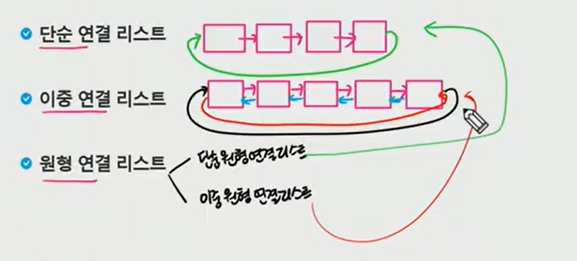
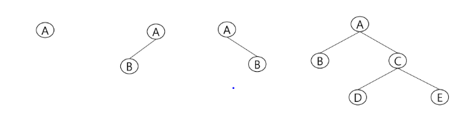
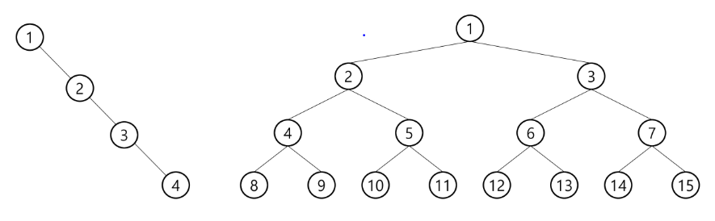
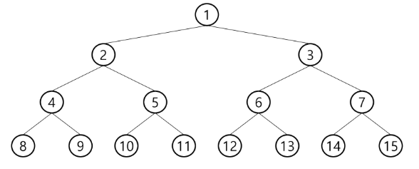
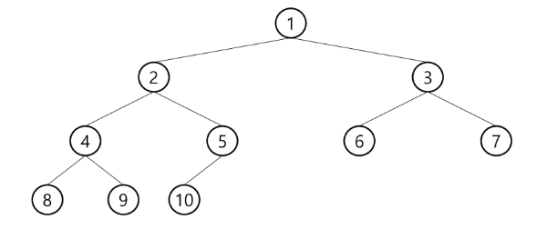
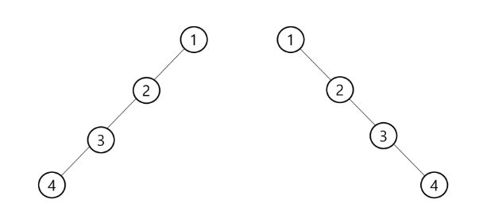
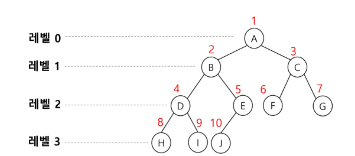
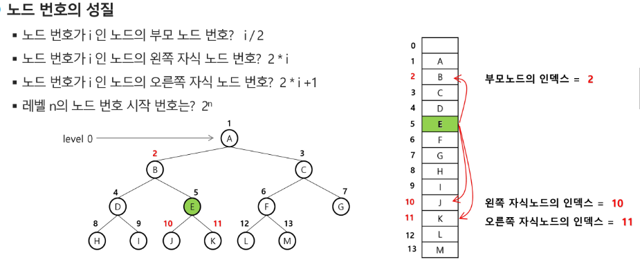
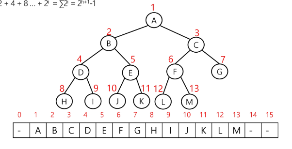
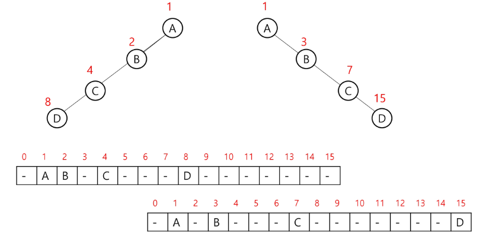

## 0808 내용기록 

---

### 리스트 

- 순서를 가진 데이터의 집합을 가리키는 추상 자료형(abstract data type) 
  - 여기서 `순서`란 넣는 순서를 의미한다.
- 동일한 데이터를 가지고 있어도 상관없다.

- 구현방법에 따라 크게 두가지로 나뉜다.
  - `순차리스트` : 배열을 기반으로 구현된 리스트 => 메모리의 물리적 공간 연속적
  - `연결리스트` : 메모리의 동적할당을 기반으로 구현된 리스트 => 메모리의 물리적 공간 비연속적이지만 논리적으로 연결되어 있음(Linked)

 

#### 순차리스트

 

##### 구현 방법
- 1차원 배열에 항목들을 순서대로 저장한다.
- 데이터의 종류와 구조에 따라 구조화된 자료구조를 만들어 배열에 저장할 수 있다.

##### 데이터 접근
- 배열의 인덱스를 이용해 원하는 위치의 데이터에 접근할 수 있다.

##### 삽입연산
  - 삽입 위치 다음의 항목들을 뒤로 이동해야한다.

##### 삭제연산
  - 삭제 위치 다음의 항목들을 앞으로 이동해야 한다.

##### 문제점 
  - 단순 배열을 이용한 순차리스트를 구현해 사용하는 경우, 자료의 삽입/삭제 연산 과정에서 연속적인 메모리 배열을 위해 원소들을 이동시키는 작업이 필요하다.
  - 원소의 개수가 많고, 삽입/삭제 연산이 빈번한게 일어날수록 작업에 소요되는 시간이 크게 증가한다.
  - 배열의 크기가 정해져 있는 경우, 실제로 사용될 메모리보다 크게 할당하여 메모리의 낭비를 초래할 수 도 있고, 반대로 할당된 메모리보다 많은 자료를 사용하여 새롭게 배열을 만들어 작업을 해야하는 경우가 발생할 수 있다.

 

#### 연결리스트(Linked List)
- 자료의 논리적인 순서와 메모리 상의 물리적인 순서가 일치하지 않고, 개별적으로 위치하고 있는 각 원소를 연결하여 하나의 전체적인 자료구조를 이룬다.
- 링크를 통해 원소에 접근하므로, 순차 리스트에서 처럼 물리적인 순서를 맞추기 위한 작업이 필요하지 않다.
- 자료구조의 크기를 동적으로 조정할 수 있어, 메모리의 효율적인 사용이 가능하다.

##### 연결리스트의 기본구조
- 연결 리스트에서 하나의 원소를 표현하는 building block
- 구성요소
  - 데이터 필드
    - 원소의 값을 저장
    - 저장할 원소의 종류나 크기에 따라 구조를 정의하여 사용함
  - 링크 필드
    - 다음 노드의 참조값을 저장

##### 헤드
- 연결 리스트의 첫 노드에 대한 참조값을 가지고 있음.

##### 연결 리스트의 종류 
- 단순 연결 리스트
- 이중 연결 리스트
- 원형 연결 리스트
  - 단순 원형 연결리스트
  - 이중 원형 연결리스트

 

---

### 단순연결리스트

#### 연결구조
  - 노드가 하나의 링크 필드에 의해 다음 노드와 연결되는 구조를 가진다.
  - 헤드가 가장 앞의 노드를 가리키고, 링크 필드가 연속적으로 다음 노드를 가리킨다.
  - 링크 필드가 Null인 노드가 연결 리스르의 가장 마지막 노드이다.

#### 삽입/삭제
- head와 tail을 사이에서 원하는 노드를 찾아 추가/삭제하고 다시 연결시킨다.

#### 활용
  - 단순 연결리스트로 스택 자료구조를 구현해보자
  - push 와 pop 에 적합한 삽입/삭제 알고리즘은? 

 

---

### 이중연결리스트

 

---

### 트리(Tree)

 

#### 개념 
- 비선형 구조
- 원소들간에 1:n 관계를 가지는 자료구조
- 원소들 간에 계층관계를 가지는 계층형 자료구조
- 상위 원소에서 하위 원소로 내려가면서 확장되는 트리(나무) 모양의 구조

 

#### 정의
1. `노드(node)` : 트리의 원소
2. 한 개 이상의 노드로 이루어진 유한 집합이며 다음 조건을 만족한다.
   - 노드 중 최상위 노드를 루트(root)라 한다.
   - 나머지 노드들은 n(>=0)개의 분리 집합 T1, ... Tn 으로 분리 될 수 있다.
3. 이들 T1 , ... , Tn 은 각각 하나의 트리가 되며(재귀적 정의) 루트의 부 트리(Sub Tree)라 한다.
4. `간선` : 노드와 노드를 연결하는 선으로 부모노드와 자식 노드를 연결
   - 형제 노드간 간선이 있다면 사이클이 생기기에 형제간에는 간선이 없다.

5. `형제 노드` : 같은 부모 노드의 자식 노드들
6. `조상 노드` : 간선을 따라 루트 노드까지 이르는 경로에 있는 모든 노드들
7. `서브 트리` : 부모 노드와 연결된 간선을 끊었을 때 생성되는 트리
8. `자손 노드` : 서브 트리에 있는 하위 레벨의 노드들
9. `차수` : 
   - `노드`의 차수 : 노드에 연결된 자식 노드의 수
   - `트리`의 차수 : 트리에 있는 노드의 차수 중에서 가장 큰 값
   - `단말노드(리프노드)` : 차수가 0인 노드 즉, 자식 노드가 없는 노드
10. `높이` :
    - `노드`의 높이 : 루트에서 노드에 이르는 간선의 수, 노드의 레벨
    - `트리`의 높이 : 트리에 있는 노드의 높이 중에서 가장 큰 값, 최대 레벨

 

---

### 이진트리

- 차수가 2인 트리
- 각 노드가 자식 노드를 최대한 2개까지만 가질 수 있는 트리
  - 왼쪽 자식 노드 (left child node)
  - 오른쪽 자식 노드 (right child node)
- 모든 노드들이 최대 2개의 서브트리를 가지는 특별한 형태의 트리
- 이진 트리의 예

#### 특성
- 높이 i(레벨i)에서의 노드의 최대 개수는 2개
- 높이가 h인 이진 트리가 가질 수 있는 노드의 최소 개수는 (h+1)개가 되며, 최대 개수는 `2^(h+1) -1` 개가 된다.

#### 포화 이진 트리(Full Binary Tree)
- 모든 레벨에 노드가 포화 상태로 차 있는 이진 트리
- 높이가 h일 때, 최대의 노드 개수인 `2^(h+1) -1`개의 노드를 가진 이진트리
  - `ex` : 높이 3일때 15개의 노드
- 루트를 1번으로 하여 `2^(h+1) -1` 까지 정해진 위치에 대한 노드 번호를 가짐

#### 완전 이진 트리 (Complete Binary Tree)
- 높이가 h이고, 노드 수가 n개일때 (단, h+1 <= n < (2^h+1)-1), 포화 이진 트리의 노드 번호 1번부터 n번까지 빈 자리가 없는 이진트리 => 즉, 맨밑에는 조금 비어있거나 하더라도, 그전 레벨까지는 모두 노드가 차있는 트리 => 주로 `힙(heap)을 구현할때 사용한다.`
- `ex` : 노드가 10개인 완전 이진 트리

#### 편향 이진 트리(Skewed Binary Tree)
- 높이 h에 대한 최소 개수의 노드를 가지면서 한 쪽 방향의 자식 노드만을 가진 이진 트리
  - 왼쪽 편향 트리
  - 오른쪽 편향 트리

#### 배열을 이용한 이진 트리의 표현 
- 이진 트리에 각 노드 번호를 다음과 같이 부여
- 루트의 번호를 1로함
- 레벨 n에 있는 노드에 대하여 왼쪽부터 오른쪽으로 2^n 부터 2^(n+1)-1 까지 번호를 차례로 부여

##### 노드 번호의 성질
- 노드 번호가 i인 노드의 부모 노드 번호 : i / 2
- 노드 번호가 i인 노드의 왼쪽 자식 노드 번호 : 2 * i
- 노드 번호가 i인 노드의 오른쪽 자식 번호 : 2 * i + 1
- 레벨 n의 노드번호 시작 번호 : 2 ^ n

- 노드 번호를 배열의 인덱스로 활용 
- 높이가 h인 이진 트리를 위한 배열의 크기는?
  - 레벨 i의 최대 노드 수 : 2 ^ i
  - 따라서 모든 노드의 수는 : 1 + 2 + 4 + 8 + ... + 2 ^ i
  - 배열의 크기는 : 2^(h+1)

- 편향 이진 트리의 경우 빈공간이 많기에 비효율적인 상황이 생긴다.
- 포화이진트리 혹은 완전 이진트리를 사용하면 위와 같은 방식도 괜춘하다.

##### 배열을 이용한 이진 트리 표현의 단점
- 편향 이진트리의 경우 사용하지 않는 배열 원소에 대한 메모리 공간 낭비 발생
- 트리의 중간에 새로운 노드를 삽입하거나 기존의 노드를 삭제할 경우 배열의 크기 변경이 어려워 비효율적이다.

 

### 비선형 자료구조 완전탐색

- 비선형 구조인 트리, 그래프의 각 노드(정점)를 중복되지 않게 전부 방문(visit)하는 것을 말하는데, 비선형구조는 선형 구조에서와 같이 선후 연결 관계를 알 수 없다.
  - 따라서 특별한 방법이 필요하다.

- 두가지 방법 : 
  1. 너비 우선 탐색(Breadth First Search, `BFS`)
  2. 깊이 우선 탐색(Depth First Search, `DFS`)

#### BFS(너비 우선 탐색)
- 너비우선 탐색은 루트 노드의 자식 노드들을 먼저 모두 차례로 방문한 후, 방문했던 자식 노드들을 기준으로 하여 다시 해당 노드의 자식 노드들을 차례로 방문하는 방식
- 인접한 노드들에 대해 탐색을 한 후, 차례로 다시 너비우선탐색을 진행해야 아므로, 선입선출 형태의 자료구조인 큐를 활용함.

 

---

### 트리탐색 - BFS

 

---