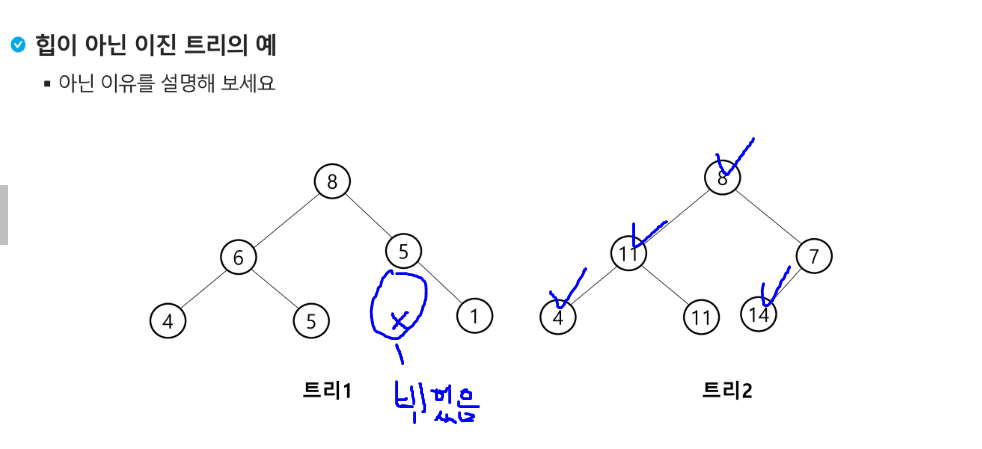
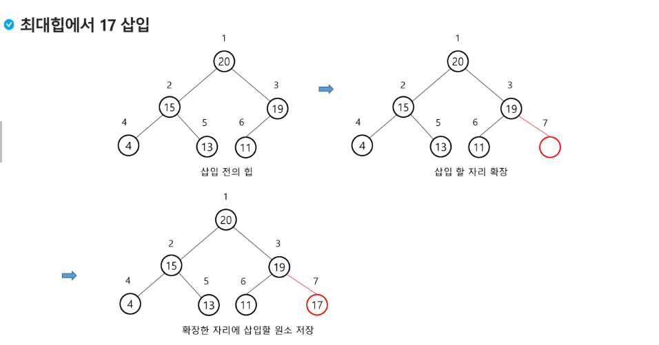
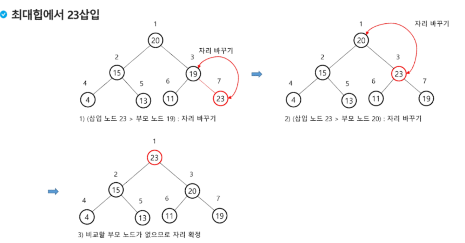
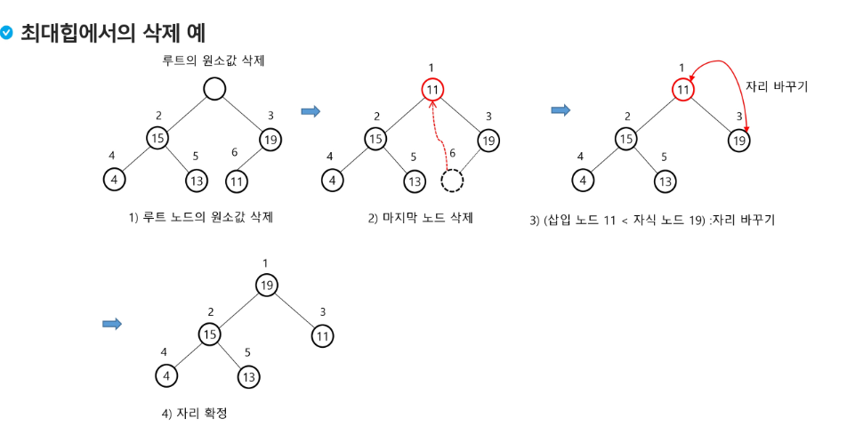
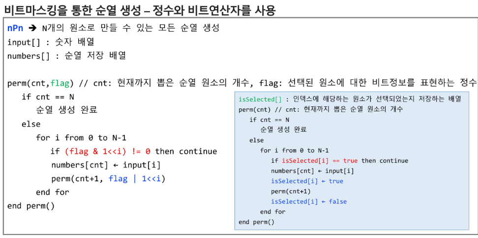
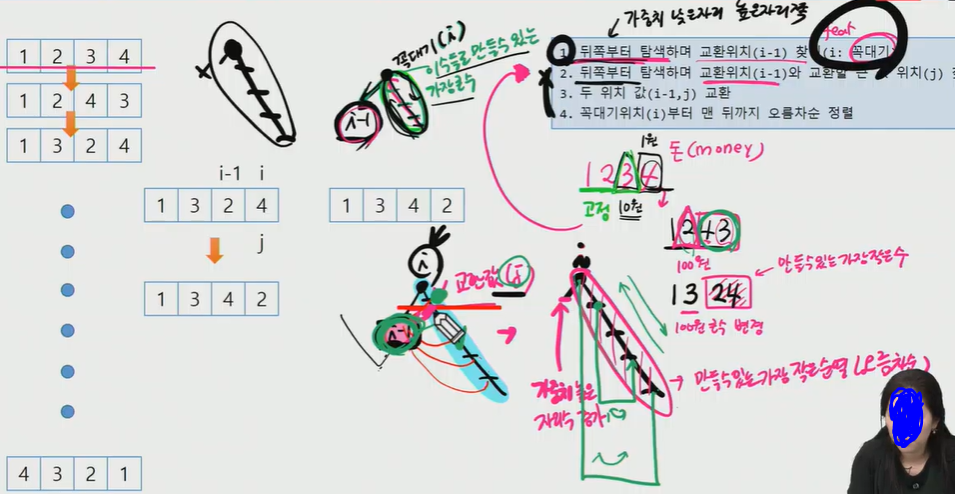
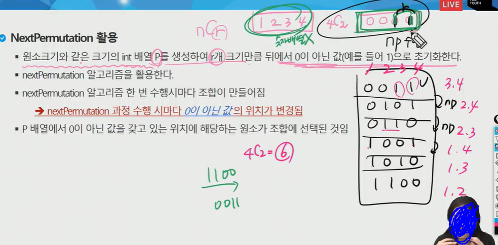

## 0811 내용 기록 

---

<br />

### BFS

- `너비우선탐색 (BFS)`
- 너비우선탐색은 루트 노드의 자식노드들을 먼저 모두 차례로 방문한 후에, 방문했던 자식 노드들을 기준으로 하여 다시 해당 노드의 자식 노드들을 차례로 방문하는 방식
- 인접한 노드들에 대해 탐색을 한 후, 차례로 다시 너비우선탐색을 진행해야 하므로, 선입선출 형태의 자료구조인 `큐`를 활용함


<br />

### DFS

- `깊이우선탐색 (DFS)`
- 루트노드에서 출발하여 한 방향으로 갈 수 있는 경로가 있는 곳까지 깊이 탐색해 가다가 더이상 갈 곳이 없게되면, 가장 마지막에 만났던 갈림길 간선이 있는 노드로 되돌아와서 다른 방향의 노드로 탐색을 계속 반복하여 결국 모든 노드를 방문하는 순회방법
- 가장 마지막에 만났던 갈림길의 노드로 되돌아가서 다시 깊이 우선 탐색을 반복해야 하므로 재귀적으로 구현하거나 후입선출 구조의 스택 사용해서 구현

<br />

### 조금 이상한 강의 코드

```JAVA
package day0811;

import java.util.LinkedList;
import java.util.Queue;
import java.util.Stack;

public class CompleteBinaryTree {
	private char[] nodes;
	private int lastIndex = 1;
	private final int SIZE;
	
	public CompleteBinaryTree(int size) {
		SIZE = size;
		nodes = new char[size+1];
	}
	
	public boolean add(char e) {
		if(lastIndex == SIZE) return false;
		nodes[lastIndex++] = e;
		return true;
	}
	
	public void bfs() {
		Queue<Integer> q = new LinkedList<>();
		q.offer(1); // 루트노드 인덱스부터
		
		while(!q.isEmpty()) { // 방문 대상이 있을때까지 반복
			int current = q.poll(); // 방문 차례인 대상 정보 꺼내기
			System.out.println(nodes[current] + " "); // 방문해서 해야할 일 처리
			
			// 현재 방문노드의 자식노드들을 대기열에 넣기
			if(current * 2 <= lastIndex) q.offer(current*2);
			if(current * 2 + 1<= lastIndex) q.offer(current*2+1);
		}
		System.out.println();
	}
	
	public void bfs2() { //이거 뭐지? 8/11 오전 강의
		Queue<Integer> q = new LinkedList<>();
		q.offer(1); // 루트노드 인덱스부터
		
		while(!q.isEmpty()) { // 방문 대상이 있을때까지 반복
			int size = q.size();
			
			while(--size >= 0) {
				int current = q.poll(); // 방문 차례인 대상 정보 꺼내기
				System.out.println(nodes[current] + " "); // 방문해서 해야할 일 처리
				
				// 현재 방문노드의 자식노드들을 대기열에 넣기
				if(current * 2 <= lastIndex) q.offer(current*2);
				if(current * 2 + 1<= lastIndex) q.offer(current*2+1);
			}
			System.out.println();
		}
		System.out.println();
	}
	
	public void dfs() {
		Stack<Integer> s = new Stack<>();
		s.push(1); // 루트노드 인덱스부터
		
		while(!s.isEmpty()) { // 방문 대상이 있을때까지 반복
			int current = s.pop(); // 방문 차례인 대상 정보 꺼내기
			System.out.println(nodes[current] + " "); // 방문해서 해야할 일 처리
			
			// 현재 방문노드의 자식노드들을 대기열에 넣기
			if(current * 2 <= lastIndex) s.push(current*2);
			if(current * 2 + 1<= lastIndex) s.push(current*2+1);
		}
		System.out.println();
	}
	
	public void dfsPreOrder(int cur) {
		if (cur >= lastIndex) return;
		
		System.out.print(nodes[cur] + " ");
		dfsPreOrder(cur * 2); 
		dfsPreOrder(cur * 2 + 1);
	}
	
	public void dfsInOrder(int cur) {
		if (cur >= lastIndex) return;
		
		dfsInOrder(cur * 2); 
		System.out.print(nodes[cur] + " ");
		dfsInOrder(cur * 2 + 1);
	}
	
	public void dfsPostOrder(int cur) {
		if (cur >= lastIndex) return;
		
		dfsPostOrder(cur * 2); 
		dfsPostOrder(cur * 2 + 1);
		System.out.print(nodes[cur] + " ");
	}
}
```

<br />

### 전위(pre), 중위(in), 후위(post) 순회(order) 구현

```java
package day0811;

import java.util.*;
import java.io.*;

public class Main {
	static char[][] board;
	static int n;
	static StringBuilder sb;
	
	public static void main(String[] args) throws IOException {
		BufferedReader br = new BufferedReader(new InputStreamReader(System.in));
		StringTokenizer st = new StringTokenizer(br.readLine());
		sb = new StringBuilder();
		
		n = Integer.parseInt(st.nextToken());

		board = new char[n][2];

		for(int i = 0 ; i < n; i++) {
			char[] temp = br.readLine().replaceAll(" ","").toCharArray();
			board[temp[0]-'A'][0] = temp[1];
			board[temp[0]-'A'][1] = temp[2]; 
		}

		pre('A');
		sb.append("\n");
		in('A');
		sb.append("\n");
		post('A');

		System.out.println(sb);
	}

    // preOrder
	private static void pre(char c) {
		if(c == '.') return;

		sb.append(c);
		pre(board[c-'A'][0]);
		pre(board[c-'A'][1]);
	}

    // inOrder
	private static void in(char c) {
		if(c == '.') return;

		in(board[c-'A'][0]);
		sb.append(c);
		in(board[c-'A'][1]);
	}

    // postOrder
	private static void post(char c) {
		if(c == '.') return;

		post(board[c-'A'][0]);
		post(board[c-'A'][1]);
		sb.append(c);
	}
}
```

- 유튜브 라이브 강의와 비슷하게 구현하였다. 재귀의 순서를 따짐에 있어서 함수 호출 순으로 구분하였다.

<br />

### 힙(heap)

- 완전 이진 트리에 있는 노드 중에서 키 값이 가장 큰 노드나 키값이 가장 작은 노드를 찾기위해서 만든 자료구조
    - 완전 이진트리는 포화상태가 아닐 수 있다.
    - 단, 왼쪽을 기준으로 모든 리프노드가 차있어야함. 순차적으로 따질때 비어있어도됨.
- 최소힙도 아니고 최대힙도 아닌 경우와 같이 뒤죽박죽인 경우도 힙이 아니다.

<span align="center">



</span>


<br />

- `최대 힙(max heap)`
  - 키 값이 가장 큰 노드를 찾기위한 완전 이진 트리
  - 부모 노드의 키 값 > 자식노드의 키 값
  - 루트노드 : 키 값이 가장 큰 노드

<br />

- `최소 힙(min heap)`
  - 키 값이 가장 작은 노드를 찾기 위한 완전 이진 트리
    - 부모 노드의 키 값 < 자식 노드의 키 값
    - 루트 노드 : 키 값이 가장 작은 노드

<br />

#### 힙 연산 - 삽입
- 새로운 값을 힙에 넣을때 완전 이진 트리의 형태는 유지되어야함 
  - 새로운 값을 넣을때에는 초기 기존 마지막 노드의 다음 순서 위치에 삽입한다.

<span align="center">



</span>

<span align="center">



</span>

- 최악의 경우 가장 큰 값(혹은 가장 작은 값)을 가장 마지막에 추가한다면 O(log~n~)의 시간복잡도를 가진다.
- 가장 큰 값 혹은 가장 작은 값의 경우에는 참조시 O(1)이 걸린다.

<br />

#### 힙 연산 - 삭제

- 힙에서는 `루트 노드의 원소만을 삭제`할 수 있다.
- 루트노드의 원소를 삭제하여 반환한다.
- 힙의 종류에 따라 최대값 또는 최소값을 구할 수 있다.

<span align="center">



</span>

<br />


<span align="center">


</span>

#### 힙의 활용 1 - 우선순위 큐(Priority Queue)

- 우선 순위큐를 구현하는 가장 효율적인 방법이 힙을 사용하는 것이다.
  - 노드 하나의 추가/삭제의 시간 복잡도가 `O(logn)`이고, 최대값/최소값을 `O(1)`에 구할 수 있다.
  - 완전 정렬보다 관리 비용이 적다.

- 배열을 통해 트리 형태를 쉽게 구현할 수 있다.
  - 부모나 자식 노드를 O(1)연산으로 쉽게 찾을 수 있다.
  - n위치에 있는 노드의 자식은 2n과 2n+1위치에 존재한다. 
  - 완전 이진트리의 특성에 의해 추가/ 삭제의 위치는 자료의 시작과 끝 인덱스로 쉽게 판단할 수 있다.

- 힙은 모두 넣어놓고 싹 구성하는 것이 아니라 원소를 넣을때 비교를 하고 구성해나가는 방식이다.
  -  힙 원소 추가/ 삭제시마다 구성이 완성
<br />

- 우선순위 큐의 특성
  - 우선순위를 가진 항목들을 저장하는 큐
  - FIFO 순서가 아니라 우선순위가 높은 순서대로 먼저 나가게 된다.

- `java.util.PriorityQueue`
  - Heap 자료구조
  - 최대 힙
    - 가장 큰값을 기준으로 먼저 나옴
  - 최소 힙
    - 가장 작은값을 기준으로 먼저 나옴

<br />

- 우선순위큐를 이용하는 방식에는 두가지가 있다.
  - Comparable => 원소 자체를 기준으로 힙을 구성
  - Comparator => 비교도우미를 기준으로 힙을 구성
    - 이 경우는 new PriorityQueue(`Comparator`) => 객체 생성시에 `Comparator`를 기준으로 원하는 경우를 정의할 수 있다.
    - 즉, 우선순위의 기준을 임의로 정의해줄 수 있다.

<br />

- `java.util.PriorityQueue()`
  - 원소들의 natural Ordering에 따라 heap을 유지한다.
  - 따라서 반드시 모든 원소는 Comparable 인터페이스를 구현해야한다.
- `java.util.PriorityQueue(Comparator comparator)`
  - 명시된 `comparator`의 구현에따라 원소들의 순서를 유지한다.

#### 우선순위큐 메서드

- offer
- poll
- peek
- isEmpty

- 등등 기존 큐의 메서드들과 비슷하다.

#### 힙의 활용 2
- 힙 정렬은 힙 자료구조를 이용해서 이진트리와 유사한 방법으로 수행된다.
- 정렬을 위한 2단계
  - 하나의 값을 힙에 삽입한다.(반복)
  - 힙에서 순차적(오름차순)으로 값을 하나씩 제거한다.

- 힙정렬의 시간 복잡도
  - N개의 노드 삽입 연산 + N개의 노드 삭제 연산
  - 노드 하나의 삽입과 삭제 연산은 각각 `O(logn)`이다.
  - 따라서, 전체 정렬은 `O(NlogN)`이다.


  <br />

### 순열 응용 - 비트마스킹 순열

- 기존 순조부에 대한 내용을 알고 있다는 전제.
- 기본적으로 int형 정수에 대한 비트 계산에 있어 int형은 32bit이다.  
- 
#### 비트연산자 

|연산자|연산자의 기능|
|:---:|:---:|
|&|비트 단위로 AND 연산을 한다.|
|\||비트 단위로 OR 연산을 한다.|
|^|비트 단위로 XOR 연산을 한다.|
|~|단항 연산자로서 피연산자의 모든 비트를 반전시킨다.|
|<<|피연산자의 비트 열을 왼쪽으로 이동시킨다.|
|>>|피연산자의 비트 열을 오른쪽으로 이동시킨다.|

- 이중에서 순열에 사용되는 연산자들에 대해 알아보자


- `&` : 조건을 판단할때 사용
- `|` : 기존 비트열에 새로운 비트 합치기
- `<<` : 초기 1 부터 시작하여 flag배열(int형 : 32bit)의 왼쪽으로 밀며 기존 `isSelected`의 역할을 할수 있도록 유지한다. 왼쪽으로 밀었을때의 bit연산의 결과값이 중요한 것이 아니다. 그 자리의 값의 0인지 0이 아닌지를 판단하기위한 배열을 flag 계속 들고 다닌다. (tail_recursive와 같이)

<span align="center">



</span>

- 위의 코드에서 볼수 있듯 각 경우의 케이스 마다 원하는 자리의 비트를 i만큼 왼쪽으로 밀어 해당 자리에 대한 `flag 표시`를 해준다.

<br />

- `&` => `mask off 연산자` : 모든 자리가 1인 비트와 모든자리가 0이고 원하는 자리만 1인 비트와 연산을 하면 내가 원하는 해당 비트만 값이 남고 모두 0이됨(꺼짐)
- `|` => `mask on 연산자` : 모든 자리가 1인 비트와 모든자리가 0이고 원하는 자리만 1인 비트와 연산을 하면 모든 자리가 값이 1이 됨 (켜짐)

```java
package day0811;

import java.util.Arrays;
import java.util.Scanner;

public class PermutationBitMaskingTest {
	
	static int N,R;
	static int[] input, numbers;
	public static void main(String[] args) {
		Scanner sc = new Scanner(System.in);
		N = sc.nextInt();
		R = sc.nextInt();
		
		input = new int[N];
		numbers = new int[R];
		
		for(int i = 0; i < N; i++) {
			input[i] = sc.nextInt();
		}
		
		permutation(0,0);
		
	}

	// cnt : 직전까지 뽑은 순열에 포함된 수의 개수, cnt+1번째 해당하는 순열에 포함될 수를 뽑기
	// flag : 선택된 수들의 상태를 비트로 표현하고 있는 비트열(정수)
	private static void permutation(int cnt, int flag) {
		if(cnt == R) {
			System.out.println(Arrays.toString(numbers));
			return;
		}
		
		for(int i = 0; i < N; i++) { // 선택지
			//시도하는 수가 선택되었는지 판단
			if((flag & 1<<i) == 1) continue;
			
			// 앞쪽에서 선택되지 않았다면 수를 사용
			numbers[cnt] = input[i];
			
			// 다음 수 뽑기 
			// flag에 해당 위치의 수에 대한 비트마스킹을 합쳐줌
			permutation(cnt+1, flag | 1<<i);

		}
		
	}
}
```

<br />

### 순열 - NextPermutation

- 현 순열에서 사전 순으로 다음 순열 생성 - `NextPermutation`
- 알고리즘
  - 배열을 오름차순으로 정렬한 후 시작한다.
  - 아래 과정을 반복하여 사전 순으로 다음으로 큰 순열 생성(가장 큰 내림차순 순열을 만들때까지 반복)
    1. 뒤쪽부터 탐색하며 교환위치(i-1) 찾기(i: 꼭대기)
    2. 뒤쪽부터 탐새갛며 교환위치(i-1)와 교환할 큰 값 위치(j) 찾기
    3. 두 위치 값(i-1,j) 교환
    4. 꼭대기위치(i)부터 맨 뒤까지 오름차순 정렬

- 주의사항 
  - `NextPermutation` 사용전에 숫자배열을 오름차순으로 정렬하여 가장 작은 순열 한번 처리

<span align="center">



</span>

```java
package day0811;

import java.util.Arrays;
import java.util.Scanner;

public class NextPermutation { // nPn
	public static void main(String[] args) {
		Scanner sc = new Scanner(System.in);
		int N = sc.nextInt();
		int[] input = new int[N];
		
		for(int i = 0; i < N; i++) {
			input[i] = sc.nextInt();
		}
		
		Arrays.sort(input);
		
		do {
			System.out.println(Arrays.toString(input));
		}while(nextPermutation(input));
	}
	
	
	private static boolean nextPermutation(int[] numbers) { 
	// numbers 배열의 상태를  근거로 다음 순열 생성, 다음 순열 존재하면 true, 아니면 false
	
		int N = numbers.length;
		
		// 1. 꼭대기를 찾는다.(맨 뒤부터)
		int i = N-1;
		
		while(i > 0 && numbers[i-1] >= numbers[i]) --i; // 앞의자리가 같거나 큰 경우 동안 인덱스 앞으로 이동
		
		if(i == 0) return false; // 다음 순열을 만들 수 없는 이미 가장 큰 순열의 상태.
		
		// 2. 꼭대기의 바로 앞자리(i-1)의 값을 크게 만들 교환 값 뒤쪽에서 찾기	
		int j = N-1;
		while(numbers[i-1] >= numbers[j]) --j; 
		// 자신보다 큰 수가 나타날때까지 j인덱스 앞으로 이동,큰수가 등장한 인덱스에서 멈춤
		// i-1 은 가장 큰수 바로 앞자리의 인덱스(뚝 떨어지는 지점)
		
		// 3. i-1위치 값과 j 위치 값 교환
		swap(numbers, i-1, j);
		
		// 4. i 위치부터 맨뒤까지의 수열을 가장 작은 형태의 오름차순으로 변경
		int k = N-1;
		while(i<k) { // i가 k보다 작은동안 진행, i는 앞에서부터, k는 뒤에서부터의 인덱스
			swap(numbers,i++,k--); // 각자리를 비교해서 작은 경우 바꿔줌 
		}
		
		return true;
	}
	
	private static void swap(int[] numbers, int i, int j) {
		int temp = numbers[i];
		numbers[i] = numbers[j];
		numbers[j] = temp;
	}
	
	
}
```

- 특히 마지막 4번에서 두 자리를 바꿔준다는 확신은 자명하다.
- 기존 2번을 통해 맨앞자리의 수보다 큰 수중 가장 가까운 수를 찾았고, 그 찾은 가장 가까운 큰 수와 `swap` 해준다. 
- 그러면 맨앞은 해당 숫자로 바뀌고나서도 뒤의 숫자들은 여전히 위에서부터 내림차순으로 존재하고 4번에서는 그러한 내림차순의 순서를 맨 앞과 맨뒤의 인덱스를 사용하여 서로 위치를 바꿔 다시 오름차순으로 바꿔주는 방식이다.

<br />

### 조합 - NextCombination => NextPermutation을 활용한다.

--- 

<span align="center">



</span>

- NextPermutation을 활용
  - 원소크기와 같은 크기의 int 배열 P를 생성하여 r개 크기 만큼 뒤에서 0이 아닌 값(예를들어 1)으로 초기화한다.
  - nextPermutation 알고리즘을 활용한다.
  - nextPermutation 알고리즘 한번 수행시마다 조합이 만들어짐
    - nextPermutation 과정 수행 시마다 0이 아닌값의 위치가 변경됨
  - P 배열에서 0 이 아닌 값을 가지고 있는 위치에 해당하는 원소가 조합에 선택된 것임

- 즉, 요약하자면 n개만큼 0으로 이루어진 배열을 생성한 뒤 뒤에서부터 r개만큼을 0보다큰수 하나로 채운다.(모두 같은수인듯 1로하라함)

- 그렇게 바꾼 배열에 대해 nextPermutation을 수행하면 조합의 결과가 나오게됨  
- 넘나 좋군
- 시간이 빠르다고하네
