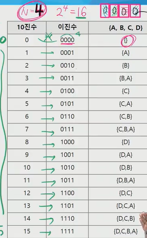
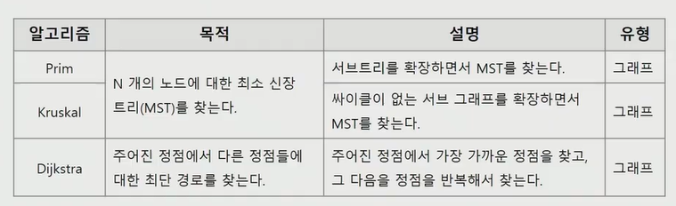
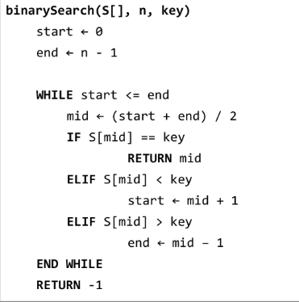
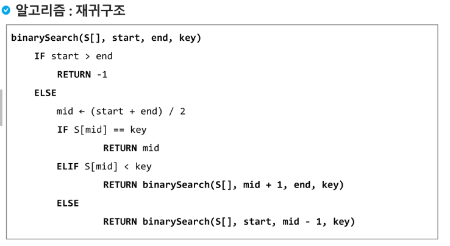

# 0816 내용 기록

---

## 부분집합 응용 - 바이너리 카운팅

- 집합에 포함된 원소들을 선택하는 것
- 다수의 중요 알고리즘들이 원소들의 그룹에서 최적의 부분집합을 찾는 것
  - ex) 배낭 짐싸기(knapsack)
- N개의 원소를 포함한 집합
  - 자기 자신과 공집합 포함한 모든 부분 집합(power set)의 개수는 2^n^개
  - 원소의 수가 증가하면 부분집합의 개수는 지수적으로 증가. => 즉 시간복잡도가 크다. => O(2^n^) 의 시간복잡도를 가짐

### 참고(지수)
- 2^10^ : 1000
- 2^20^ : 100만
- 2^30^ : 10억

- 즉, 30개만 되어도 거의 10초가 걸린다.


### 부분집합의 생성방법
- 기존 반복문은 원소하나당 반복문이 하나씩 추가되었고, 그로 인해 재귀를 이용해 부분집합을 만드는 방법을 학습하였었다.

### 새로운 생성 방법 - 바이너리 카운팅을 이용
- 부분집합을 생성하기 위한 가장 자연스러운 방법이다
- 바이너리 카운팅은 사전적 순서로 생성하기 위한 가장 간단한 방법이다.

`바이너리 카운팅`
- 원소 수에 해당하는 N 개의 비트열을 이용한다.
- n번째 비트값이 1이면 n번째 원소가 포함되었음을 의미한다.

<span align="center">



</span>


### 구현 코드
```java
import java.util.Scanner;

public class Subset_BinaryCountingTest {
	static int[] numbers;
	static int N;
	public static void main(String[] args) {
		Scanner sc = new Scanner(System.in);
		N = sc.nextInt();
		numbers = new int[N];
		
		for(int i = 0; i < N; i++) {
			 numbers[i] = sc.nextInt();
		}
		generateSubset();
	}

	private static void generateSubset() {
		// 모든 가능한 비트열의 상황에 대한 처리;
		for(int flag = 0, caseCnt = 1 << N; flag < caseCnt; flag++) {
			
			// 현 비트열의 상태에 대해 각 원소의 부분집합에 포함 유/무 확인
			for(int i = 0; i < N; i++) {
				if((flag&1<<i) != 0) { // i번째 원소가 부분집합에 포함되었다는 의미
					System.out.print(numbers[i] +" ");
				}
			}
			System.out.println();			
		}
	}
}
```

<br />

---

## 탐욕 기법
- 탐욕 알고리즘은 최적해를 구하는데 사용되는 근시안적인 방법
- 최적화문제란 가능한 해들 중 가장 좋은해(최대 혹은 최소)를 찾는 문제이다.
- 일반적으로 머리속에서 떠오르는 생각을 검증없이 바로 구현하면 Greedy 접근이 된다.
- 여러 경우 중 하나를 선택 할 때마다 그 순간에 최적이라고 생각되는 것을 선택해 나가는 방식으로 진행하여 최종적인 해답에 도달한다.
- 각 선택 시점에서 이루어지는 결정은 지역적으로는 최적이지만, 그 선택들을 계속 수집하여 최종적인 해답을 만들었다고 하여, 그것이 최적이라는 보장은 없다. => 검증이 요구된다.
- 일단, 한번 선택된 것은 번복하지 않는다. 이런 특성 때문에 대부분의 탐욕 알고리즘들은 단순하며, 또한 제한적인 문제들에 적용된다.

### 대표적인 탐욕기법의 알고리즘들

<span align="center">



</span>


### 백준 설탕 배달
```java
package day0816;

import java.util.*;
import java.io.*;

public class Main {
    public static void main(String[] args) throws IOException {
        Scanner sc = new Scanner(System.in);
        int n = sc.nextInt();

        int[][] board = new int[3][n+1];
        
        for(int i = 0; i < n; i++) {
        	if(i % 3 == 0) board[0][i] = n / 3;
        	else if(i % 5 == 0) board[1][i] = n / 5;
        	else if(i > 5){        	
	        	int minA = board[0][i-3] > board[1][i - 3] ? board[1][i-3] : board[0][i-3];
	        	int minB = board[0][i-5] > board[1][i - 5] ? board[1][i-5] : board[0][i-5];
	        	
	        	if(minA == 0 || minB == 0) continue;
	        	
	        	board[2][i] = minA + minB;
        	}
        }
        
       System.out.println(board[2][n]);
        
    }
}

/*
package day0816;

import java.util.*;
import java.io.*;

public class Main {
    public static void main(String[] args) throws IOException {
        Scanner scan = new Scanner(System.in);
        int n = scan.nextInt();

        if (n == 4 || n == 7) {
            System.out.println(-1);
        } else if (n % 5 == 0) {
            System.out.println(n / 5);
        } else if (n % 5 == 1 || n % 5 == 3) {
            System.out.println((n / 5) + 1);
        } else if (n % 5 == 2 || n % 5 == 4) {
            System.out.println((n / 5) + 2);
        } else {
            System.out.println(-1);
        }
    }
}
*/


/* while 문 사용
package day0816;

import java.util.*;
import java.io.*;

public class Main {
    public static void main(String[] args) throws IOException {
        Scanner scan = new Scanner(System.in);
        int n = scan.nextInt();
        int count = 0;
        while(n > 0) {
        	if(n % 5 == 0) {
        		count ++;
        		n -= 5;
        		continue;
        	}
        	
        	n -= 3;
        	count ++;
        }
        
        System.out.println(n < 0? -1 : count);
    }
}
*/
```

<br />

---

## 탐욕 기법 - 배낭 짐싸기

<br />

---

## 탐욕 기법 활용 - 회의실 배정

```java
package day0816;

import java.util.*;

public class MeetingRoomTest {
	
	static class Meeting implements Comparable<Meeting>{
		int start, end;
		
		public Meeting(int start, int end) {
			super();
			this.start = start;
			this.end = end;
		}
		
		@Override
		public int compareTo(Meeting o) {
			// 종료시간 기준 오름차순, 종료시간이 같다면 시작시간 기준 오름차순
			if(this.end == o.end) {
				return this.start - o.start;
			}else {
				return this.end - o.end;
			}
		}
	}
	
	
	public static void main(String[] args) {
		Scanner sc = new Scanner(System.in);
		int N = sc.nextInt();
		
		Meeting[] meetings = new Meeting[N];
		
		for(int i = 0; i < N; i++) {
			meetings[i] = new Meeting(sc.nextInt(), sc.nextInt());
		}
		
		List<Meeting> result = getSchedule(meetings);
		
		System.out.println(result.size());
		for(Meeting m : result) {
			System.out.println(m.start + " : " + m.end);
		}
		
		
	}
	
	private static List<Meeting> getSchedule(Meeting[] meetings){
		// 모든 회의를 종료시간 기준 오름차순, 종료시간이 같다면 시작시간 기준 오름차순 정렬
		List<Meeting> result = new ArrayList<>();
		Arrays.sort(meetings);
		result.add(meetings[0]); // 첫회의 스케쥴에 추가
		
		for(int i = 1, size = meetings.length; i < size; i++) {
			if(result.get(result.size()-1).end <= meetings[i].start) {
				result.add(meetings[i]);
			}
		}
				
		return result;
	}

}
```

<br />

---

## 탐욕 기법 응용 - 동전 자판기

- 동전의 최소개수가 아닌 최대개수를 파악하는 문제이다.

<br />

- 강사님 제시 방법
  - 보유한 동전으로 가능한 금액을 계산
  - 나머지 금액을 최소로 하면 최대 개수를 구할 수 있다.


```java
package day0816;

import java.util.Scanner;

public class 동전자판기_Test {
	public static void main(String[] args) {
		Scanner sc = new Scanner(System.in);
		
		int trgMoney = sc.nextInt();
		
		int[] coins = {500,100,50,10,5,1};
		int[] count = {sc.nextInt(),sc.nextInt(),sc.nextInt(),sc.nextInt(),sc.nextInt(),sc.nextInt()};
	
		int totalMoney = 0;
		
		for(int i = 0, size = coins.length; i < size; i++) { // 보유한 모든 동전으로 만들 수 있는 금액 계산
			totalMoney += coins[i] * count[i];
		}
		
		
		// 가지고 있는 돈에서 음료수 값을 지불하고 남은 나머지 금액
		int remain = totalMoney - trgMoney;
		
		// 음료수 값을 지불하는데 동전을 최대로 사용하려면, 지불하고 남은 금액의 동전수를 최소로 하면 됨.
		
		int sum = 0, maxCnt, availCnt;
		
		// 가장 큰 화폐단위부터 많이 사용하도록
		for(int i =0, size = coins.length; i < size; i++) { 
			maxCnt = remain / coins[i]; // 해당 금액을 i 환폐 단위를 가장 많이 쓸때의 개수 
			availCnt = maxCnt <= count[i] ? maxCnt : count[i];
						
			count[i] -= availCnt;
			remain -= availCnt * coins[i];
			sum+= count[i];
		}
		
		System.out.println(sum);
		
		for(int i =0, size=count.length; i < size; i++) {
			System.out.print(count[i] + " ");
		}
	}
}
```


<br />

---

## 분할 정복 기법
- 설계전략
  - 분할(divide) : 해결할 문제를 여러개의 작은 문제로 나눈다.
  - 정복(conquer) : 나눈 작은 문제를 각각 해결한다.
  - 통합(combine) : (필요하다면) 해결된 해답을 모은다.

<br />

---

## 분할 정복 활용 - 이진 검색

- 자료의 가운데에 있는 항목의 키 값과 비교하여 다음 검색의 위치를 결정하고, 검색을 계속 진행하는 방법
  - 목적 키를 찾을때까지 이진 검색을 순환적으로 반복 수행함으로써 검색 범위를 반으로 줄여가면서 보다 빠르게 검색을 수행함

- 이진 검색을 하기 위해서는 자료가 `정렬된 상태`여야 한다.

<span align="center">



</span>

<span align="center">



</span>

### java.util.Arrays.binarySearch

- 이진탐색 API
- int binarySearch(int[] a, int key)
- int binarySearch(int[] a, int from, int to, int key)
- 반환 값은 찾은 원소의 인덱스를 반환, 못찾을 경우 음수의값 반환(-1)


<br />


---

## 분할 정복 응용 - 같은 색 공간 만들기

<br />

---