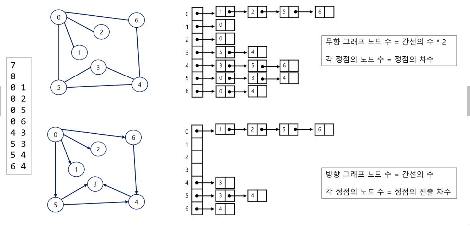
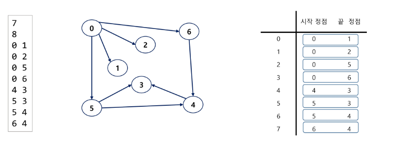

## 0817 내용기록

---

<br />

### 백트래킹

- 퇴각검색
- 모든 조합을 시도해서 문제의 해를 찾는다.
- 해를 얻을때까지 모든 가능성을 시도한다. 
- 모든 가능성은 하나의 트리처럼 구성할 수 있으며, 가지(선택지) 중 해결책이 있다.
- 여러가지(선택지)들이 존재하는 상황에서 하나의 가지를 선택한다.
- 선택이 이루어지면 새로운 선택지들의 집합이 생성된다.
- 이런 선택을 반복하면서 최종 상태에 도달한다.
- 보통 재귀함수로 구현된다.

#### 백트래킹과 완전탐색(DFS)의 차이
- 어떤 노드에서 출발하는 경로가 해결책으로 이어질 것 같지 않으면 더 이상 그 경로를 따라가지 않음으로써 시도의 횟수를 줄임(prunning 가지치기)
- 완전 탐색이 모든 경로를 추적하는데 비해 백트리캥은 불필요한 경로를 조기에 차단한다.
- 완전 탐색을 가하기에는 경우의 수가 너무나 많다.(예를 들어 N! 가지의 경우의 수를 가진 문제에 대해 완전 탐색을 가하면 당연히 처리 불가능한 문제이다.)
- 백트래킹 알고리즘을 적용하면 일반적으로 경우의 수가 줄어들지만 이 역시 최악의 경우에는 여전히 지수함수 시간을 요하므로 처리 불가능하다.

#### 정리 
- 백트래킹은 모든 가능한 경우의 수 중에서 특정한 조건을 만족하는 경우만 살펴보는 것
- 답이 될 만한지 판단하고 그렇지 않으면 그 부분까지 탐색하는 것을 하지 않고 가지치기 하는 것
- 주로 문제 풀이에서는 DFS로 모든 경우의수를 탐색하는 과정에서, 조건으로 답이 절대로 될 수 없는 상황을 정의하여 체크하고 그러한 상황일 경우에는 탐색을 중지한 뒤 이전으로 돌아가서 다시 다른 경우를 탐색하게끔 구현할 수 있다.

#### 백트래킹 느낌 물씬
```java
package day0818;

import java.util.Scanner;

public class NQueenTest {
	static int N, cols[], ans;
	public static void main(String[] args) {
		Scanner sc = new Scanner(System.in);
		N = sc.nextInt();
		
		cols = new int[N+1];
		ans = 0;
	}
	private static void setQueen(int rowNo) { // 하나의 퀸만 가능한 모든 곳에 놓아보기
		if(!isAvailable(rowNo-1)) return; // 직전까지의 상황이 유망하지 않으면 현재 퀸 놓을 필요 없으니 백트랙킹
		
		if(rowNo > N) { // 퀸을 다 놓았으면(모든 퀸의 배치에 성공한 상황
			ans ++;
			return;
		}
		
		for(int i = 1; i <= N; i++) {
			cols[rowNo] = i;
			setQueen(rowNo+1);
		}
	}
	
	private static boolean isAvailable(int rowNo) {
		for(int i = 1; i < rowNo; i++) {
			if(cols[i] == cols[rowNo] || rowNo - i == Math.abs(cols[rowNo] - cols[i])) return false; 
		}
		return true;
	}
}
```

#### 백트래킹 내포됨
```java
package day0818;

import java.util.Scanner;

public class NQueenTest2 {
	static int N, cols[], ans;
	public static void main(String[] args) {
		Scanner sc = new Scanner(System.in);
		N = sc.nextInt();
		
		cols = new int[N+1];
		ans = 0;
	}
	private static void setQueen(int rowNo) { // 하나의 퀸만 가능한 모든 곳에 놓아보기
		if(rowNo > N) { // 퀸을 다 놓았으면(모든 퀸의 배치에 성공한 상황
			ans ++;
			return;
		}
		
		for(int i = 1; i <= N; i++) {
			cols[rowNo] = i;
			if(isAvailable(rowNo)) setQueen(rowNo+1);
		}
		
	}
	
	private static boolean isAvailable(int rowNo) {
		for(int i = 1; i < rowNo; i++) {
			if(cols[i] == cols[rowNo] || rowNo - i == Math.abs(cols[rowNo] - cols[i])) return false; 
		}
		return true;
	}
}
```
- 기존과 유사하지만 돌아온다는 느낌이 없어서 백트래킹 같지 않다. 하지만 백트래킹이다. 이와 같이 코딩해왔다면 백트래킹을 사용했던것이다.

<br />

### 백트래킹 활용 - 부분집합의 합

#### 첫번째 문제
- 유한 개의 정수로 이루어진 집합이 있을때, 이 집합의 부분집합 중에서 그 집합의 원소를 모두 더한 값이 0이 되는 경우가 몇 번이나 있는지 알아내는 문제
- 완전 검색 기법으로 부분집합 합 문제를 풀기 위해서는 우선 집합의 모든 부분집합을 생성한 후 각 부분집합의 합을 계산해야한다.
  
```java

```

#### 두번째 문제
- 유한 개의 자연수로 이루어진 집합이 있을때, 이 집합의 부분집합 중에서 그 집합의 원소를 모두 더한 값이 21이 되는 경우가 몇번이나 있는지 알아내는 문제

```java

```

<br />

### 그래프
- 그래프는 아이템(사물 또는 추상적 개념)들과 이들 사이의 연결관계를 표현
- 정점(vertex) : 그래프의 구성 요소로 하나의 연결점
- 간선(Edge) : 두 정점을 연결하는 선
- 차수(degree) : 정점에 연결된 간선의 수
- 그래프는 정점들의 집합과 이들을 연결하는 간선들의 집합으로 구성된 자료구조이다.
  - 정점의 개수, 그래프에 포함된 간선의 개수
  - V개의 정점을 가지는 그래프는 최대 `V*V(-1)/2` 간선이 가능 
    - 예) 5개 정점을 가지는 그래프는 최대 10개의 간선을 가진다.
- 선형 자료구조나 트리 자료구조로 표현하기 어려운 N:N관계를 가지는 원소들을 표현하기 용이하다.

#### 그래프 유형
- 무향 그래프 : 방향성이 없는 그래프(양방향 관계의 그래프)
- 유향 그래프 : 방향성이 있는 그래프
- 가중치 그래프
- 사이클이 없는 방향성 그래프
- 완전 그래프 : 정점들에 대해 가능한 모든 간선들을 가진 그래프
- 부분그래프 : 원래그래프에서 일부의 정점이나 간선을 제외한 그래프
- `트리도 그래프이다`
  - 각 노드는 최대 하나의 부모 노드가 존재할 수 있다.
  - 각 노드는 자식 노드가 없거나 하나 이상이 존재할 수 있다.
  - 두 노드 사이에는 유일한 경로가 존재한다.
  
#### 인접(Adjacency)
- 두 개의 정점에 간선이 존재(연결됨)하면 서로 인접해 있다고 한다.
- 완전 그래프에 속한 임의의 두 정점들은 서로 인접해 있다.

#### 경로(Path)
- 경로란 어떤 정점 A에서 시작하여 다른 정점 B로 끝나는 순회로 두 정점 사이를 잇는 간선들을 순서대로 나열한 것
  - 같은 정점을 거치지 않는 간선들의 sequence
  - 어떤 정점에서 다른 정점으로 가는 경로는 여러가지 일 수 있따.
- `싸이클`
  - 경로의 시작 정점과 끝 정점이 같은 경우
  - 시작한 정점에서 끝나는 경로

#### 그래프 표현 
- 간선의 정보를 저장하는 방식, 메모리나 성능을 고려해서 결정
- 인접행렬
  - V x V 크기의 2차원 배열을 이용해서 간선 정보를 저장
  - 배열의 배열
- 인접 리스트(Adjacent List)
  - 각 정점마다 다른 정점으로 나가는 간선의 정보를 저장
- 간선 리스트(Edge List)
  - 간선(시작 정점, 끝 정점)의 정보를 객체로 표현하여 리스트에 저장

<br />

### 그래프 - 인접 행렬
- 두 정점을 연결하는 간선의 유무를 행렬로 표현
  - V x V 정방 행렬
  - 행 번호와 열번호는 그래프의 정점에 대응
  - 두 정점이 인접되어 있으면 1, 그렇지 않으면 0으로 표현
- 무향 그래프
  - i번째 행의 합 = i 번째 열의 합 = V~i~의 차수
- 유향 그래프
  - 행i의 합 = V~i~의 진출 차수
  - 열i의 합 = V~i~의 진입 차수

- 단 간선이 많이 없고 정점이 많다면 공간적으로 굉장한 손해를 볼 수 있다.
- 이러한 그래프를 희소그래프(간선이 별로 없는)라고하고, 이경우엔 인접 행렬이 어울리지 않는다.
- 즉, 완전그래프에 가까울수록 인접행렬로 구현하는것이 났다는 이야기이다.

### 그래프 - 인접 리스트
- 각 정점에 대한 인접 정점들을 순차적으로 표현
- 하나의 정점에 대한 인접 정점들을 각각 노드로 하는 연결리스트로 저장

<span align="center">



</span>

### 그래프 - 간선 리스트
- 두 정점에 대한 간선 그자체를 객체로 표현하여 리스트로 저장
- 간선을 표현하는 두 정점의 정보를 나타냄

<span align="center">



</span>

### 그래프 - 너비 우선 탐색(BFS) & 그래프 - 깊이 우선 탐색(DFS) - 인접 행렬

```java
package day0818;

import java.util.ArrayDeque;
import java.util.Queue;
import java.util.Scanner;

public class AdjacentMatrix {
	static int[][] adjMatrix;
	static int N;
	static boolean[] visited;
	public static void main(String[] args) {
		Scanner sc = new Scanner(System.in);
		N = sc.nextInt();
		
		int E = sc.nextInt();
		
		adjMatrix = new int[N][N];
		
		
		for(int i = 0; i < E; i++) {
			int from = sc.nextInt();
			int to = sc.nextInt();
			
			adjMatrix[from][to] = 1;
			adjMatrix[to][from] = 1;
		}
		visited = new boolean[N];
		bfs();
		visited = new boolean[N];
		dfs(0);
	}
	
	private static void bfs() {
		Queue<Integer> q = new ArrayDeque<>();
		boolean[] visited = new boolean[N];
		
		visited[0] = true;
		q.offer(0);
		
		while(!q.isEmpty()) {
			int cur = q.poll();
			System.out.print((char) (cur+'A'));
			
			// 현재 정점의 인접 정점들을 큐에 넣어서 차후에 탐색하도록 만들기
			for(int i = 0; i < N; i++) {
				if(!visited[i] && adjMatrix[cur][i] != 0) {
					visited[i] = true;
					q.offer(i);
				}
			}
		}
		System.out.println();
	}
	
	private static void dfs(int cur) {
		visited[cur] = true;
		System.out.print((char) (cur+'A'));

		// 현재 정점의 인접 정점들을 큐에 넣어서 차후에 탐색하도록 만들기
		for(int i = 0; i < N; i++) {
			if(!visited[i] && adjMatrix[cur][i] != 0) {
				dfs(i);
			}
		}
	}
}

```

<br />

### 그래프 - 너비 우선 탐색(BFS) & 그래프 - 깊이 우선 탐색(DFS) - 인접 리스트

```java
package day0818;

import java.util.Scanner;

public class AdjList {
	static class Node{
		int to;
		Node next;
		
		public Node(int to, Node next) {
			this.to = to;
			this.next = next;
		}
	}
	
	static Node[] adjList;
	static int N;
	static boolean[] visited;
	public static void main(String[] args) {
		Scanner sc = new Scanner(System.in);
		N = sc.nextInt();
		int E = sc.nextInt();
		
		adjList = new Node[N];
		for(int i = 0; i < E; i++) {
			int from = sc.nextInt();
			int to = sc.nextInt();
			
			adjList[from] = new Node(to, adjList[from]);
			adjList[to] = new Node(from, adjList[to]);
		}
		
		visited = new boolean[N];
		dfs(0);
		visited = new boolean[N];
	}
	
	private static void dfs(int cur) {
		visited[cur] = true;
		System.out.print((char)(cur+'A'));
		
		for(Node temp = adjList[cur]; temp != null; temp = temp.next) {
			if(!visited[temp.to]) {
				dfs(temp.to);
			}
		}
	}
}

```