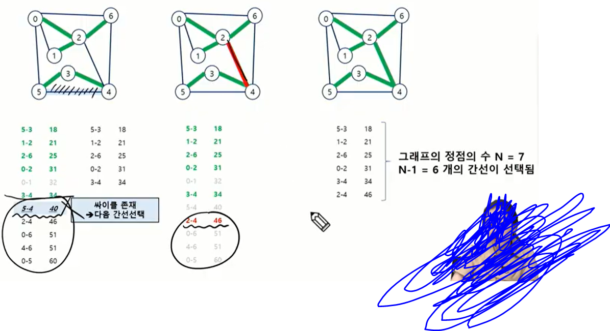

## 0822 내용 기록

---

<br />

### 서로소 집합

- 서로소 또는 상호배타 집합들은 서로 중복 포함된 원소가 없는 집합들이다. 즉, 교집합이 없다.
- 집합에 속한 하나의 특정 멤버를 통해 각 집합들을 구분한다.
- 이를 대표자(representative)라 한다.

- 서로소 집합을 표현하는 방법
  - 연결 리스트
  - 트리

- 서로소 집합 연산
  - Make-Set(x) : 집합을 생성 (원소 X를 가지는)
  - Find-Set(x) : X가 속한 집합 찾기
  - Union(x, y) : x,y원소를 하나의 집합으로 만들기

<br />

- 같은 집합의 원소들은 하나의 연결 리스트로 관리한다.
- 연결리스트의 맨 앞 원소를 집합의 대표원소로 삼는다.
- 각 원소는 집합의 대표 원소를 가리키는 링크를 가진다.

<br />

1. 초기 1개짜리 서로소 집합들을 만든 후 union 진행
2. 이때 union을 진행할 시 각각이 서로소 집합인지 확인(부모 원소를 확인(find-set)해서)


### 서로소 집합에 대한 연산
- Make-Set(x) : 집합을 생성 (원소 X를 가지는)
- Find-Set(x) : X가 속한 집합 찾기
- Union(x, y) : x,y원소를 하나의 집합으로 만들기

#### 연산의 효율을 높이는 방법
1. Rank(트리의 높이)를 이용한 Union
  - 각 노드는 자신을 루트로 하는 subtree의 높이를 rank로 저장한다.
  - 두 집합을 합칠 때 rank가 낮은 집합을 rank가 높은 집합에 붙인다.

2. Path compression
- Find-Set을 행하는 과정에서 만나는 모든 노드들이 직접 root를 가리키도록 포인터를 바꿔준다.
- 결과적으로 퍼지는 형태로 만들어진다.
- 기존 방식보다는 조금 더 효율적인 형태의 트리를 생성할 수 있다.

- Path Compression을 적용한 Find-set 연산

- 기존방식:

```java
Find_Set(x){
    if (x == p[x]) return x;
    else return Find_Set(p[x]);
}
```

- 개선 방식 :

```java
Find_Set(x){
    if (x == p[x]) return x;
    else return p[x] = Find_Set(p[x]);
}
```

<br />

- path압축 + rank 관리를 함께 사용하는 경우도 있다.
- 이 경우는 구현이 쉽지 않다.
- path 압축이 일어나면 rank에 변화가 생길 가능성도 있기 때문에 완벽에 두 기법을 동시에 가져가는 것은 어렵다.
- 이렇게 두 기법을 사용하는 경우는 비용적인 소모가 크다. 
- 이로 인해 두 기법을 함께 사용하는 경우는 완벽한 rank관리가 아닌 극한의 상황을 피하기 위해 임시적으로 rank설정을 사용하는 경우이다.

### 최소 신장 트리
- 그래프에서 최소 비용 문제
  - 모든 정점을 연결하는 간선들의 가중치의 합이 최소가 되는 트리
  - 두 정점 사이의 최소 비용의 경로 찾기
- 신장 트리
  - n개의 정점으로 이루어진 무향 그래프에서 n개의 정점과 n-1개의 간선으로 이루어진 트리
- 최소 신장 트리(Minimum Spanning Tree)
  - 무향 가중치 그래프에서 신장 트리를 구성하는 간선들의 가중치의 합이 최소인 신장 트리

### 크루스칼 알고리즘(Kruskal) - 그리디 알고리즘
- 간선을 하나씩 선택해서 MST를 찾는 알고리즘
  1. 최초, 모든 간선을 가중치에 따라 오름차순으로 정렬
  2. 가중치가 가장 낮은 간선부터 선택하면서 트리를 증가시킴
    - 사이클이 존재하면 다음으로 가중치가 낮은 간선 선택
  3. n-1개의 간선이 선택될 때까지 `2번`을 반복한다.

<span align="center">



</span>

- pseudo code
```java
MST_KRUSKAL(G,w){
    for vertex v in G.V {
        Make_Set(v);
    }

    // G.E에 포함된 간선들을 가중치 w를 이용한 오름차순 정렬

    for 가중치가 가장 낮은 간선 (u,v) ∈ G.E 선택(n-1개) : 
        if Find-Set(u) ≠ Find-Set(v) :
            Union(u, v);
}
```

#### 구현 코드 :

```java
package day0822;

import java.util.*;
import java.io.*;

/*
5 10
0 1 5
0 2 10
0 3 8
0 4 7
1 2 5
1 3 3
1 4 6
2 3 1
2 4 3
3 4 1

output==>10

7 11
0 1 32
0 2 31
0 5 60
0 6 51
1 2 21
2 4 46
2 6 25
3 4 34
3 5 18
4 5 40
4 6 51

output==>175
*/

public class KruskalTest {
	
	static class Edge implements Comparable<Edge>{
		int from, to, weight;

		public Edge(int from, int to, int weight) {
			super();
			this.from = from;
			this.to = to;
			this.weight = weight;
		}

		@Override
		public int compareTo(Edge o) {
			// return Integer.compare(this.weight, o.weight);
			return this.weight - o.weight; // 위의 줄도 같은 코드
		}
		
		
		
	}
	// ------------------Kruskal-------------------
	static int V,E;
	static Edge[] edgeList;
	
	// ------------------Union-Find알고리즘-------------------
	static int[] parents;
	
	static void make() { // 크기가 1인 서로소 집합 생성
		parents = new int[V]; // 부모배열 초기화
		for(int i = 0; i < V; i++) { // 모든 노드가 자신을 부모(대표자)로 하는 집합으로 만듦 
			parents[i] = i;
		}
	}
	
	static int find(int a) { // a의 대표자 찾기
		if(parents[a] == a) return a;
		return parents[a] = find(parents[a]); 
	}
	
	// 리턴값 : true = union 성공
	static boolean union(int a, int b) { // 왼쪽 집합에 오른쪽을 합치는 union
		int aRoot = find(a);
		int bRoot = find(b);
		
		if(aRoot == bRoot) return false; // 같은 그룹이라면 합칠 수 없음
		parents[bRoot] = aRoot;
		return true;
	}
	// ------------------Union-Find알고리즘-------------------
	
	public static void main(String[] args) throws IOException {
		
		BufferedReader br = new BufferedReader(new InputStreamReader(System.in));
		StringTokenizer st = new StringTokenizer(br.readLine());
		
		V = Integer.parseInt(st.nextToken());
		E = Integer.parseInt(st.nextToken());
		
		edgeList = new Edge[E];
		
		for(int i = 0; i < E; i++) { // 간선 입력받기
			st = new StringTokenizer(br.readLine());
			edgeList[i] = new Edge(Integer.parseInt(st.nextToken()),Integer.parseInt(st.nextToken()),Integer.parseInt(st.nextToken()));
		}
		
		make();
		
		Arrays.sort(edgeList); // 간선 비용으로 정렬(오름차순)
		
		int result = 0;
		int count = 0;
		for(Edge edge : edgeList) {
			if(union(edge.from, edge.to)) {
				result += edge.weight;
				count++;
				if(count == V-1) {
					break;
				}
			}
		}
		
		System.out.println(result); // MST에 있는 간선들의 비용 총합
	}
}

```