## 타겟기업 정보조사 

---

 

- 어느 정도 기업에 대한 분석을 해야 서류를 낼 수 있다.

- 인사담당자가 말하는 SSAFY생이 자주하는 실수
1. 우리회사에서 판매중인 제품이나 서비스 등 사업 분야에 대해서 아는게 없는데, 우리 회사가 어떤 회사인지 알고 지원했는지 의문.
   - 회사가 어떤 사업을 운영하고 있고, 어떤 조직인지를 이해하고 지원했으면 좋겠음.

2. 회사에서 맡게 될 직무 정보를 숙지하지 않은 채로 "내가 열심히 해왔다" "나는 이걸 잘한다"라고 어필하는 경우가 있다. 
   - 직무 이해가 부족하다 보니 입사 후 포부도 추상적이거나 감정적인 이야기 위주로 호소하곤 합니다.
- 내가 어떤 역할을 맡았고, 이 직무에 이렇게 도움이 될것이다 라고 명시하는게 좋다.

3. 포털사이트에 기업명을 검색하고 첫 페이지에 뜨는 정보만 보고 회사에 대해 단편적인 판단을 내리는 경우도 있다. 
   - 작은 정보를 가지고 너무 과도한 판단을 섣불리 하는 것 같아서 아쉬울 때가 있다.

 

### 1. 산업과 기업 분석

1. 전반적인 경제상황 분석
- 국내/외 주요 이슈 파악(경기변동, 환율, 물가, GDP 성장률 등)

2. 관련 산업에 대한 상황 분석
- SW업계의 산업 분석(산업의 특성, 최근 기술 이슈, 신기술 관련 동향 등)

3. 산업 및 업종에 대한 기업 파악 및 타겟 기업 전반에 대한 분석
- SI, 보안, 인터넷, 클라우드 등 업종에 속한 기업을 찾고 기업 전반에 대한 분석(비전, 미션, 채용절차, 사업/재무정보 등)

- 비전 : 우리 회사가 앞으로 3~4년간 이뤄야할 목표를 글로푼것
- 미션 : 우리 회사가 존재하는 이유
- 채용절차 : 
- 사업/재무정보 : 

 

#### 업종의 이해
- 이벤트형 :
  - 레저, 바이오, 엔터
  - 사회 이슈 및 특정 트렌드나 기술에 의해 매출과 이익에 영향을 받는 구조의 업종
  - 바이오 업종은 신약 개발이 중심으로 오랜 기간의 노력이 필요하며, 엔터, 게임, 영화는 히트작의 유무가 중요하다.
  - 예측하기 어려운 구조이나 기존의 성공경험과 인력, 영업망을 통해서 기업과 채용을 예상해야 한다.

- 생활 일착형 :
  - 건강, 미용, 금융, 생활, 유통, 운수, 섬유, 패션, 등등

- 경기순환형 : 
  - 건설, 건자재, 금속, 기계, 자동차, 조선/해운, 화학
  - 경기에 따라 호황과 불황의 사이클을 타는 업종
  - 혹독한 불황을 잘 이겨낼 수 있는 기업의 체력과 건실한 재무구조, 시작 지배력이 중요하다.

- 지식 집얍형 : 
  - IT,디스플레이, 반도체, 스마트폰, 의료기기, 통신
  - 지식의 변화가 빠른 분야, 따라잡지 못하면 뒤쳐질 수 있는 업종
  - 연구개발에 대한 투자, 지식재산권 등의 역량을 갖추었는지가 중요하다.

 

#### IT산업분석을 위한 채널 파악하기

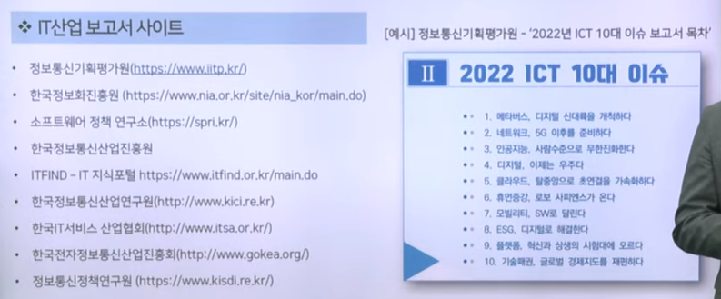

 

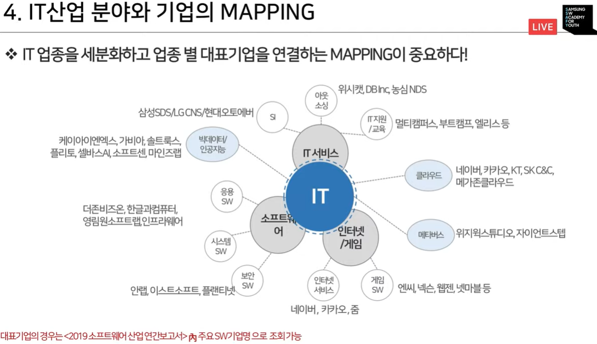

 

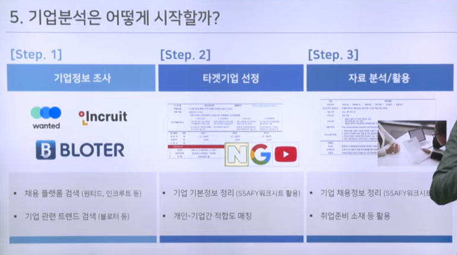

 

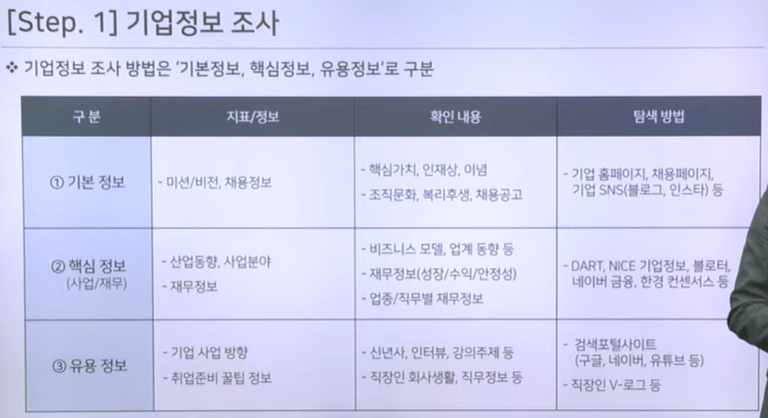

- 핵심가치를 읽고 자소서에 키워드를 조금씩 넣는게 좋다.
- 재무정보는 우상향이 좋다.
- 상장기업의 경우 대표 혹은 임원들의 인터뷰나 인사등을 찾아보는것도 도움됨
- 클리앙 같은 커뮤니티 사이트 좋음 => 헬린이마냥 모르는 척 들어가자
- 기업의 sns블로그

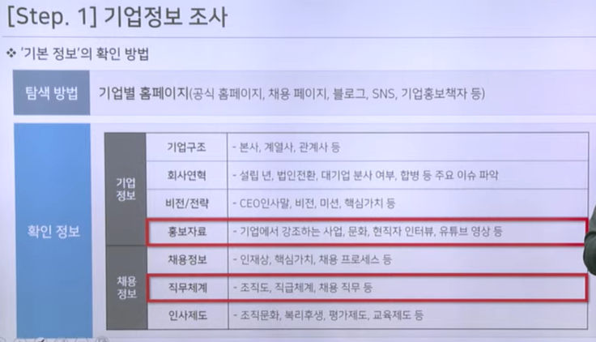

- IR 공시자료 (투자하라고 주는 자료)같은 것도 좋다.

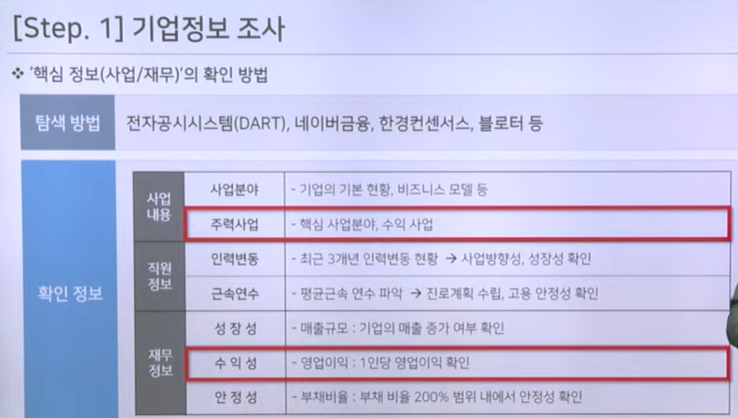

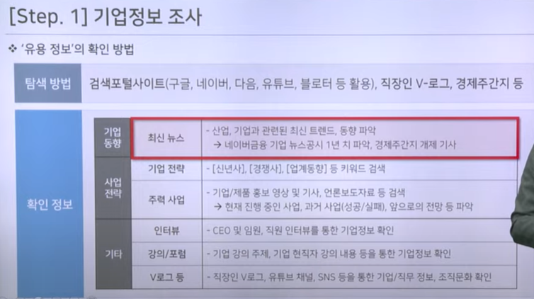

- 밀리의 서재 : 경제 주간지 보는거 추천

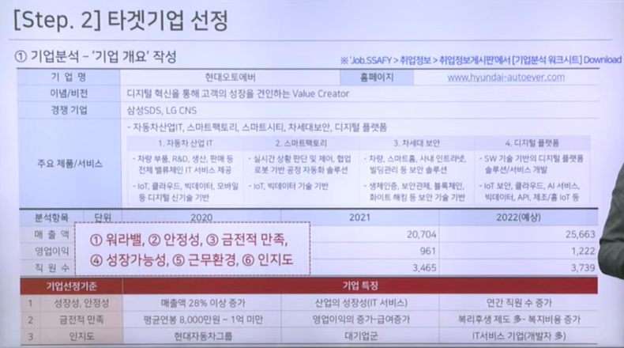

- 타겟기업 선정 및 분석 예시

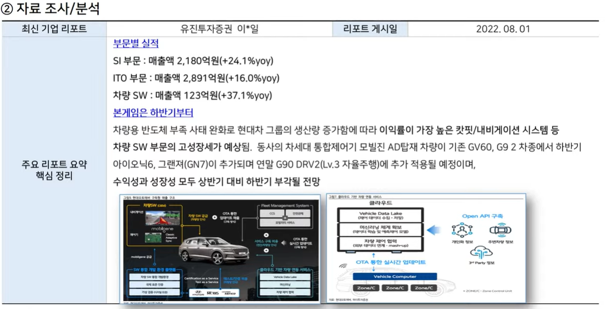

- 자료분석/활용 예시

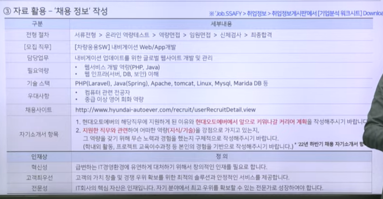

- 채용정보 분석 예시

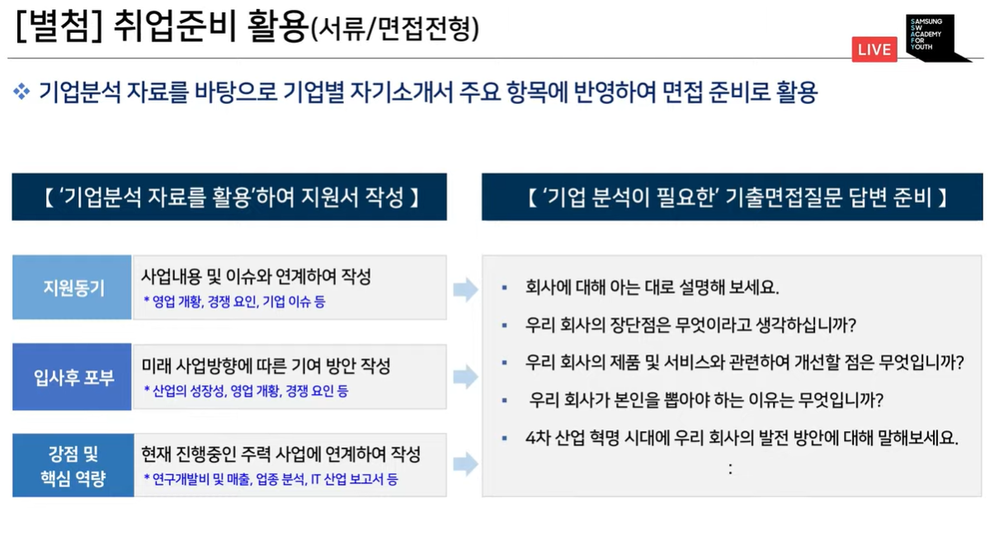

- 이렇게 뽑은 자료들로 지원서 작성 

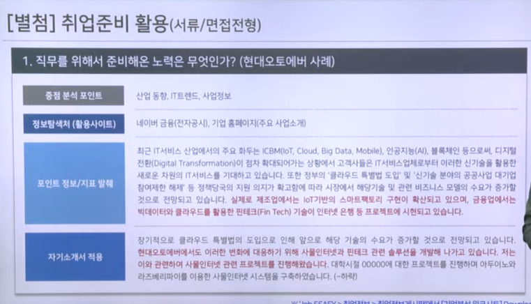

- 지원서 예시

 

### 2. 기업분석 방법(상장 기업)

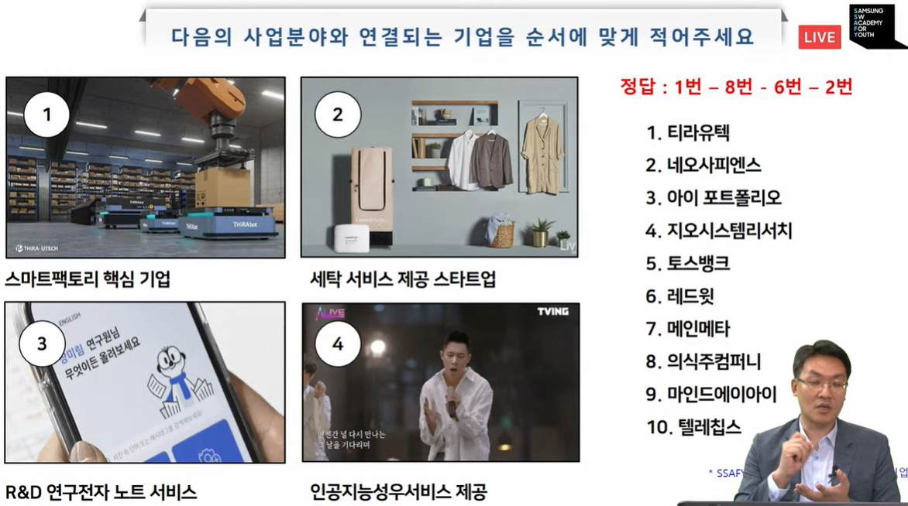

- 괜찮은 기업들

- 참고 사이트들

- Dart에 들어가서 기업 보고서를 볼때 참고항목들
- 사업개요
- 회사 위치
- 주요 제품 및 서비스 - 직무 및 갈 팀을 결정
- 임원 및 직원 현황을 통해 어떤 분들이 계신지 확인
- 기간의 정함이 없는 근로자 = 정규직
- 그리고 보고서 외적으로 뉴스공시를 확인해도 좋다. => 종목토론방은 걸러라 이상한 곳이다.

 

- 한경 컨센서스에 들어가서 기업의 레포트를 봐도 좋다.
- 주식을 보지 말고 내용을 볼것
- 부채비율이 높다고 나쁜 것은 아님 - 기업이 어딘가에 투자하고 있다는 것일 수 있음
- 부채비율이 200퍼정도면 적당. 네임드, 건설, 제조업체들은 3~400퍼정도일 수 있음

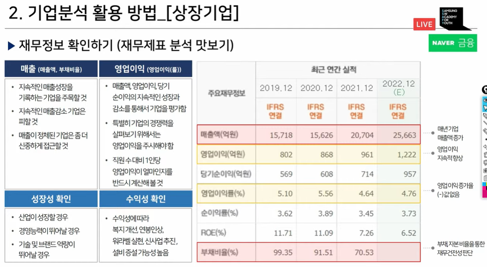

- 재무재표를 통해 판단하자.

-자란다를 통한 스타트업 확인

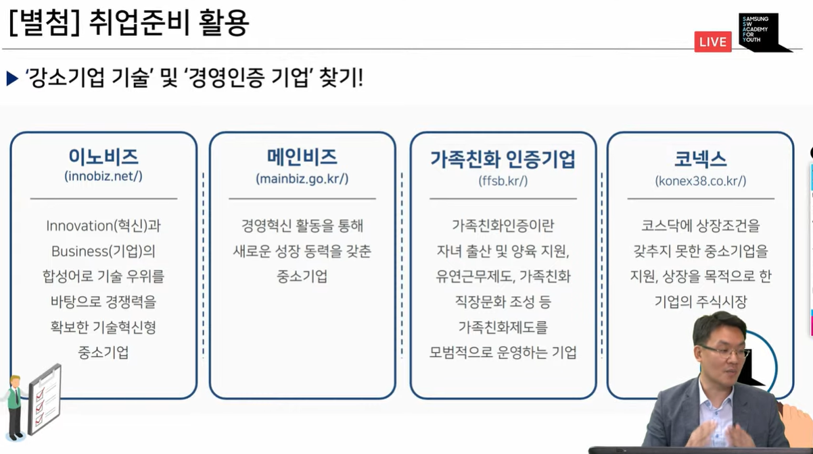

- 가족친화 인증기업! 

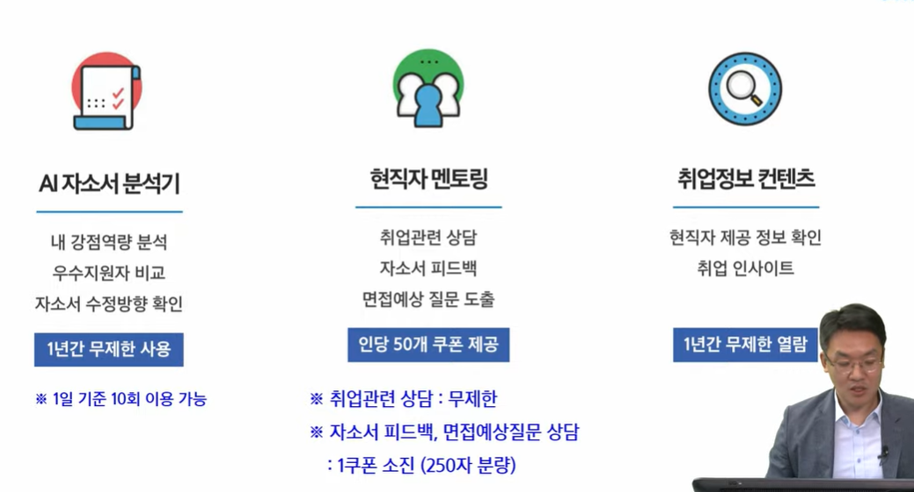

- 코멘토 활용!

#### 싸피 우대 기업

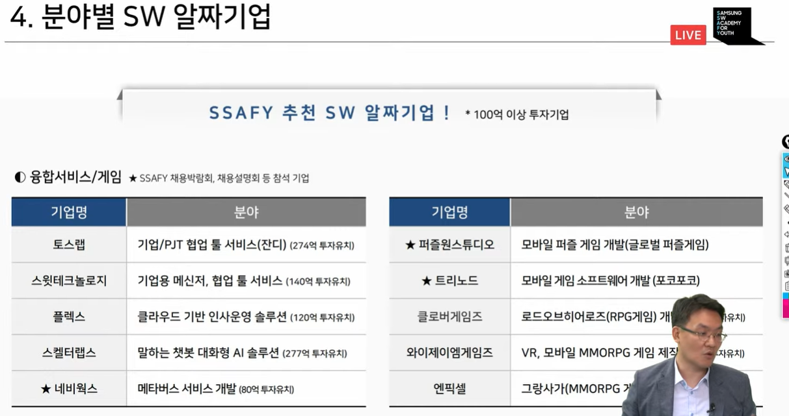

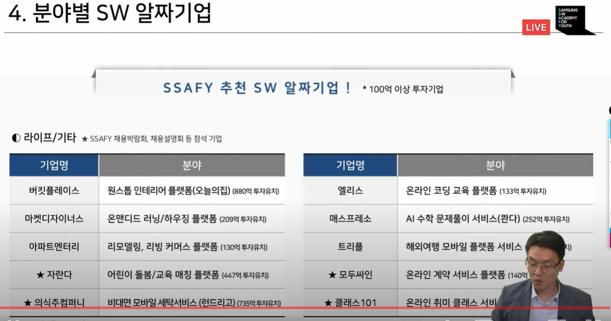

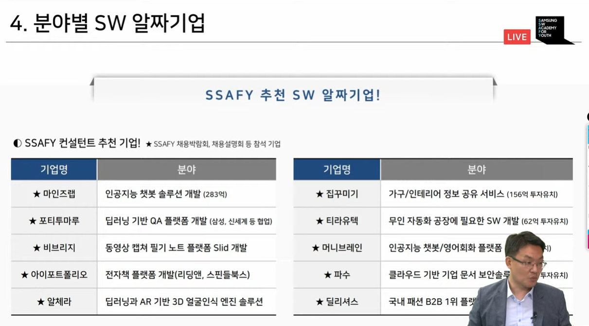

