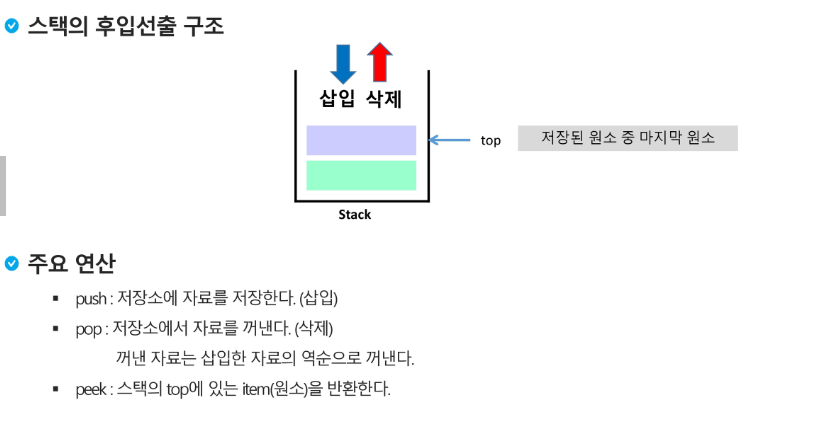
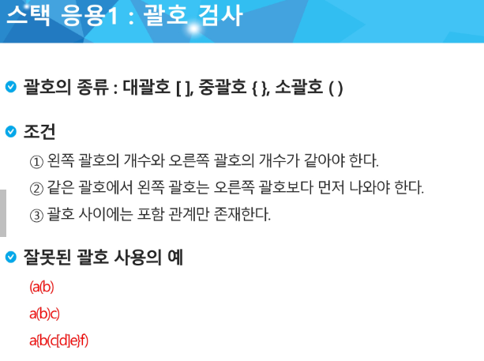
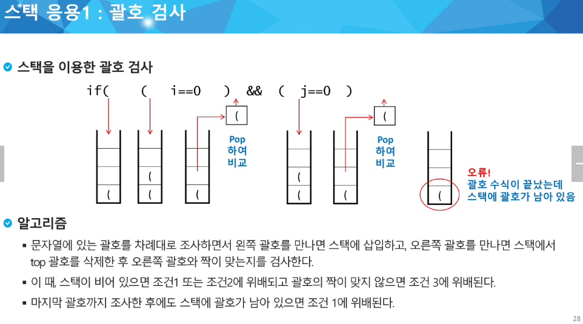
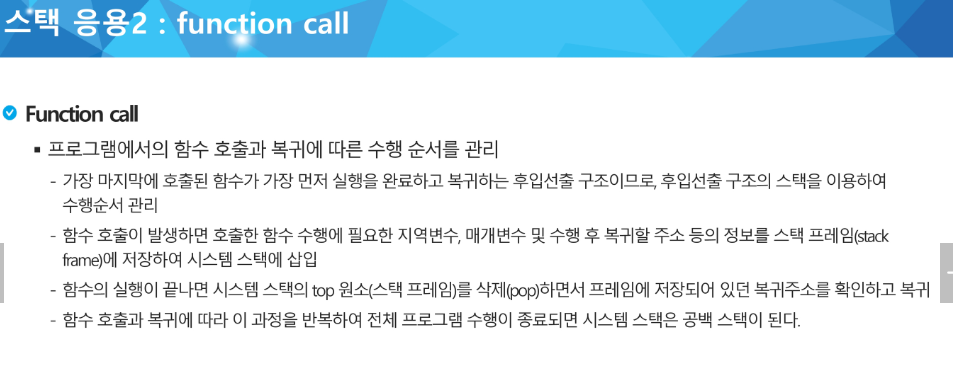
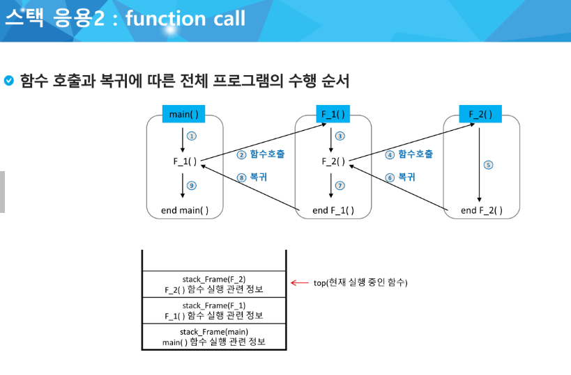
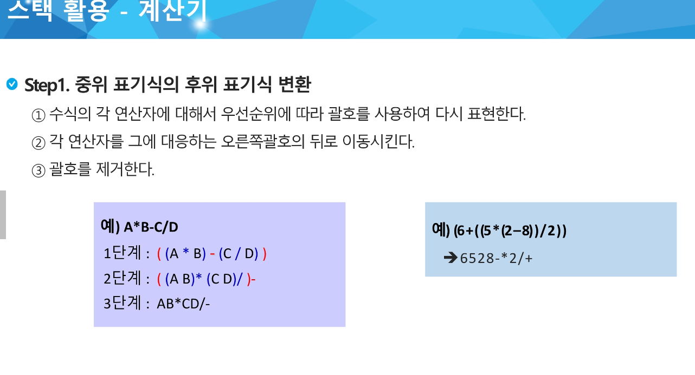
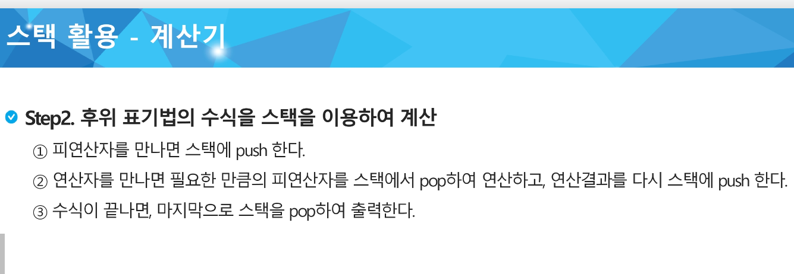
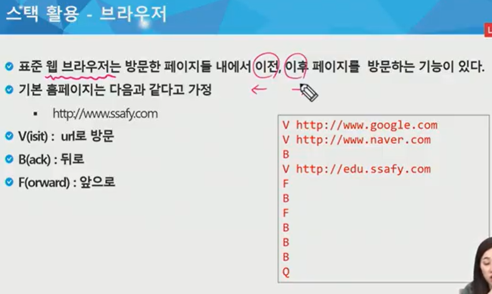
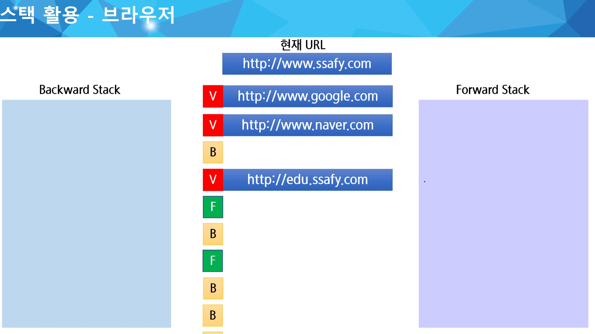
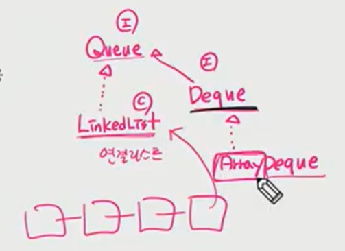

## 0804 내용 기록 - Stack & Queue

---

 

### 스택(Stack)
- 물건을 쌓아 올리듯 자료를 쌓아 올린 형태의 자료구조이다.
- 스택에 저장된 자료는 선형 구조를 갖는다.
  - `선형구조` : 자료간의 관계가 1대1의 관계를 갖는다.
  - `비선형구조` : 자료간의 관계가 1대 N의 관계를 갖는다(ex. 트리)

- 스택에 자료를 삽입하거나 스택에서 자료를 꺼낼 수 있다.
- 후입 선출 구조(LIFO, Last-in-First-out)
  - 마지막에 삽입한 자료를 가장 먼저 꺼낸다.
  - 예를 들어 스택에 1,2,3 순으로 자료를 삽입한 후 꺼내면 역순으로 즉 3,2,1 순으로 꺼낼 수 있다.

#### 주요 메서드

- push()
- pop()
- isEmpty()
- size()

#### 스택 응용 1

 
 

#### 스택 활용 - 계산기

0 

 

#### 스택 활용 - 브라우저

- 

 

---

#### 큐 (Queue)

- 큐는 인터페이스이다. 이를 구현한 구현체중에 LinkedList가 있다.
- 또한 큐를 상속받는 Deque 인터페이소 있다.

