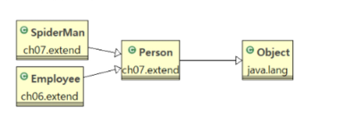

## 0721 기록 - OOP
---

### 상속

---

#### Object 클래스
- `Object`클래스는 모든 클래스의 조상 클래스이다.
- 모든 클래스는 `Object` 클래스의 멤버를 사용할 수 있다.
- 별도의 `extends` 선언이 없는 클래스들은 `extends Object`가 생략된 클래스들이다.
- 따라서 모든 클래스에는 `Object` 클래스에 정의된 메서드가 있다.

---

#### 상속의 관계(is a)

    

- Person is a Object, SpiderMan is a Person

---

#### 단일 상속(Single Inheritance)
- 다중 상속의 경우 여러 클래스의 기능을 물려받을 수 있으나 관계가 매우 복잡해진다.
- 동일한 이름의 메서드가 두 부모에게 있다면 자식은 어떤 메서드를 사용할 것인가?
- 따라서 자바는 `단일 상속`만을 지원하며, 대신 `interface와 포함관계`를 이용해 단점을 극복한다.

---
#### 포함 관계(has a 관계)
- 상속 이외에 클래스를 재활용 하는 방법
  - 2개 이상의 클래스에서 특성을 가져올 때 하나는 상속, 나머지는 멤버변수로 처리.
- 포함관계의 UML 표현 : 실선
- Spider의 코드를 수정하면 SpiderMan에도 반영되므로 유지 보수성 확보

- 어떤 클래스를 상속 받고 어떤 클래스를 포함해야 하는가?
  - 문법적인 문제는 아니며 프로젝트의 관점 문제
  - 상속 : is a 관계가 성립하는가 ? 
  - 포함 : has a 관계가 성립하는가 ?

- 개인 적인 느낌을 정리하자면 is a 와 has a 모두 다른 기능들을 사용함에 있어 필요하지만 main이 되는 범주는 상속을 통해 가져오고, 다른 범주의 클래스들은 포함(클래스 내 에서 해당 범주 클래스 객체를 생성)관계를 통해 기능을 가져와 사용하는 느낌인 듯 하다.
---

