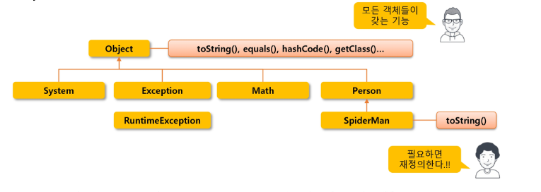
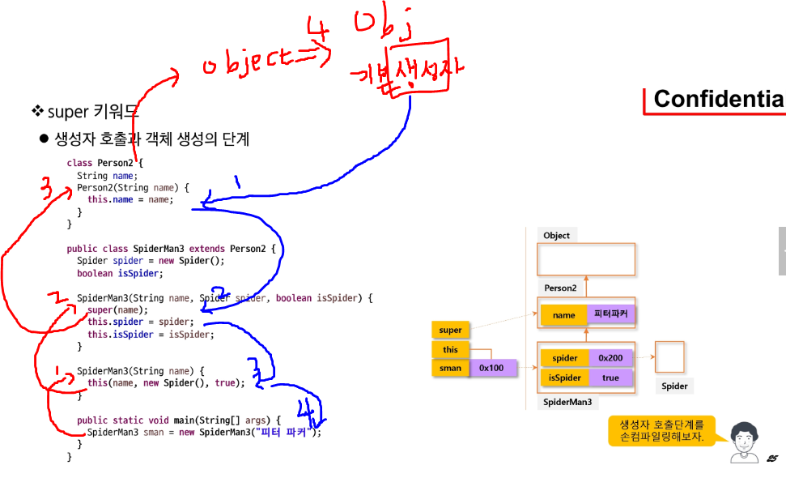
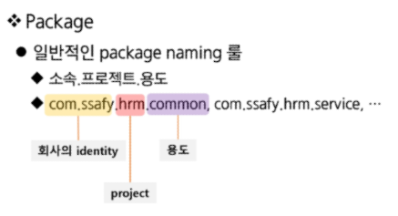

## 0721 기록 - OOP
---

### 상속

---

#### Object 클래스
- `Object`클래스는 모든 클래스의 조상 클래스이다.
- 모든 클래스는 `Object` 클래스의 멤버를 사용할 수 있다.
- 별도의 `extends` 선언이 없는 클래스들은 `extends Object`가 생략된 클래스들이다.
- 따라서 모든 클래스에는 `Object` 클래스에 정의된 메서드가 있다.

---

#### 상속의 관계(is a)

<span align="center">


</span>

- Person is a Object, SpiderMan is a Person

---

#### 단일 상속(Single Inheritance)
- 다중 상속의 경우 여러 클래스의 기능을 물려받을 수 있으나 관계가 매우 복잡해진다.
- 동일한 이름의 메서드가 두 부모에게 있다면 자식은 어떤 메서드를 사용할 것인가?
- 따라서 자바는 `단일 상속`만을 지원하며, 대신 `interface와 포함관계`를 이용해 단점을 극복한다.

---
#### 포함 관계(has a 관계)
- 상속 이외에 클래스를 재활용 하는 방법
  - 2개 이상의 클래스에서 특성을 가져올 때 하나는 상속, 나머지는 멤버변수로 처리.
- 포함관계의 UML 표현 : 실선
- Spider의 코드를 수정하면 SpiderMan에도 반영되므로 유지 보수성 확보

- 어떤 클래스를 상속 받고 어떤 클래스를 포함해야 하는가?
  - 문법적인 문제는 아니며 프로젝트의 관점 문제
  - 상속 : is a 관계가 성립하는가 ? 
  - 포함 : has a 관계가 성립하는가 ?


- 개인 적인 느낌을 정리하자면 is a 와 has a 모두 다른 기능들을 사용함에 있어 필요하지만 main이 되는 범주는 상속을 통해 가져오고, 다른 범주의 클래스들은 포함(클래스 내 에서 해당 범주 클래스 객체를 생성)관계를 통해 기능을 가져와 사용하는 느낌인 듯 하다.
---

#### 메서드 재정의(Override)

- `메서드 오버라이딩(overriding)`
  - 조상 클래스에 정의된 메서드를 자식 클래스에서 적합하게 수정하는 것

##### 메서드 오버라이딩의 조건
1. 메서드 이름이 같아야 한다.
2. 매개 변수의 개수, 타입, 순서가 같아야 한다.
3. 리턴 타입이 같아야 한다.
4. 접근 제한자는 부모보다 범위가 넓거나 같아야 한다.
5. 조상보다 더 큰 예외를 던질 수 없다.

#### Annotation
- 사전적 의미 : 주석
- 컴파일러, JVM, 프레임워크 등이 보는 주석
- 소스코드에 메타 데이터를 삽입하는 형태
  - 소스코드에 붙여 놓은 라벨
  - 코드에 대한 정보 추가 => 소스코드의 구조 변경, 환경 설정 정보 추가 등의 작업 진행 
- 참고 : 롬복(Lombok)

#### JDK 1.5의 기본 annotation 예시
- `@Deprecated`
  - 컴파일러에게 해당 메서드가 `deprecated` 되었다고 알려줌
  - `@Deprecated` : 앞으로 `사용되지 않을 메소드`라는 것을 `annotation`으로 명시해놓는데 사용된다. `annotation`을 써놓으면 메소드명에 `취소선`이 생긴다. 즉, 이 `메소드 앞으로 없어질 수도 있다` 라는 의미의 `annotation`
-`@Override`
  - 컴파일러에게 해당 메서드는 `override`한 메서드 임을 알려줌
  - `@Override`가 선언된 경우 반드시 `super class`에 선언되어 있는 메서드여야 함
- `@SuppressWarnings`
  - 컴파일러에게 사소한 warning의 경우 신경 쓰지 말라고 알려줌

#### Object 클래스
- 가장 최상위 클래스로 모든 클래스의 조상
  - `Object의 멤버는 모든 클래스의 멤버`

<span align="center">


    
</span>

- `toString()`메서드
  - 객체를 문자열로 변경하는 메서드
  - 보통 주소값을 반환하기에 정보를 반환하는 메서드로 재정의해서 사용하는 경우가 많음
- `equals()`메서드
  - 두 객체가 같은지를 비교하는 메서드
  - 두 개의 레퍼런스 변수가 같은 객체를 가리키고 있는가?
  - [참고] 주소값 비교는 `==`연산자를 사용해서 비교
  - 즉, 두 레퍼런스 객체의 `값`을 비교하기 위해서는 `equals()` 를 사용

---
### super 키워드
- `this`를 통해 멤버에 접근하듯이 `super`를 이용해 조상 클래스 멤버에 접근한다.
  - `super.`을 이용해 조상의 메서드 호출로 조상의 코드 재사용

#### 변수의 scope
- 사용된 위치에서 점점 확장해가며 처음 만난 선언부에 연결됨
- method 내부 => 해당 클래스 멤버 변수 => 조상 클래스 멤버 변수

#### super() 생성자
- `this()`가 해당 클래스의 다른 생성자를 호출하듯 `super()`는 조상 클래스의 생성자 호출
  - 조상 클래스의 선언된 멤버들은 조상 클래스의 생성자에서 초기화가 이뤄지므로 이를 재활용
  - 자식 클래스에 선언된 멤버들만 자식 클래스 생성자에서 초기화
- `super()`는 자식 클래스 생성자의 맨 첫 줄에서만 호출 가능
  - 즉 생성자의 첫 줄에만 `this()` 또는 `super()`가 올 수 있다.
- 명시적으로 `this()` 또는 `super()`를 호출하지 않는 경우 컴파일러가 `super()` 삽입
  - 결론적으로 맨 상위의 Object까지 객체가 다 만들어지는 구조

<span align="center">


    
</span>

- `빨강` => 생성자 호출 순서
- `파랑` => 인스턴스 생성 순서
- `Person2`에서 생성자 호출이 종료되고, 객체가 생성될 것 같지만 `Person2`는 암묵적으로 `extends Object`키워드가 붙어있기 때문에 `Object`클래스의 `기본 생성자`를 호출하고, 그로 인한 `Object 인스턴스`가 생성된후 다른 생성자들을 통한 인스턴스 생성이 진행된다. => 잘 파악해두자.

---
### package & import

#### Package
- PC의 많은 파일 관리 => 폴더 이용
  - 유사한 목적의 파일을 기준으로 작성
  - 이름은 의미있는 이름으로, `계층적 접근`
- 프로그램의 많은 클래스 => 패키지 이용
  - 패키지의 이름은 의미있는 이름으로 만들고 `.`를 통해 계층적 접근
  - 물리적으로 패키지는 클래스 파일을 담고있는 `디렉터리`
- package의 선언
  - `package package_name`
  - 주석, 공백을 제외한 첫번째 문장에 하나의 패키지만 선언
  - 모든 클래스는 반드시 하나의 패키지에 속한다.
  - 패키지 선언을 하지 않으면 `default package`가 생성되는데 사용하지 말것. 즉, 정의해서 사용할 것!
- package naming 룰
- 
<span align="center">


    
</span>

#### import 
- 다른 패키지에 선언된 클래스를 사용하기 위한 키워드
  - 패키지와 클래스 선언 사이에 위치
  - 패키지와 달리 여러번 선언 가능
- 선언 방법
  - `import 패키지명.클래스명`
  - `import 패키지명.*` => 하위 패키지까지 import 하지는 않는다.
- import 한 package의 클래스 이름이 동일하여 명확히 구분해야 할때 
  - 클래스 이름 앞에 전체 패키지명을 입력
  ```java
    java.util.List list = new java.util.ArrayList();
  ```
- `default import package`
  - java.lang.*
  - Math와 같이 별도로 불러오지 않아도 사용할 수 있는 package

---

