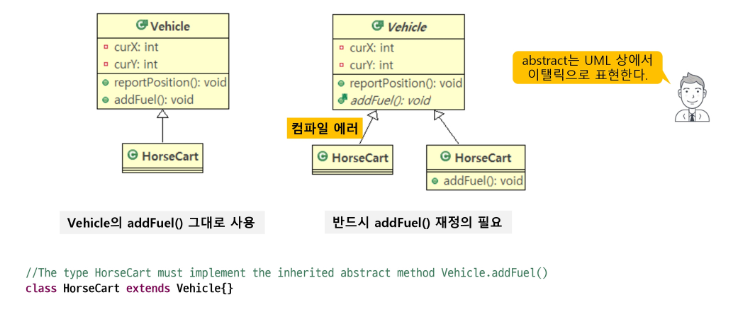
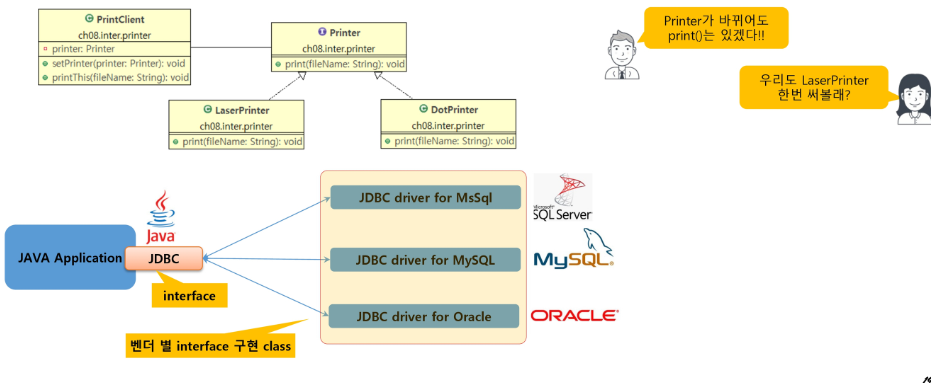
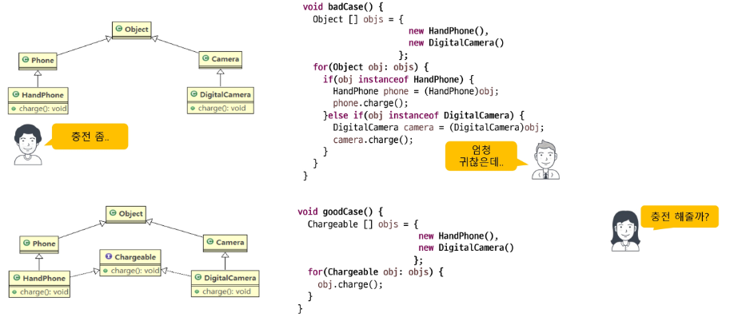
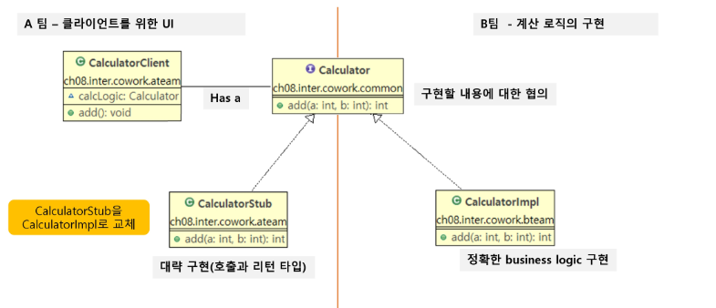
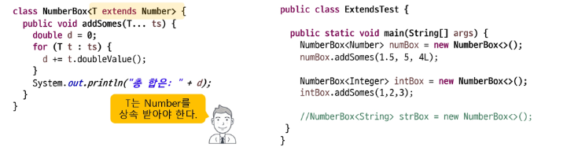
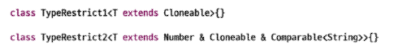
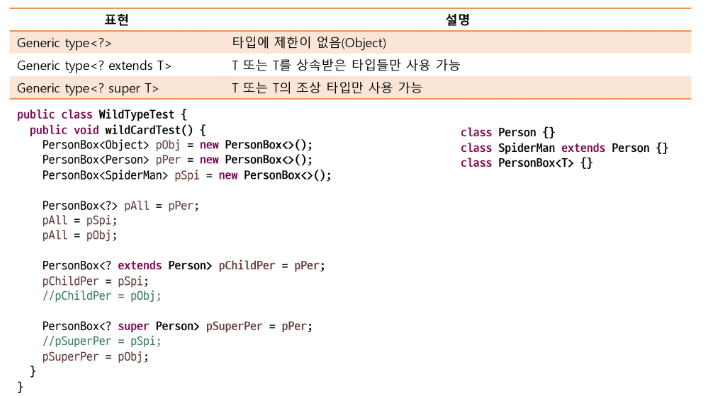
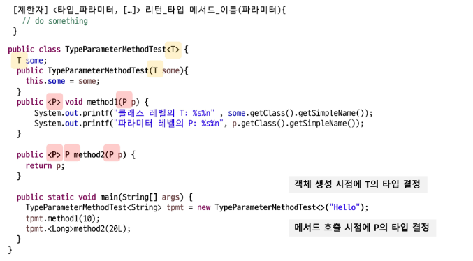

## 0725 기록 - interface & generic

---

<br />

### 추상 클래스
- 인터페이스와 비슷하지만 메서드의 구현부가 있어도 되고 없어도됨. 

<br />

#### 추상 클래스의 특징
- `abstract` 클래스는 `상속 전용`의 클래스
  - 클래스에 구현부가 없는 메서드가 존재할 수 있어 객체를 생성할 수 없다.
  - 하지만 상위 클래스 타입으로써 자식을 참조할 수 있다.

```java
//Vehicle v = new Vehicle
// 추상클래스는 객체를 생성할 수 없음

Vehicle v = new DiselSUV();
// 자식을 참조하는 것은 문제없음
```

- 부모 클래스에서 상속받은 `abstract` 메서드를 재정의 하지 않은 경우
  - 클래스 내부에 `abstract`메서드가 있는 상황이므로 자식 클래스는 `abstract` 클래스로 선언되어야 한다.

<br />

#### 추상(abstract) 클래스를 사용하는 이유

<span align="center">



</span>

- `abstract` 클래스는 `구현의 강제를 통해 프로그램의 안정성을 향상시킨다.`
- `interface`에 있는 메서드 중 구현할 수 있는 메서드를 구현해 개발의 편의 지원

---

### 인터페이스(interface)

- 인터페이스란?
  - 서로 다른 두 시스템, 장치, 소프트웨어 따위를 서로 이어주는 부분, 또는 그런 접속 장치

<br />

- GUI - Graphic User Interface
  - 프로그램과 사용자 사이의 접점

<br />

#### 인터페이스 작성
- 최고 수준의 추상화 단계 : 일반 메서드는 모두 `abstract` 형태
  - JDK 8 에서 default method와 static method 추가
- 형태
  - 클래스와 유사하게 interface 선언
  - 멤버 구성
    - 모든 멤버변수는 `public static final`이며 생략 가능
    - 모든 메서드는 `public abstract`이며 생략 가능

<br />

#### 인터페이스 상속
- 클래스와 마찬가지로 인터페이스도 `extends`를 이용해 상속이 가능
- 클래스와 다른 점은 `인터페이스는 다중 상속이 가능`

```java

interface Fightalbe{
    int fire();
}

interface Transformable{
    void changeShape(boolean isHeroMode);
}

public interface Heroable extends Fightable, Transformable{
    void upgrade();
}
```

<br />

#### 인터페이스 구현과 객체 참조
- 클래스에서 `implements 키워드`를 사용해서 `interface 구현`
- `implements` 한 클래스는 
  - 모든 `abstract` 메서드를 `override`해서 구현하거나
  - 구현하지 않을 경우 `abstract` 클래스로 표시해야함.
- 여러개의 `interface implements` 가능
- `다형성`은 부모 클래스 뿐 아니라 `부모 인터페이스에도 적용가능`

<br />

#### 인터페이스의 필요성
- 구현의 강제로 표준화 처리
  - `abstract 메서드` 사용
- 인터페이스를 통한 간접적인 클래스 사용으로 손쉬운 모듈 교체 지원
- 서로 상속의 관계가 없는 클래스들에게 인터페이스를 통한 관계 부여로 다형성 확장
- 모듈 간 독립적 프로그래밍 가능 => 개발 기간 단축
- 구현의 강제로 표준화 처리 => 손쉬운 모듈 교체 지원
  
<span align="center">



</span>

- 서로 상속의 관계가 없는 클래스들에게 인터페이스를 통한 관계 부여로 다형성 확장

<span align="center">



</span>

- 독립적인 프로그래밍으로 개발기간 단축

<span align="center">



</span>

<br />

#### default method
- 인터페이스에 선언된 구현부가 있는 메서드
  - 메서드 선언부에 `default modifier` 추가 후 메서드 구현부 작성
    - 접근제한자는 public 으로 한정됨(생략 가능)

  - 필요성
    - 기존에 interface 기반으로 동작하는 라이브러리의 interface에 추가해야하는 기능이 발생
    - 기존 방식으로라면 모든 구현체들이 추가되는 메서드를 override 해야 함
    - `default 메서드`는 abstract 가 아니므로 반드시 구현해야 할 필요는 없어짐
    - `default 메서드`로인해 abstract 클래스가 잘 사용되지 않는 추세임.

- default method의 충돌
  - JDK 1.7 이하의 java에서는 interface method에 구현부가 없으므로 충돌이 없었음.
  - 1.8부터 `default 메서드` 가 생기면서 동일한 이름가지는 구현부가 있는 메서드가 충돌
  - method 우선순위
    - `super class`의 method가 우선이다. : `super class`가 구체적인 메서드를 가지는 경우 default method는 무시됨.
    - `interface`간의 충돌 : 하나의 interface 에서 default method를 제공하고 다른 interface에서도 같은 이름의 메서드(default 유무와 무관)가 있을때 sub class는 반드시 `oveeride`해서 충돌 해결해야한다.


<br />

#### static method
- interface 에 선언된 static method
  - 일반 static 메서드와 마찬가지로 별도의 객체가 필요없음
  - 구현체 클래스없이 바로 인터페이스 이름으로 메서드에 접근해서 사용가능

---

### Generic

<br />

#### Generics

- 다양한 타입의 객체를 다루는 메서드, 컬렉션 클래스에서 `컴파일 시에 타입 체크`
  - 미리 사용할 타입을 명시해서 형변환을 하지 않아도 되게함 
    - 객체의 타입에 대한 안전성 향상 및 형 변환의 번거로움 감소

<br />

#### 표현 
- 클래스 또는 인터페이스 선언 시 `<>` 에 타입 파라미터 표시
  - Class_Name : Raw Type
  - Class_Name<T> : Generic Type

- 타입 파라미터
  - 특별한 의미의 알파벳 보다는 단순히 `임의의 참조형 타입`을 말함
  - `T` : reference Type
  - `E` : Element 
  - `K` : key 
  - `V` : Value

- 객체 생성
  - 변수 쪽과 생성 쪽의 타입은 반드시 같아야 함.

<br />

#### 사용
- 컴파일 타입에 타입 파라미터들이 대입된 타입으로 대체됨

|Object|Generic|
|:---:|:---:|
|Object 파라미터를 사용 => 어떤 객체든지 수용 가능|무언가 T로 객체를 한정 => T의 자식까지만 허용됨|

<br />

#### Type Parameter의 제한
- 필요에 따라 구체적인 타입 제한 필요
  - 계산기 프로그램 구현 시 Number 이하의 타입(Byte, Short, Integer...)로만 제한
    - type parameter 선언 뒤 extends와 함께 상위 타입 명시
 
 
<span align="center">



</span>
 
  - 인터페이스로 제한할 경우도 extends 사용
  - 클래스와 함께 인터페이스 제약 조건을 이용할 경우 `&` 로 연결


<span align="center">



</span>

<br />

#### Generic Type 객체를 `할당 받을 때` 와일드 카드(?) 이용
- generic type에서 구체적인 타입 대신 사용

<span align="center">



</span>

<br />

#### Generic Method
- 파라미터와 리턴타입으로 type parameter를 가지는 메서드
  - 메서드 리턴 타입 앞에 타입파라미터 변수 선언

<span align="center">



</span>

---

