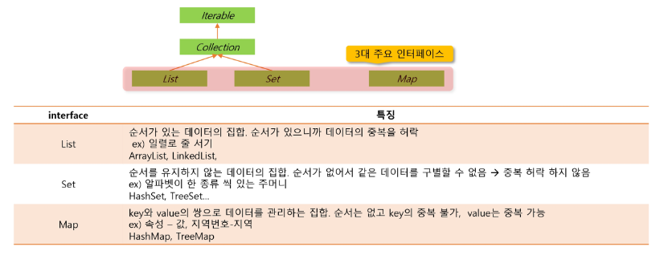
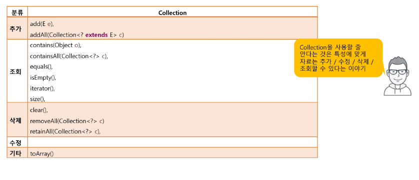
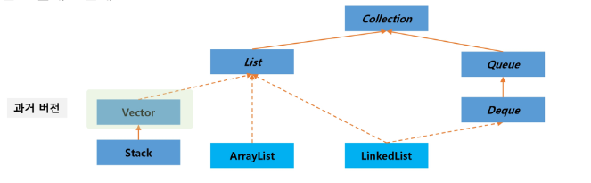
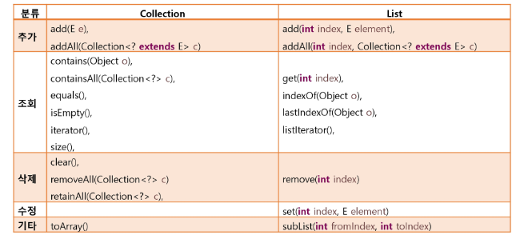
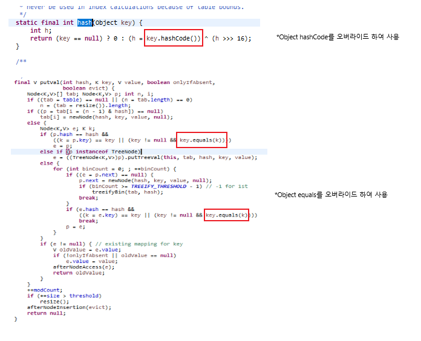

## SSAFY - 2022/07/27 내용 기록

---

### Collection Framework List 계열
---

<br />

#### 자료구조
- 자료구조는 컴퓨터 과학에서 효율적인 접근 및 수정을 가능케 하는 자료의 조직, 관리, 저장을 의미한다. 
- 더 정확히 말해 자료구조는 데이터 값의 모임 또 데이터 간의 관계 그리고 데이터에 적용할 수 있는 함수나 명령을 의미한다.

<br />

#### 배열 
- 가장 기본적인 자료구조
- `homogeneous collection` : 동일한 데이터 타입만 관리가능
  - 타입이 다른 객체를 관리하기 위해서는 매번 다른 배열 필요
- `polymorphism` 
  - `Object`를 이용하면 모든 객체 참조 가능 => `Collection Framework`
  - 담을때는 편리하지만 빼낼때는 `Object`로만 가져올 수 있음
  - 런타임에 실제 객체의 타입 확인 후 사용해야하는 번거로움
- `Generic`을 이용한 타입 한정
  - 컴파일 타임에 저장하려는 타입제한 => 형변환의 번거로움 제거

<br />

#### Collection Framework
- java.util 패키지 
  - 다수의 데이터를 쉽게 처리하는 방법 제공 => DB 처럼 CRUD 기능 중요
- collection framework 핵심 interface

<span align="center">



</span>

- Collection interface

<span align="center">



</span>

<br />

[참고] : `Java`에서 `synchronized` 키워드는 해당 키워드가 붙은 곳의 자원(변수도 가능하지는 잘 모르겠음 우선은 메서드)을 하나의 스레드만 사용할 수 있도록 하게 만드는 키워드이다.

#### List 
-  보통 웹 개발을 진행할때 Java에서는 거의 ArrayList를 사용한다. 단, 웹이 아닌 Java Application의 경우에는 다양하게 사용된다.

- 특징 : 
  - 순서가 있는 데이터의 집합
  - 순서가 있으므로 데이터의 중복을 허락

<br />

- 관련 클래스 관계도

<span align="center">



</span>

<br />

- 주요 메서드
<span align="center">



</span>

<br />

- 기존 `Collection` 메서드와 차이에 있어서 `List`는 `index`가 존재한다.(순서가 있기 때문)

<br />

- 배열과 ArrayList
  - 배열의 장점
    - 가장 기본적인 형태의 자료구조로 가난하며 사용이 쉬움
    - 접근 속도가 빠름
  - 배열의 단점
    - 크기를 변경할 수 없어 추가데이터를 위해 새로운 배열을 만들고 복사해야함
    - 비 순차적 데이터의 추가 삭제에 많은 시간이 걸림
  - 배열을 사용하는 ArrayList도 태생적으로 배열의 장-단점을 그대로 가져감

<br />

- `LinkedList`
  - 각 요소를 Node로 정의하고 Node는 다음 요소의 참조 값과 데이터로 구성됨
    - 각 요소가 다음 요소의 링크 정보를 가지며 연속적으로 구성될 필요가 없다.
    - 데이터 삭제 및 추가

<br />

|구분|순차 추가/수정/삭제시|중간에 추가/수정/삭제시|조회|
|:--:|:--:|:--:|:--:|
|ArrayList|빠름|느림|빠름|
|LinkedList|느림|빠름|느림|

- 결과 
  - 특정클래스가 좋고 나쁨이 아니라 용도에 적합하게 사용해야함
  - 소량의 데ㅣ터를 가지고 사용할 경우는 큰 차이가 없음.
  - 정적인 데이터 활용, 단순한 데이터 조회용 => `ArrayList`
  - 동적인 데이터 추가, 삭제가 많은 작업 => `LinkedList`

<br />

##### 자료 삭제시 주의사항
- index를 이용한 for문

```java
List<Integer> nums = new ArrayList<>();
Random rand = new Random();

for(int i = 0; i < 10; i++){
    nums.add(rand.nextInt(20));
}

System.out.println("전체 : "+nums);

for(int i = 0; i < nums.size(); i++){
    if(nums.get(i) % 2 == 0){
        nums.remove(i);
        i--;
    }
}
System.out.println("짝수 삭제후 : "+nums);
```

- 요소가 삭제되면 size가 줄어들기때문에 index 차감이 필요하다.
- 거꾸로 접근하면 자연스럽게 해결된다.
```java
for(int i = nums.size()-1; i >= 0; i--){
    if(nums.get(i)%2==1){
        nums.remove(i);
    }
}
```
- 즉, 중간에 index를 건너뛰지 않기 위한 처리를 해줘야한다.
- 결과적으로 이러한 처리를 해주기 위해 컬렉션을 거꾸로 탐색하며 진행하거나 index를 한번 더 감소시켜주는 두가지 방식이 존재한다.

<br />

- 그리고 특히 `forEach(향상된 for문)`은 `Collecion 크기가 불변`해야하기 때문에 주의해야한다.

```java
package com.ssafy.live4.collection.list;

import java.util.ArrayList;
import java.util.List;


public class ForEachTest {

    public static void main(String[] args) {
        List<Integer> nums = new ArrayList<>();
        for(int i=0; i<10; i++) {
            nums.add(i);
        }
        
        System.out.println("시작\t: "+nums);
        
        // 다음 iteration에서 nums의 개수가 변경되면 오류
        for(Integer num: nums) {
            if(num%2==0) {
                nums.add(num*num);
                //nums.remove(num);
                break;
            }
        }       
        System.out.println("삭제 \t: "+nums);        
    }
}
```
- for-each문에서 하나를 삭제하고 break하면 상관없지만 break문이 없다면 전체 index에 변화가 생기고 순회중인 Collection에 크기의 변화가 생기기 때문에 에러가 발생할 수 있다. => for-each문을 통해 추가/삭제 작업을 하지말것을 권장하는 바이다.

<br />

- 그리고 순회하는 방식에는 Iterator를 활용하는 방법도 존재한다. 이때에도 원소 삭제시 주의를 해야한다.

```java
List<Integer> nums = new ArrayList<>();

for (int i = 0; i < 10; i++) {
    nums.add(i);
}
System.out.println("전체: " + nums);

Iterator<Integer> iter = nums.iterator();

while(iter.hasNext()) {
    if(iter.next() % 3 == 0) {
        iter.remove();
    }
}
System.out.println("3의 배수 삭제 후: " + nums);
```

- 또한 아래와 같은 두가지 경우가 있었다.

<span align="center">


</span>

- 결론부터 말하자면 `Iterator` 객체 선언시점에 따라 정보가 다르기때문이다.
- 위의 케이스를 전자와 후자라 하자면, 전자의 경우 리스트에 원소를 추가하기전 `Iterator` 를 선언하여 `Iterator` 객체에 저장된 리스트의 길이정보가 0이다. 반면 후자는 10이다. 이와중에 while문을 통해 next()를 진행했으니 전자의 경우 에러가 남은 당연하다.
- 여기서 추가적으로 주의할점은 전자와 후자 모두 같은 크기의 메모리 공간을 차지한다는 점이다. 전자와 후자의 경우 `Iterator` 생성시점에 nums와 같은 공간을 가리키게 되는데 이때 원소를 추가하게됨으로써 메모리공간에 차지하는 부분이 똑같이 늘어나게 된다. 즉 원소는 모두 가지고 있는 상태이지만 `Iterator` 객체에서 가지고 있는 `expectedModCount`의 값이 초기 선언시점에 따라 다르게 설정됨으로써 순회가 가능하거나, 순회가 불가능한 결과를 출력하게 되는것이다.
- 결과적으로 리스트내 원소의 개수에 변화가 생긴다면(add 혹은 remove)를 통해 추가/삭제 작업 이후에 `Iterator` 객체를 선언하도록 하자.

<br />

- 람다식을 이용해 편리하게도 작성할 수 있다.

```java
nums.removeIf(num -> num % 3 == 0);
```
- 자바스크립트 화살표 함수느낌인듯하다.
- num 하나를 넘겨 뒤에 비교문에 부합하면 제거한다.
- `Predicate` 클래스가 `Functional Interface`이기 때문에 가능하다.

<br />

- 추가적으로 `Arrays.asList()`를 통해 반환된 리스트는 추가/삭제(add/remove) 작업이 불가능하다. => 단, 수정(set)은 가능하다.

```java
List<String> strs = Arrays.asList("Hello", "Collection", "World");
        // TODO: strs에 자료를 추가, 수정, 삭제해보자.
        // END:
        strs.set(0,"HI");
        System.out.println(strs);
```

- Arrays.asList()에서 반환하는 ArrayList는 해당 Arrays클래스 내부 클래스로 따로 구현된 ArrayList를 반환하는데 이는 add와 remove를 override하고 있지않고 해당 클래스의 부모클래스에 있는 add와 remove는 예외를 throw하기에 주의해야한다.
- 즉, 일반적으로 우리가 선언해서 사용한 ArrayList와는 다르게 add와 remove가 불가능하다.

<br />

#### Set Interface 
- 특징
  - 순서 없이 주머니에 데이터를 넣는 형태
  - 순서가 없으므로 데이터를 구별할 index가 없어 중복이 허용되지 않는다.
    - 효율적인 중복 데이터 제거 수단

<br />

- 관련 클래스 관계도

<span align="center">


</span>

<br />

- Set은 같은 값인지를 비교함에 있어서 equals()메서드를 이용한다. 기본적으로 객체는 Object클래스를 상속받고 있고, Object클래스에 선언되어 있는 `equals` 메서드는 주소값을 비교하기 때문에 상속받은 클래스에 `equals`메서드를 재정의함으로써 원하는 값을 비교하도록 바꿀 수 있다. 아래코드의 결과를 확인해보자

<span align="center">


</span>

- 위 코드의 결과를 통해 확인할 수 있듯이 Object클래스에 선언되어 있는 `equals` 를 사용했기 때문에 두 값이 저장된 객체의 주소값이 다르다고 판단하여 set에는 두 번호 모두 저장된다. 이제 값에 대한 비교를 해주기 위해 `equals` 메서드를 재정의한다.

```java
package com.ssafy.live4.collection.set;

// TODO: SmartPhone이 다른 SmartPhone과 번호를 기준으로 비교가능하게 처리하시오.
 public class SmartPhone {
    // END:

    String number;

    public SmartPhone(String number) {
        this.number = number;
    }

    public String toString() {
        return "전화 번호: " + number;
    }

    // TODO: 동일한 번호의 SmartPhone이면 하나만 추가될 수 있도록 처리하시오.
    // END:
    @Override
    public boolean equals(Object obj) {
    	System.out.println("SmartPhone equals() 호출...");
    	if(obj != null && obj instanceof SmartPhone) {
    		return (this.number.equals(((SmartPhone) obj).number));
    	}
    	return false;
    }
  
    
    @Override
    public int hashCode() {
    	return number.hashCode();
    }    
}

```
- hashCode에 대한 부분 질문

```java
package com.ssafy.live4.collection.set;

import java.util.HashSet;
import java.util.Set;


public class SetTest {
    Set<Object> hset = new HashSet<Object>();

    private void addMethod() {
        hset.add(Integer.valueOf(1));
        hset.add("Hello");     
        hset.add("Hello");      // 동일한 데이터 추가 확인
        hset.add(1);            // 기본형은 wrapper를 통해 추가
        // TODO: SmartPhone 타입의 객체를 추가해보자.
        // END:
        SmartPhone phone1 = new SmartPhone("010-111-1111");
        SmartPhone phone2 = new SmartPhone("010-111-1111");
        SmartPhone phone3 = new SmartPhone("010-333-3333");
        hset.add(phone1);
        hset.add(phone2);
        hset.add(phone3);
        System.out.println("데이터 추가 결과: " + hset);
    }

    private void retrieveMethod() {
        System.out.println("데이터 개수: " + hset.size());

        for (Object sobj : hset) {
            System.out.println("데이터 조회: " + sobj);
        }
    }

    private void removeMethod() {
        hset.remove("Hello");
        System.out.println("데이터 삭제 결과: " + hset);
    }
    
    public static void main(String[] args) {
        SetTest test = new SetTest();
        test.addMethod();
        test.retrieveMethod();
        test.removeMethod();
    }
}
```

- equals() 와 hashCode() 메서드를 재정의(override)함으로써 중복저장을 피할 수 있다.
- `equals() 와 hashCode()` 모두 Object 클래스에 정의된 바로는 객체의 주소값을 비교하고, 객체의 주소에 따른 해시값을 반환하는 형태이다. 하지만 Set 혹은 HashSet, Map 혹은 HashMap에서의 Key값에 사용하기 위해서는 해당하는 값에 대한 비교를 진행하여야하고, Set과 Map에서는 equals()를 사용해 중복을 피하고 HashSet과 HashMap에서는 equals() 와 hashCode()를 사용하여 중복을 피하기 떄문에 두개의 메서드를 재정의해줌으로써 사용자 정의 클래스 타입에 대한 원소들의 중복 비교를 피할 수 있다. 즉, 위와 같이 코드를 작성하면 된다는 것이다.
- 위 코드를 기준으로 이제 같은 전화번호를 넣으면 중복으로 인해 저장하지 않는다.
- 아래의 사진도 참고하면 좋다.

<span align="center">



</span>

<br />

#### Map Interface

- Key와 Value를 하나의 Entry로 묶어서 데이터관리
  - `Key` : Object 형태로 데이터의 중복을 허용하지 않는다.
  - `Value` : Object 형태로 데이터 중복이 허락됨.


<br />

- 클래스 관계도

<span align="center">


</span>

- Vector와 Hashtable은 `동기화(Synchronized)를 사용한다는 점`에서 ArrayList와 HashMap과는 차이를 보인다. 

<br />

- Map Interface 주요 메서드

<span align="center">


</span>

- `entrySet()` 은 `내부 클래스(Inner Class)`로 선언된 Entry클래스 객체를 `Set`으로 반환한다.
- `Entry` 는 `Key-Value` 쌍을 가진다.

- 즉, `entrySet()`의 반환결과 타입은

```java
Set<Entry<K,V>>
```
- 의 타입을 가진다. 이렇게되면 Iterable 클래스를 상속받는 Set이 되므로 for-each문을 사용할 수 있다.
- 즉 Set도 Generic으로 선언되어 있어서, 위와 같이 사용할 수 있지만, 내부 클래스인 Entry도 Generic으로 선언되어 있기에 이와같이 활용할 수 있다.
- 

<br />

```java
public interface Map<K,V> {
    // Query Operations

    /**
     * Returns the number of key-value mappings in this map.  If the
     * map contains more than <tt>Integer.MAX_VALUE</tt> elements, returns
     * <tt>Integer.MAX_VALUE</tt>.
     *
     * @return the number of key-value mappings in this map
     */
    int size();

    /**
     * Returns <tt>true</tt> if this map contains no key-value mappings.
     *
     * @return <tt>true</tt> if this map contains no key-value mappings
     */
    boolean isEmpty();

     .....


```

- Map 인터페이스는 Iterable을 상속받지 않는다. => 다른 Collection들과 다르게 for-each를 이용해 순회할 수 없다.
- Map에서는 이를 위해 `Set`의 특성을 띄는 `Key(키)`의 집합을 Set으로 반환한다. 이렇게 되면 Iterable하니까 이를 이용해 for-each를 사용하는 방법도 있다. 

<br />

#### Map 사용 예제 코드 1

```java
package com.ssafy.live4.collection.map;

import java.util.HashMap;
import java.util.Map;
import java.util.Map.Entry;
import java.util.Set;


public class MapTest {
    Map<String, String> hMap = new HashMap<>();

    private void addMethod() {
        System.out.println("추가 성공?: " + hMap.put("andy", "1234"));
        // 동일한 키의 사용 결과는?
        System.out.println("추가 성공?: " + hMap.put("andy", "4567"));
        hMap.put("kate", "9999");
        // 기존에 해당 키에 대한 값이 없을 때만 추가하기
        hMap.putIfAbsent("kate", "1234");

        hMap.put("henry", "4567"); // 동일한 값
        
        hMap.put("hong", "1234");
        System.out.println("추가 결과: " + hMap);
    }

    private void retrieveMethod() {
        // TODO: kate의 전화번호가 있나요?
        // END:
    	System.out.println(hMap.containsKey("Kate"));

        // TODO: map이 가지고 있는 key와 거기에 연결된 value를 출력하시오.
        // END:
    	Set<String> keys = hMap.keySet();
    	System.out.println("\nKey를 이용한 출력 ==============");
    	for(String key : keys) {
    		System.out.println(key +" : " +hMap.get(key));
    	}
    	
    	System.out.println("\nEntry를 이용한 출력 ==============");
    	Set<Entry<String, String>> entries = hMap.entrySet();
    	for(Entry<String,String> e : entries) {
    		System.out.println(e.getKey() + " : " + e.getValue());
    	}
    	    	
        // TODO: 값이 4567인 사람의 이름은?
        // END:
    	System.out.println("\n값이 4567인 사람의 이름 ==============");
    	for(Entry<String,String> e : entries) {
    		if(e.getValue().equals("4567")) {
    			System.out.println("이름 : " + e.getKey());
    		}
    	}
    	
    }

    private void removeMethod() {
        // TODO: andy의 자료를 삭제하고 출력하시오.
        // END:
    	System.out.println("\n이름 andy 삭제 ==============");
    	hMap.remove("andy");
    	System.out.println(hMap);
    }

    public static void main(String[] args) {
        MapTest hmt = new MapTest();
        hmt.addMethod();
        hmt.retrieveMethod();
        hmt.removeMethod();
    }
}
```

```java
Output

추가 성공?: null
추가 성공?: 1234
추가 결과: {hong=1234, henry=4567, kate=9999, andy=4567}
false

Key를 이용한 출력 ==============
hong : 1234
henry : 4567
kate : 9999
andy : 4567

Entry를 이용한 출력 ==============
hong : 1234
henry : 4567
kate : 9999
andy : 4567

값이 4567인 사람의 이름 ==============
이름 : henry
이름 : andy

이름 andy 삭제 ==============
{hong=1234, henry=4567, kate=9999}
```
- `put`메서드는 이전 key가 있었다면 이전 key에 해당하는 value를 반환한다.
  - 같은 Key값으로 덮어쓰게 되는 경우를 생각할 수 있다. 없던 경우엔 null을 반환한다.
- `putIfAbsent()`메서드는 key값이 있는지 확인하고 없다면 entry를 넣고 있다면 entry를 추가하지 않는다.

<br />

---

### 정렬
- 요소를 특정 기준에 대한 `내림차순` 또는 `오름차순`으로 배치하는 것
 
<br />

- 순서를 가지는 Collection 들만 정렬 가능
  - List 계열
  - Set에서는 SortedSet의 자식 객체
  - Map에서는 SortedMap의 자식 객체(Key 기준)

```java
public void basicSort() {
		System.out.println("오름차순");
		Collections.sort(names);// 오름차순
		// Hello Hi 중 큰 값은 Hi 이다. 앞에서부터 값을 비교하기에 두번째자리에서 Hi가 더 큰값으로 판단하여 Hi가 Hello보다 뒤에온다.
		System.out.println(names);
		System.out.println("\n내림차순");
		Collections.reverse(names);// 내림차순
		System.out.println(names);
	}
```

<br />

- Collections의 sort()를 이용한 정렬
  - sort(List<T> list)
    - 객체가 Comparable을 구현하고 있는 경우 내장 알고리즘을 통해 정렬

<br />

- 정렬에 있어 가장 중요하고 어려운 부분은 사용자 정의 Sorting을 진행하는 것이다. 

```java
public void sortPhone() {
		List<SmartPhone> phones = Arrays.asList(
				new SmartPhone("016"),
				new SmartPhone("011"),
				new SmartPhone("017")
				);
		
		Collections.sort(phones); 
	}
```

- 단순히 이렇게 사용하면 sort를 진행할 수 없다. sort에서 사용하는 `Comparable`의 메서드를 구현하지 않았기 때문인데, 이를 `implements`해서 `compareTo`메서드를 구현하여야 한다.
- 이와 같이 `interface`를 통해 메서드의 재정의를 강제할 수 있다.

```java
package com.ssafy.live4.collection.set;

// TODO: SmartPhone이 다른 SmartPhone과 번호를 기준으로 비교가능하게 처리하시오.
 public class SmartPhone implements Comparable<SmartPhone>{
    // END:

    String number;

    public SmartPhone(String number) {
        this.number = number;
    }

    public String toString() {
        return "전화 번호: " + number;
    }

    // TODO: 동일한 번호의 SmartPhone이면 하나만 추가될 수 있도록 처리하시오.
    // END:
    @Override
    public boolean equals(Object obj) {
    	System.out.println("SmartPhone equals() 호출...");
    	if(obj != null && obj instanceof SmartPhone) {
    		return (this.number.equals(((SmartPhone) obj).number));
    	}
    	return false;
    }
  
    
    @Override
    public int hashCode() {
    	return number.hashCode();
    }

	@Override
	public int compareTo(SmartPhone o) {	
		return this.number.compareTo(o.number);
	}    
}
```

- `Comparable<SmartPhone>` 에서처럼 비교되는 객체 즉, 클래스타입간 비교이므로 SmartPhone이 타입 파라미터에 들어가고 미구현된 compareTo메서드를 구현해주면 정렬을 할 준비가 된것이다. 

- 이제 아래의 테스트문 처럼 sort를 사용하게되면 사용자가 정의한 클래스타입에 대해서도 정렬을 수행할 수 있다.(물론 역순도! ㅎㅎ)

```java
public void sortPhone() {
    List<SmartPhone> phones = Arrays.asList(
            new SmartPhone("016"),
            new SmartPhone("011"),
            new SmartPhone("017")
            );
    System.out.println("\n사용자 정의 정렬 오름차순");
    Collections.sort(phones);
    System.out.println(phones);
    System.out.println("\n사용자 정의 정렬 내림차순");
    Collections.reverse(phones);
    System.out.println(phones);
}
```
- 자기자신과 상대방을 비교했을때 양수가 나온다면 위치를 바꿔줘야한다는 의미이고, 만일 음수가 나온다면 자기자신이 더 작다는의미이다. 즉, 양수가 나오면 자리를 바꿔줘야한다는의미, 0이라면 같은 값이라는 의미, 음수라면 그 수보다 큰 값이라는 의미인 것이다.

<br />

#### 문자열의 길이에 따른 정렬
- 이와 같이 새로운 정렬기준을 제시해야하는 경우에는 Comparable을 상속받아 정의하는 것이 아닌 Comparator를 정의하여 사용한다는 개념이다.

```java
class MyComp implements Comparator<String>{
    @Override
    public int compare(String o1, String o2) {
        return Integer.compare(o1.length(), o2.length());
    }
}

public void stringLengthSort() {
    // 교수님 방식
    System.out.println("\n문자열 길이에 따른 정렬 : 별도 클래스 정의");
    Collections.sort(names,new MyComp());
    System.out.println(names);// [Hi, Java, World, Welcome]
    // 여기서 사용된 MyComp클래스는 한번만 사용되기에 이런 경우에는 익명클래스로 선언하여 사용하는 것이 더 좋다.
    
    
    // 람다식 사용
    System.out.println("\n문자열 길이에 따른 역순정렬 : 람다식 사용");
    names.sort((s1, s2) -> s2.length() - s1.length());
    System.out.println(names); 
}
```

- 여기서 사용된 MyComp클래스는 한번만 사용되기에 이런 경우에는 `익명클래스`로 선언하여 사용하는 것이 더 좋다.

<br />

#### 익명 클래스 
- 이름이 없다. (class 이름 - X)
- 객체를 생성 + 클래스 내용 정의

```java
new `부모클래스(또는)부모인터페이스` (){

    ... 클래스 내용
}
```
- 이 자리에 오는 `클래스와 인터페이스명`은 이 `익명클래스`가 상속한 `부모클래스 혹은 부모 인터페이스` 즉 부모 타입의 이름이 온다.

- 그 뒤에는 익명클래스의 클래스 내용이 온다.

<br />

#### 람다 표현식(Lambda Expression)
```java
// 람다식 사용
		System.out.println("\n문자열 길이에 따른 역순정렬 : 람다식 사용 + ");
		names.sort((s1, s2) -> s2.length() - s1.length());
		System.out.println(names); 
		
		// Collections.sort() 활용
		System.out.println("\n문자열 길이에 따른 정순정렬 : 람다식 사용 + Collections.sort() 활용");
		Collections.sort(names,(s1, s2) -> Integer.compare(s1.length(), s2.length()));
		// 이처럼 Integer의 비교는 Integer 클래스의 compare를 이용하는 것이 좋다.
		System.out.println(names); 
```

- 아무 관계없는 람다식이 아닌 `Comparator` 인터페이스 자리에는 `Comparator` 인터페이스와 관련이 있게 람다식을 작성해야한다. 
- 가장 중요한 전제 조건은 `해당 인터페이스에 구현해야할 메서드가 하나만 있어야한다`. 이렇게 메서드가 하나만있어서 람다식으로 구현할 수 있는 것을 `Funtional Interface`라고 한다.
- `Funtional Interface`로는 `Comparator` 그리고 `Predicate` 인터페이스 등이 있다.(더많겠지..?)

<br />

#### 전체 예제 코드 
```java
package com.ssafy.live4.collection.sort;

import java.util.Arrays;
import java.util.Collections;
import java.util.Comparator;
import java.util.List;

import com.ssafy.live4.collection.set.SmartPhone;

public class ListSortTest {

	private List<String> names = Arrays.asList("Hi Hello", "Java", "World", "Welcome");

	public void basicSort() {
		System.out.println("오름차순");
		Collections.sort(names);// 오름차순
		// Hello Hi 중 큰 값은 Hi 이다. 앞에서부터 값을 비교하기에 두번째자리에서 Hi가 더 큰값으로 판단하여 Hi가 Hello보다 뒤에온다.
		System.out.println(names);
		System.out.println("\n내림차순");
		Collections.reverse(names);// 내림차순
		System.out.println(names);
	}

	public void sortPhone() {
		List<SmartPhone> phones = Arrays.asList(
				new SmartPhone("016"),
				new SmartPhone("011"),
				new SmartPhone("017")
				);
		System.out.println("\n사용자 정의 정렬 오름차순");
		Collections.sort(phones);
		System.out.println(phones);
		System.out.println("\n사용자 정의 정렬 내림차순");
		Collections.reverse(phones);
		System.out.println(phones);
	}

	//별도의 Inner Class 정의
	class MyComp implements Comparator<String>{
		@Override
		public int compare(String o1, String o2) {
			return Integer.compare(o1.length(), o2.length());
		}
	}

	public void stringLengthSort() {
		// 교수님 방식
		System.out.println("\n문자열 길이에 따른 정렬 : 별도 클래스 정의");
		Collections.sort(names,new MyComp());
		System.out.println(names);// [Hi, Java, World, Welcome]
		// 여기서 사용된 MyComp클래스는 한번만 사용되기에 이런 경우에는 익명클래스로 선언하여 사용하는 것이 더 좋다.

		
		System.out.println("\n문자열 길이에 따른 정렬 : 익명 클래스 정의");
		Collections.sort(names, new Comparator<String> () {
			@Override
			public int compare(String o1, String o2) {
				return Integer.compare(o1.length(), o2.length());
			}
		});
		System.out.println(names);// [Hi, Java, World, Welcome]

		// 람다식 사용
		System.out.println("\n문자열 길이에 따른 역순정렬 : 람다식 사용 + ");
		names.sort((s1, s2) -> s2.length() - s1.length());
		System.out.println(names); 
		
		// Collections.sort() 활용
		System.out.println("\n문자열 길이에 따른 정순정렬 : 람다식 사용 + Collections.sort() 활용");
		Collections.sort(names,(s1, s2) -> Integer.compare(s1.length(), s2.length()));
		// 이처럼 Integer의 비교는 Integer 클래스의 compare를 이용하는 것이 좋다.
		// 1. 아무 관계없는 람다식이 아닌 Comparator 인터페이스 자리에는 Comparator 인터페이스와 관련이 있게 람다식을 작성해야한다.
		// 2. 가장 중요한 전제 조건은 해당 인터페이스에 구현해야할 메서드가 하나만 있어야한다. 이렇게 메서드가 하나만있어서 람다식으로 구현할 수 있는 것을 `Funtional Interface`라고 한다.
		System.out.println(names); 
	}

	public static void main(String[] args) {
		ListSortTest st = new ListSortTest();
		st.basicSort();
		st.sortPhone();
		st.stringLengthSort();
	}

}
```
```java
Output

오름차순
[Hi Hello, Java, Welcome, World]

내림차순
[World, Welcome, Java, Hi Hello]

사용자 정의 정렬 오름차순
[전화 번호: 011, 전화 번호: 016, 전화 번호: 017]

사용자 정의 정렬 내림차순
[전화 번호: 017, 전화 번호: 016, 전화 번호: 011]

문자열 길이에 따른 정렬 : 별도 클래스 정의
[Java, World, Welcome, Hi Hello]

문자열 길이에 따른 정렬 : 익명 클래스 정의
[Java, World, Welcome, Hi Hello]

문자열 길이에 따른 역순정렬 : 람다식 사용 + 
[Hi Hello, Welcome, World, Java]

문자열 길이에 따른 정순정렬 : 람다식 사용 + Collections.sort() 활용
[Java, World, Welcome, Hi Hello]
```

- 전체 예제 코드이다. 결과를 확인하여 잘 살펴보자

<br />

