## SSAFY - 2022/07/28 내용 기록

---

### I/O Stream

- I/O : 데이터의 입력과 출력
- 데이터는 한쪽에서 주고 한쪽에서 받는 구조로 되어있음
  - 이때 입력과 출력의 끝단 : 노드(Node)'
  - 두 노드를 연결하고 데이터를 전송할 수 있는 개념 : 스트림(Stream)
    - 물의 흐름이나 전기의 흐름과 같은 개념
  - 스트림은 단방향으로 통신이 가능하며 하나의 스트림으로 입력과 출력을 같이 처리할 수 있음

<br />

- 노드 스트림(Node Stream)의 종류와 naming
  - Node Stream : node에 연결되는 스트림

<span align="center">

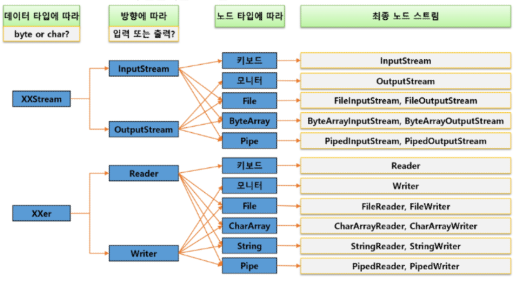

</span>

<br />


<span align="center">

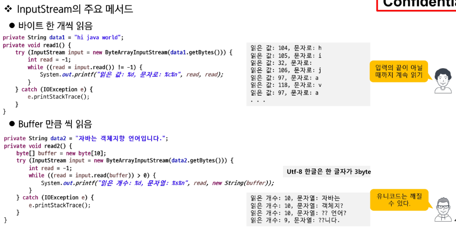

</span>

<br />

<span align="center">

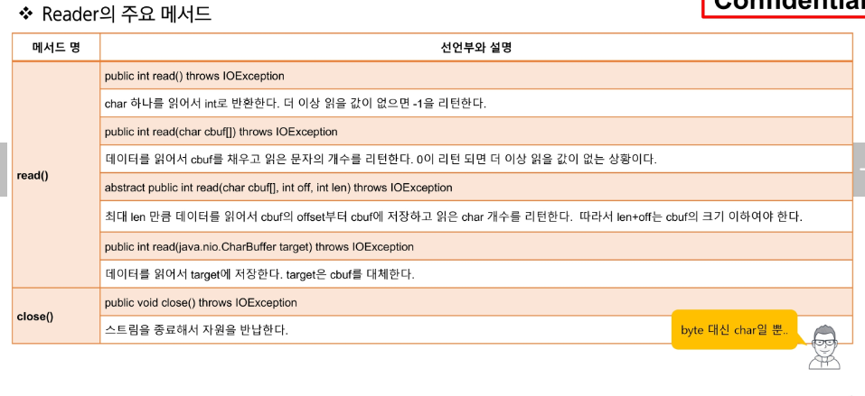

</span>

<span align="center">

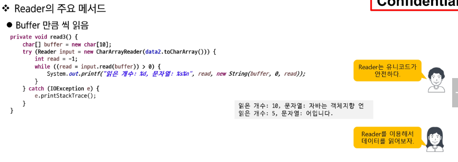

</span>

<span align="center">

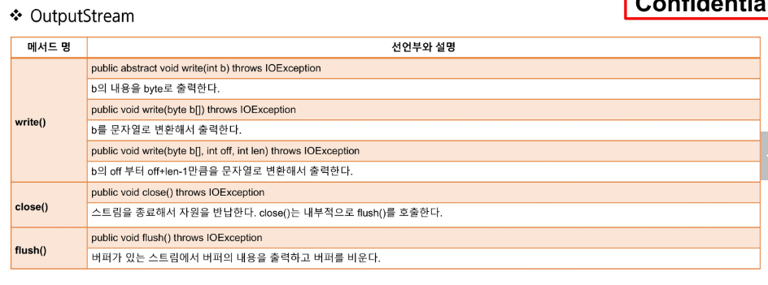

</span>

<span align="center">

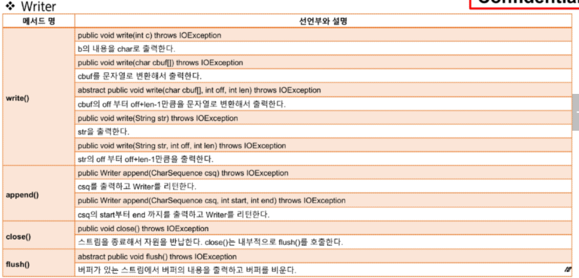

</span>

<span align="center">

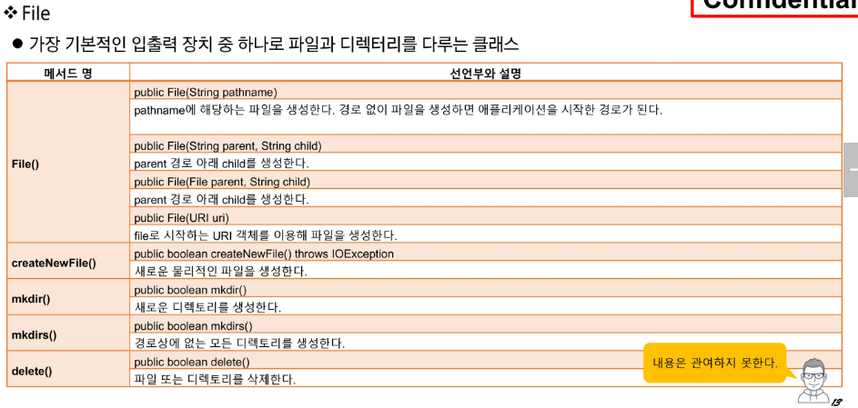

</span>

<span align="center">

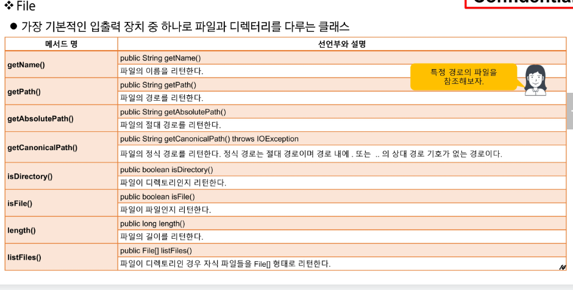

</span>

<span align="center">

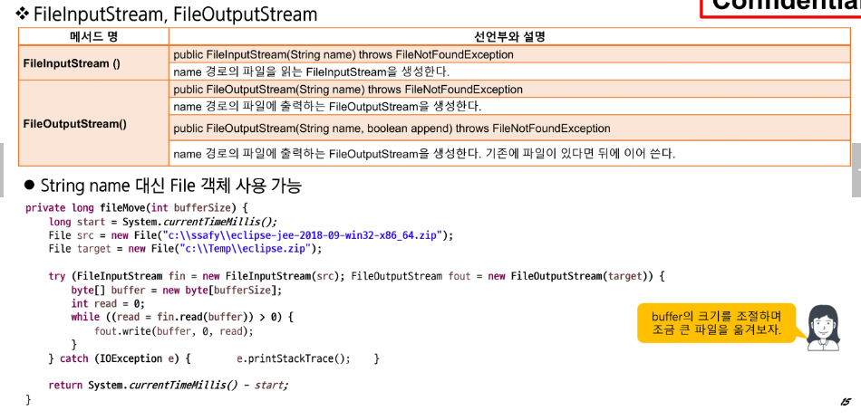

</span>

<span align="center">

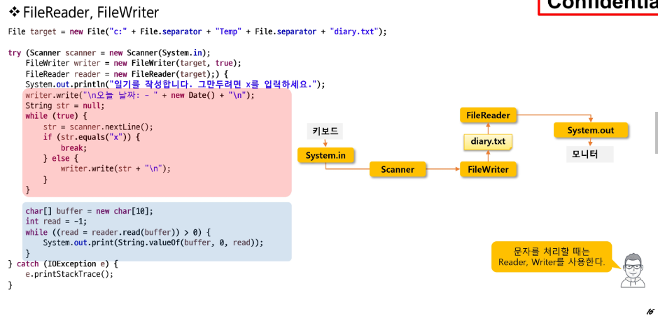

</span>

<br />

- 주의할 점으론 src에서 .java파일을 작성하지만 결과적으로 실행중에는 bin 디렉터리에서 class파일이 실행되는 시점을 생각해야한다. 즉, 파일이 있는지를 검사할때 주체가 bin 폴더내에서 출발해야함을 할 수 있다.
- 또한 프로그래밍을 함에 있어 파일명 혹은 디렉터리 명을 정할때 있어 `한글`과 `공백`은 금기시 된다.
- 
---

### 보조 스트림
- 보조 스트림 : Filter Stream, Processing Stream
    - 다른 스트림에 부가적인 기능을 제공하는 스트림

<span align="center">

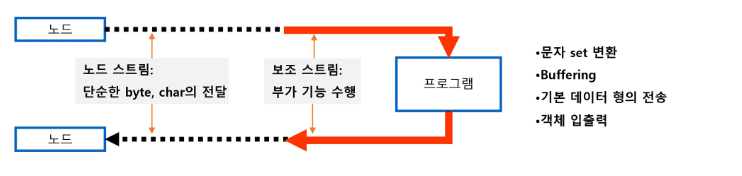

</span>


- 스트림 체이닝(Stream Chaining)
  - 필요에 따라 여러보조 스트림을 연결해서 사용가능


<span align="center">

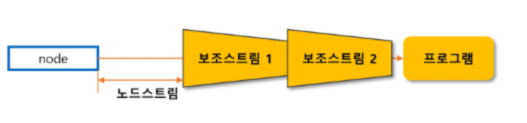

</span>

<br />

- 보조 스트림의 종류

<span align="center">

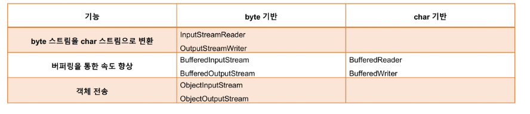

</span>


- 생성 => 이전 스트림을 생성자의 파라미터에 연결

<span align="center">

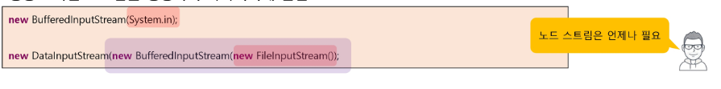

</span>

- 종료
  - 보조 스트림의 `close()`를 호출하면 노드 스트림의 `close()`까지 호출됨 

<br />

- 사용할 스트림의 결정 과정

<span align="center">

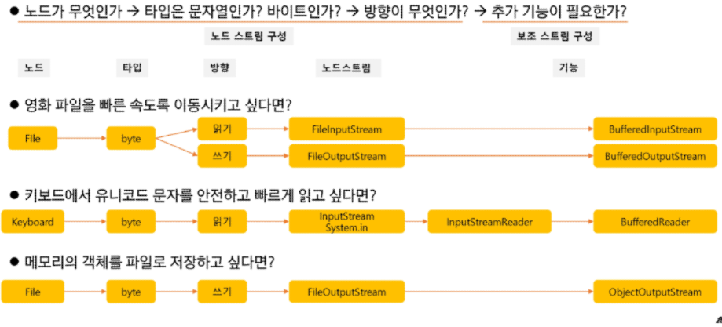

</span>

---

### 보조 스트림 활용 1

<br />

#### InputStreamReader & OutputStreamWriter

- byte 기반 스트림을 char 기반으로 변경해주는 스트림
  - 문자열을 관리하기 위해서는 byte 단위보다 char 단위가 유리
  - 키보드에서 입력(byte stream) 받은 데이터를 처리할 경우 등
- 변환 시 encoding 지정 가능

<span align="center">

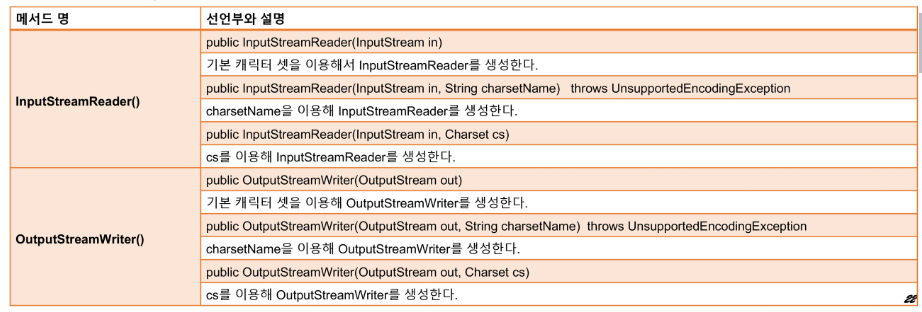

</span>

<br />

##### Buffered 계열
- 버퍼의 역할

<span align="center">

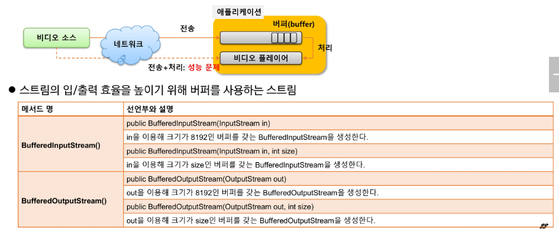

</span>

- BufferedReadeer & BufferedWriter

<span align="center">

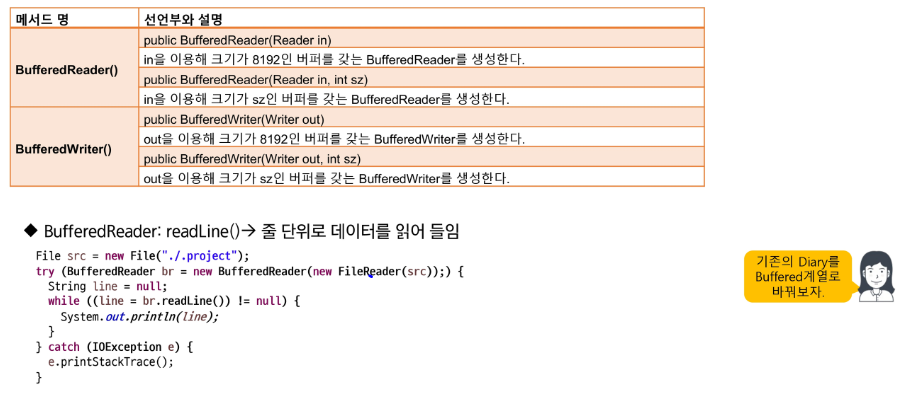

</span>

<br />

---

### 보조 스트림 활용 2

<br />

- 객체 직렬화(serialization)
  - 객체를 파일등에 저장하거나 네트워크로 전송하기 위해 연속적인 데이터로 변환하는 것
  - 반대의 경우는 역 직렬화(deserialization)

<span align="center">

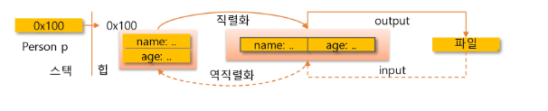

</span>


- 직렬화 되기 위한 조건
  - `Serializable` 인터페이스를 구현할 것
  - 클래스의 모든 멤버가 `Serializable` 인터페이스를 구현해야함
  - 직렬화에서 제외하려는 멤버는 `transient` 선언

<span align="center">

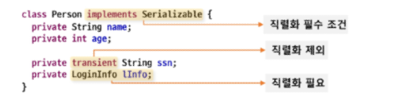

</span>

- 직렬화 시키려는 대상의 내부에 있는 멤버타입들도 모두 Srializable을 구현하고 있어야한다.

<br />

- serialVersionUID
  - 클래스의 변경 여부를 파악하기 위한 유일키

<span align="center">

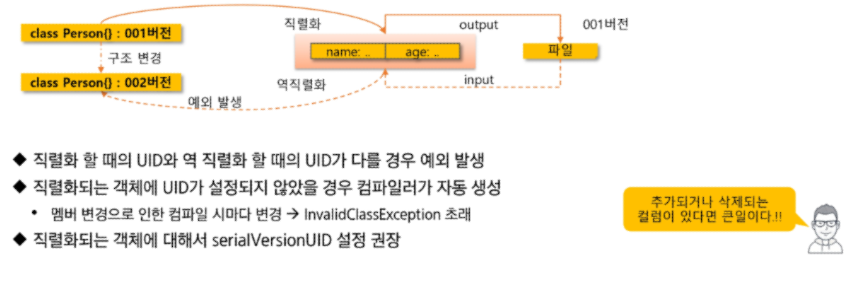

</span>


  - 직렬화 할떄의 UID와 역 직렬화 할 때의 UID가 다를 경우 예외 발생
  - 직렬화되는 객체에 UID가 설정되지 않았을 경우 컴파일러가 자동 생성
    - 멤버변경으로 인한 컴파일 시마다 변경 => InvalidClassException
  - 직렬화되는 객체에 대해서 serialVersionUID 설정 권장

<br />

- ObjectInputStream, ObjectOutputStream 

<span align="center">

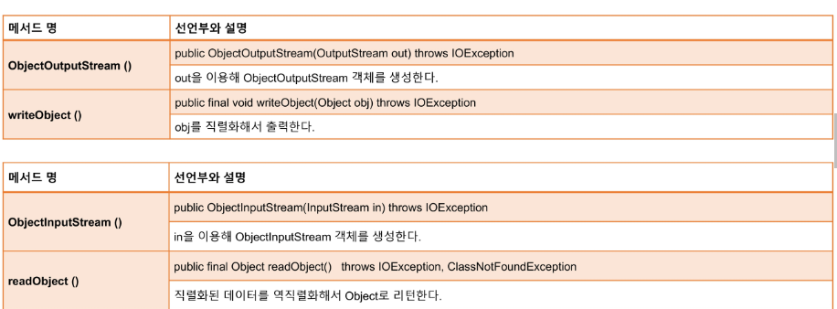

</span>

<br />

- Scanner 와 BufferedReader
  - char형태의 데이터를 읽기위한 클래스들
  - Scanner : 자동 형변환을 지원하는 등 사용이 간편하지만 속도가 느림
  - BufferedReader : 직접 스트림을 구성해야 하는 등 번거롭지만 속도가 빠름

<br />

---

## 공공 데이터와 XML

<br />

### 공공 데이터란?
- 공공기관이 만들어내는 모든 공적인 정보
- 각 공공 기관이 보유한 데이터를 개방하여 누구나 원하는 기능에 활용 가능
- [www.data.go.kr](www.data.go.kr)등 회원 가입 후 개별 키를 발급 받아 사용 

<br />

### 데이터의 형태
- API를 통해 XML 혹은 JSON 형태로 제공된다.

- 종류
  - `CSV` : Comma Separated Value
  - `XML` : 태그를 통해 데이터 형식 정의
  - `JSON` : JSON(Javascript Object Notation) 을 통해 데이터 형식 정의

<br/>

#### XML

- Markup Language
  - 태그등을 이용하여 문서나 데이터의 구조를 명기하는 언어
  - HTML, SGML...

- XML
  - Extensible Markup Language

- HTML과 달리
  - 필요에 따라서 태그를 확장해서 사용 가능
  - 정확한 문법을 지켜야 동작 : Well formed

<br />

- 기본 문법
  - 문서의 시작은 `<?xml version="1.0" encoding="UTF-8"?>` 로 한다.
  - 반드시 `root element`가 존재해야 한다.
    - 나머지 태그들은 `Tree`형태로 구성된다. 

- 시작 태그와 종료 태그는 일치해야 한다.
- 시작 태그는 `key-value` 구조의 속성을 가질 수 있다.
  - 속성 값은 `""` 또는 `''`로 묶어서 표현한다.
- 태그는 `대소문자를 구별`한다.

<br />

- valid : 작성자의 의도대로 잘 작성되었는지?
  - xml 태그는 자유롭게 생성하기 때문에 최초 작성자의 의도대로 작성되는지 확인할 필요가 있다.
    - 문서의 구조와 적절한 요소, 속성들의 개수, 순서들이 잘 지켜졌는가?
    - `DTD` 또는 `Schema`를 이용해서 문서의 규칙 작성

<span align="center">

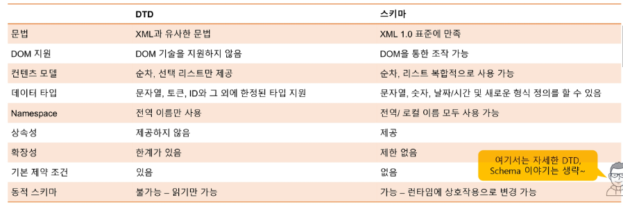

</span>

- DTD, Schema를 잘따른 문서를 `valid 하다` 라고 한다.

<span align="center">

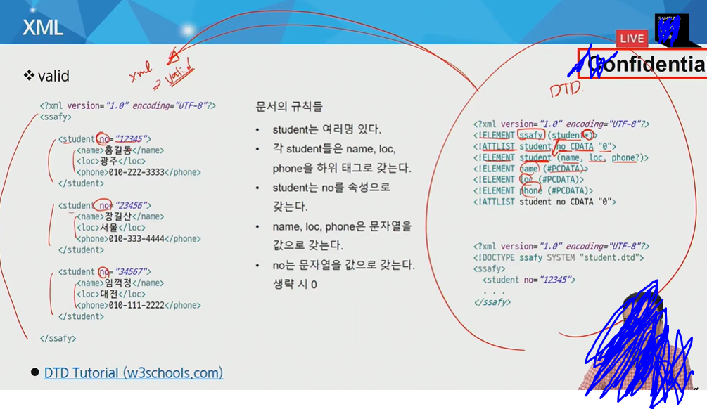

</span>

<br />

---

### 문서의 Parsing - SAX

<br />

#### XML 파싱

- 파싱 : 문서에서 필요한 정보를 얻기위해 태그를 구별하고 내용을 추출하는 과정
  - 전문적인 parser 활용
- SAX parser
  - Simple API for XML parser
  - 문서를 읽으면서 태그의 시작, 종료 등 이벤트 기반으로 처리하는 방식

- DOM parser 
  - Document Object Model
  - 문서를 다읽고 난 후 문서 구조 전체를 자료구조에 저장하여 탐색하는 방식
  
- SAX는 빠르고 한번에 처리하기 때문에 다양한 탐색이 어렵다.
- DOM은 다양한 탐색이 가능하지만 느리고, 무거우며 큰 문서를 처리하기 어렵다.

#### SAX(Simple API for XML) Parser
- 동작 방식
  - 문서를 읽다가 발생하는 이벤트 기반으로 문서 처리


<span align="center">

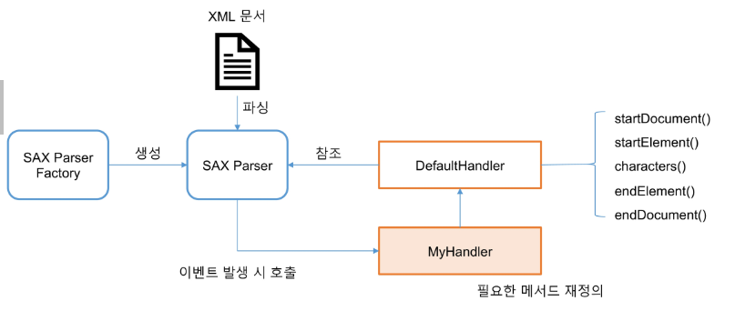

</span>

- SAX Parser가 문서를 읽다가 이벤트가 발생하면 `Myhandler => DefualtHandler`를 호출

<br />

- 영화정보를 저장하기 위한 클래스 구성(`DTO`) => `getter` `setter` `default constructor` `toString`을 포함

<br />

##### SimpleDataFormat

|Letter|Date or Time Component|Presentation|Examples|
|:--:|:--:|:--:|:--:|
|G|  Era designator | Text | AD  |
|y|  Year | Year | 1996; 96  |
|Y|  Week year | Year | 2009; 09  |
|M|  Month in year (context sensitive) | Month | July; Jul; 07 | 
|L|  Month in year (standalone form) | Month | July; Jul; 07  |
|w|  Week in year | Number | 27  |
|W|  Week in month | Number | 2  |
|D|  Day in year | Number | 189  |
|d|  Day in month | Number | 10  |
|F|  Day of week in month | Number | 2  |
|E|  Day name in week | Text | Tuesday; Tue  |
|u|  Day number of week (1 = Monday, ..., 7 = Sunday) | Number | 1  |
|a|  Am/pm marker | Text | PM  |
|H|  Hour in day (0-23) | Number | 0  |
|k|  Hour in day (1-24) | Number | 24  |
|K|  Hour in am/pm (0-11) | Number | 0  |
|h|  Hour in am/pm (1-12) | Number | 12  |
|m|  Minute in hour | Number | 30  |
|s|  Second in minute | Number | 55|  
|S|  Millisecond | Number | 978  |
|z|  Time zone | General time zone | Pacific Standard Time; PST; GMT-08:00  |
|Z|  Time zone | RFC 822 time zone | -0800  |
|X|  Time zone | ISO 8601 time zone | -08; -0800; -08:00  |

<br />

#### BoxOfficeSaxParser 구현 예제 코드

```java
package com.ssafy.live5.parse.sax;

import java.io.File;
import java.io.IOException;
import java.util.ArrayList;
import java.util.List;
import javax.xml.parsers.ParserConfigurationException;
import javax.xml.parsers.SAXParser;
import javax.xml.parsers.SAXParserFactory;
import org.xml.sax.Attributes;
import org.xml.sax.SAXException;
import org.xml.sax.helpers.DefaultHandler;

import com.ssafy.live5.parse.BoxOffice;


public class BoxOfficeSaxParser extends DefaultHandler { //MyHandler
	private final File xml = new File("./src/com/ssafy/live5/parse/boxoffice.xml");
	// 파싱된 내용을 저장할 List
	private List<BoxOffice> list = new ArrayList<>();
	// 현재 파싱하고 있는 대상 객체
	private BoxOffice current;
	// 방금 읽은 텍스트 내용
	private String content;

	public List<BoxOffice> getBoxOffice() {
		// TODO: SAXParser를 구성하고 boxoffice.xml을 파싱하시오.
		SAXParserFactory factory = SAXParserFactory.newInstance();
		try {
			SAXParser parser = factory.newSAXParser();
			parser.parse(xml, this);
		} catch (ParserConfigurationException e) {
			e.printStackTrace();
		} catch (SAXException e) {
			e.printStackTrace();
		}catch(IOException e) {
			e.printStackTrace();
		}
		// END:
		return list;
	}

	// TODO: 필요한 매서드를 재정의 하여 boxOffice.xml을 파싱하시오.

	@Override
	public void startDocument() throws SAXException {
		System.out.println("문서 읽기 시작!");
	}

	@Override
	public void endDocument() throws SAXException {
		System.out.println("문서 읽기 완료!");
	}
	@Override
	public void startElement(String uri, String localName, String qName, Attributes attributes) throws SAXException {
		// 태그트리들을 탐색할때 여는태그위치에서 발생
		if(qName.equals("dailyBoxOffice")) { // dailyBoxOffice 태그를 읽을때 객체를 생성
			current = new BoxOffice();
		}		
	}

	@Override
	public void endElement(String uri, String localName, String qName) throws SAXException {
		// 닫는 태그에 대해서 수행함
		if(qName.equals("rank")) {
			current.setRank(Integer.valueOf(this.content));
		}else if(qName.equals("movieNm")) {
			current.setMovieNm(this.content);
		}else if(qName.equals("openDt")) {
			current.setOpenDt(current.toDate(this.content));
		}else if(qName.equals("audiAcc")) {
			current.setAudiAcc(Integer.valueOf(this.content));
		}else if(qName.equals("dailyBoxOffice")) {
			list.add(current);
			current = null;
		}
	}

	@Override
	public void characters(char[] ch, int start, int length) throws SAXException {
		this.content = new String(ch, start, length);
		// 왜 이렇게만 해줘도 되는 것일까?
	}
}
```
- `<a> bcd </a>` 라는 xml 태그를 읽을때 3번의 이벤트가 발생한다. 
- 여는 태그 내용 닫는 태그 순의 3번의 이벤트가 발생하는데, 이때 사용되는 메서드들이, `startElement()`, `characters()`, `endElement()`인것이다.
- `SAX`는 한번읽고서 쭉 넘어가기 때문에 그 순간에 바로 처리해줘야한다.
- 코드를 보면 알 수 있듯이 닫힐때 태그에 따라 처리하는 로직이 다르다. => 어떤때는 `속성을 추가`하고, `객체를 리스트에 추가`한다. 

<br />

---

### 문서의 Parsing - DOM

<br />

#### DOM Parser

- 동작 방식
  - 문서를 완전히 메모리에 로딩 후 필요한 내용 찾기

- `DOM Tree`
  - 문서를 구성하는 모든 요소를 Node(태그, 속성, 값)로 구성
  - 태그들은 root노드(주소록)을 시작으로 부모-자식의 관계 구성

<br />

#### 유용한 API들

<span align="center">

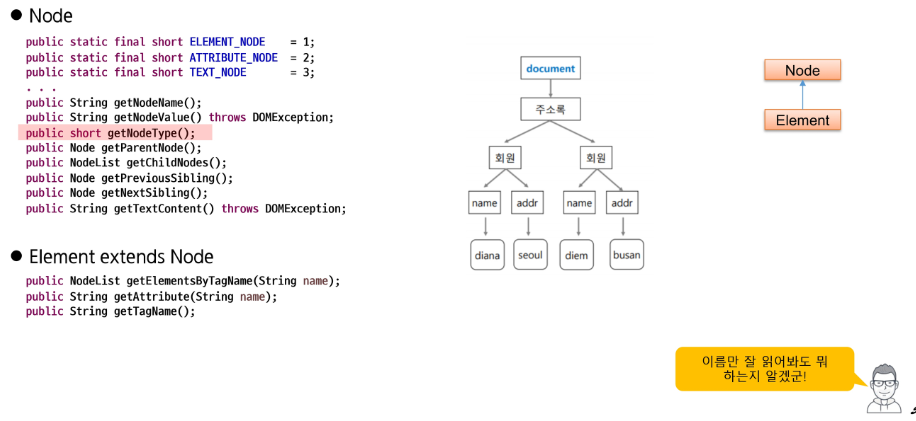

</span>

<br />

#### DOM Parser 예제 코드 
```java
package com.ssafy.live5.parse.dom;

import java.io.File;
import java.io.IOException;
import java.util.ArrayList;
import java.util.List;
import javax.xml.parsers.DocumentBuilder;
import javax.xml.parsers.DocumentBuilderFactory;
import javax.xml.parsers.ParserConfigurationException;
import org.w3c.dom.Document;
import org.w3c.dom.Element;
import org.w3c.dom.Node;
import org.w3c.dom.NodeList;
import org.xml.sax.SAXException;

import com.ssafy.live5.parse.BoxOffice;

public class BoxOfficeDomParser {
    private final File xml = new File("./src/com/ssafy/live5/parse/boxoffice.xml");
    private List<BoxOffice> list = new ArrayList<>();
    
    public List<BoxOffice> getBoxOffice() {
        try {
            DocumentBuilderFactory factory = DocumentBuilderFactory.newInstance();
            DocumentBuilder builder = factory.newDocumentBuilder();
            // 문서 로딩 완료 --> 원하는 요소들 골라내기
            Document doc = builder.parse(xml);
            // 최 상위 element
            Element root = doc.getDocumentElement();
            parse(root);
        } catch (IOException | ParserConfigurationException | SAXException e) {
            e.printStackTrace();
        }
        return list;
    }

    private void parse(Element root) {
        // TODO: root에서 dailyBoxOffice를 추출한 후 BoxOffice를 생성해 list에 저장하시오.
    	NodeList list = root.getElementsByTagName("dailyBoxOffice"); //root의 엘리먼트들의 NodeList타입의 리스트를 반환
    	for(int i = 0; i < list.getLength(); i++) {
    		Node node = list.item(i); //Node 타입의 객체를 반환
    		 this.list.add(getBoxOffice(node));
    	}
        // END:
    }

    private static BoxOffice getBoxOffice(Node node) {
        BoxOffice boxOffice = new BoxOffice();
        // TODO: node 정보를 이용해서 BoxOffice를 구성하고 반환하시오.
        NodeList childs = node.getChildNodes();
        for(int i = 0; i < childs.getLength(); i++) {
        	Node childNode = childs.item(i);
        	String nodeName = childNode.getNodeName();
        	if(nodeName.equals("rank")) {
        		boxOffice.setRank(Integer.valueOf(childNode.getTextContent()));
        	}else if(nodeName.equals("movieNm")) {
        		boxOffice.setMovieNm(childNode.getTextContent());
        	}else if(nodeName.equals("openDt")) {
        		boxOffice.setOpenDt(boxOffice.toDate(childNode.getTextContent()));
        	}else if(nodeName.equals("audiAcc")) {
        		boxOffice.setAudiAcc(Integer.valueOf(childNode.getTextContent()));
        	}
        }
        // END:
        return boxOffice;
    }
}
```

- 나는 Sax보다는 DOM이 더 편한 것 같다.
- DOM은 메모리에 다 올려야하기 때문에 양이 많으면 무리가 가기에 상황에 맞추어 사용하는 것이 좋다.

<br />

---

## JSON

<br />

### JSON
- Javascript Object Notation(자바스크립트에서의 객체 표현법)
- 간결한 문법, 단순한 텍스트, 적은 용량으로 대부분의 언어, 대부분의 플랫폼에서 사용 가능하다.
  - 이 기종 간의 데이터 교환에 광범위하게 사용된다.

<span align="center">

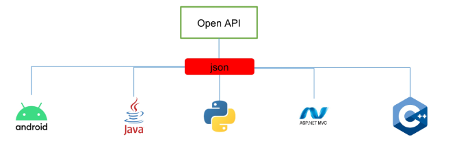

</span>

- 객체를 `key-value`의 쌍으로 관리한다.

<br />

#### JSON Parser 예제 코드 

- JsonParserTest.java
```java
package com.ssafy.live5.parse.json;

import java.io.IOException;
import java.util.List;

import com.fasterxml.jackson.core.JsonParseException;
import com.fasterxml.jackson.databind.JsonMappingException;
import com.ssafy.live5.parse.BoxOffice;

public class JsonParserTest {
	public static void main(String[] args) {
		System.out.println("JSON");
		try {
			UseJson parser = new UseJson();
			List<BoxOffice> list = parser.getBoxOffice();
			for(BoxOffice info: list) {
				System.out.println(info);
			}
		} catch (JsonParseException e) {
			// TODO Auto-generated catch block
			e.printStackTrace();
		} catch (JsonMappingException e) {
			// TODO Auto-generated catch block
			e.printStackTrace();
		} catch (IOException e) {
			// TODO Auto-generated catch block
			e.printStackTrace();
		}
	}   
}

```

- UserJson.java

```java
package com.ssafy.live5.parse.json;

import java.io.File;
import java.io.IOException;
import java.text.SimpleDateFormat;
import java.util.ArrayList;
import java.util.List;
import java.util.Map;
import com.fasterxml.jackson.annotation.JsonIgnoreProperties;
import com.fasterxml.jackson.core.JsonParseException;
import com.fasterxml.jackson.databind.JsonMappingException;
import com.fasterxml.jackson.databind.ObjectMapper;
import com.ssafy.live5.parse.BoxOffice;

public class UseJson {
    private final File json = new File("./src/com/ssafy/live5/parse/boxoffice.json");
    private List<BoxOffice> list = new ArrayList<>();

    @SuppressWarnings({ "unchecked", "rawtypes" })
    public List<BoxOffice> getBoxOffice() throws JsonParseException, JsonMappingException, IOException {
        ObjectMapper mapper = new ObjectMapper();

        // 날짜 변경과 관련된 룰 지정
        mapper.setDateFormat(new SimpleDateFormat("yyyy-MM-dd"));

        // TODO: json을 파싱해서 list를 구성하시오.
        Map<String,Map<String,Object>> result = mapper.readValue(json, Map.class);
        List<Map<String,Object>> list =(List)result.get("boxOfficeResult").get("dailyBoxOfficeList");
        
        for(Map<String,Object> info : list) {
        	// info를 원하는 타입으로 바꿔준다. 즉 info를 BoxOffice.class로 변환
        	BoxOffice box = mapper.convertValue(info, BoxOffice.class);
        	this.list.add(box);
        }
        // END:
        return this.list;
    }
}

```

- BoxOffice.java
```java
package com.ssafy.live5.parse;

import java.text.ParseException;
import java.text.SimpleDateFormat;
import java.util.Date;

import com.fasterxml.jackson.annotation.JsonIgnoreProperties;
@JsonIgnoreProperties(ignoreUnknown=true) // 필요없는 속성들은 무시하는 어노테이션
public class BoxOffice { // DTO 
    private Integer rank; // 등수
    private String movieNm; // 영화제목
    private Date openDt; // 개봉일
    private Integer audiAcc;// 누적 관객 수

    public Integer getRank() {
        return rank;
    }

    public void setRank(Integer rank) {
        this.rank = rank;
    }

    public String getMovieNm() {
        return movieNm;
    }

    public void setMovieNm(String movieNm) {
        this.movieNm = movieNm;
    }

    public Date getOpenDt() {
        return openDt;
    }

    public void setOpenDt(Date openDt) {
        this.openDt = openDt;
    }

    public Integer getAudiAcc() {
        return audiAcc;
    }

    public void setAudiAcc(Integer audiAcc) {
        this.audiAcc = audiAcc;
    }

    public Date toDate(String date) {
        Date dateObj = null;
        // TODO: 문자열 형태의 날짜를 Date로 변환해서 반환하시오.
        SimpleDateFormat format = new SimpleDateFormat("yyyy-MM-dd");
        try {
        	return format.parse(date);
        }catch(ParseException e) {
        	e.printStackTrace();
        	return new Date();
        }
        // END:
    }

    @Override
    public String toString() {
        return "[rank=" + rank + ", movieNm=" + movieNm + ", openDt=" + openDt + ", audiAcc="
               + audiAcc + "]";
    }
}
```

- BoxOffice 클래스에서 주의할점으로는 모든 속성을 다 받는것이 아니기 때문에 

```java
@JsonIgnoreProperties(ignoreUnknown=true) 
// 필요없는 속성들은 무시하는 어노테이션
```
- 위의 어노테이션을 붙여 사용하지 않는 속성들은 무시해야 에러가 발생하지 않는다.

<br />

#### Swing
- Java Application 에서 사용되는 GUI를 제공하는 추상적으로 정의된 도구(컴포넌트) 모음

<br />

- Container
  - 다른 컴포넌트들을 배치하기 위한 컴포넌트
  - Container는 다른 Container를 포함할 수 있고, 나중에 복합적인 Layout을 구성할 수 있게 한다.
  - JFrame : 독립적으로 사용될 수 있으며 타이틀과 사이즈를 조절할 수 있는 버튼을 가짐
  - JPanel : 반드시 다른 Container에 포함되어야 하며 복합적인 레이아웃 구성에 사용


<br />

- 다른 Component

```Java
JButton b;
JLabel l;
JTextField tf;
JTable table;
JList list;
```

<br />

- Layout과 LayoutManager
  - Layout : Component 들을 Container에 어떻게 배치할 것인가 => LayoutManager가 관리
  - LayoutManager : Container 별로 Component의 위치와 크기, 배치 방식을 결정하는 객체

<br />

- FlowLayout
  - JPanel의 기본 LayoutManager
  - 요소를 가로로 물 흐르듯이 배치

- BorderLayout
  - JFrame의 기본 LayoutManager
  - 특별한 영역 즉, 상,하,좌,우,가운데 에 각각의 컴포넌트를 배치한다.(`North`,`South`,`West`,`East`,`Center`)
    - Component들을 배치할때는 영역을 지정(BorderLayout.CENTER or "Center")
    - 사용하지 않는 공간은 크기가 0*0 이 되고 Center가 기본이다.
    - 각각의 영역에는 하나의 Component를 담을 수 있고, 중복해서 담을 경우는 마지막에 담은 컴포넌트만 보인다.
    - 크기를 조절할때 North와 South는 좌우로, East와 West는 상하로만 늘어난다. Center는 양방향

- GridLayout

<br />

#### Layout과 LayoutManager
- Layout 설정
  - 생성자 또는 setLayout 메서드로 layout 변경 가능

```Java
JPanel panel = new JPanel();
panel.setLayout(new BorderLayout());

JPanel panel2 = new JPanel(new GridLayout());
```

- 복합적인 Layout 구성
  - Container 안에 또다른 Container를 배치하는 형태로 복합적인 Layout 구성

<span align="center">

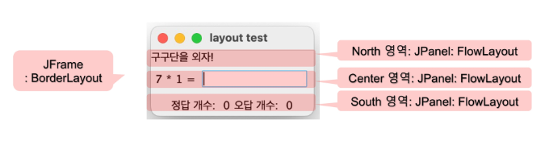

</span>

- 예제 코드
```java
package com.ssafy.live5.gui;

import java.awt.BorderLayout;
import java.awt.event.KeyAdapter;
import java.awt.event.KeyEvent;
import java.util.Random;

import javax.swing.JFrame;
import javax.swing.JLabel;
import javax.swing.JPanel;
import javax.swing.JTextField;

public class LayoutTest extends JFrame {
    private static final long serialVersionUID = 1L;
    private JLabel lNum1, lNum2, lCorrectCnt, lWrongCnt;
    private JTextField tfAns;
    private int answer;

    public static void main(String[] args) {
        LayoutTest lt = new LayoutTest();
        lt.launchUi();
    }

    private void launchUi() {
        this.add(new JLabel("구구단을 외자!"), BorderLayout.NORTH);
        
        makeResultPanel();
        makeProblemPanel();
        // Frame 기본 설정
        this.setTitle("layout test");
        this.setDefaultCloseOperation(JFrame.EXIT_ON_CLOSE);
        this.pack();
        this.setVisible(true);
    }
    
    private void makeProblem() {
        Random rand = new Random();
        int num1 = rand.nextInt(9) + 1;
        int num2 = rand.nextInt(9) + 1;
        this.answer = num1 * num2;
        lNum1.setText(num1 + "");
        lNum2.setText(num2 + "");
        tfAns.setText("");
    }
    
    private void makeResultPanel() {
        // TODO: 결과를 보여줄 panel을 구성하시오.
    	JPanel panel = new JPanel();
    	panel.add(new JLabel("정답개수 : "));
    	lCorrectCnt = new JLabel("0");
    	panel.add(lCorrectCnt);
    	panel.add(new JLabel("오답개수 : "));
    	lWrongCnt = new JLabel("0");
    	panel.add(lWrongCnt);
    	this.add(panel, BorderLayout.SOUTH);
        // END:
    }


    
    private void makeProblemPanel() {
        // TODO: 문제를 출제할 패널을 구성하시오.
    	JPanel panel = new JPanel();
    	lNum1 = new JLabel();
    	lNum2 = new JLabel();
    	panel.add(lNum1);
    	panel.add(new JLabel(" * "));
    	panel.add(lNum2);
    	panel.add(new JLabel(" = "));
    	tfAns = new JTextField(10);// 인자 : 입력받을 글자 길이
    	panel.add(tfAns);
    	makeProblem();
    	tfAns.addKeyListener(new KeyAdapter() {
    		@Override
    		public void keyReleased(KeyEvent e) { // 키가 눌렸다가 뗴어지는 타이밍의 이벤트 = Released
    			super.keyReleased(e);
    			if(e.getKeyCode() == 10) {//10 이 Enter키
    				int val = Integer.parseInt(tfAns.getText());
    				if(val == answer) {
    					int pre = Integer.parseInt(lCorrectCnt.getText());
    					lCorrectCnt.setText(pre+1+"");
    				}else {
    					int pre = Integer.parseInt(lWrongCnt.getText());
    					lWrongCnt.setText(pre+1+"");
    				}
    				makeProblem();
    			}
    		}
		});
    	this.add(panel, BorderLayout.CENTER);
        // END:
    }
}

```

<br />

#### 이벤트 처리 모델(Delegation Model)

- 위임형 모델

<span align="center">

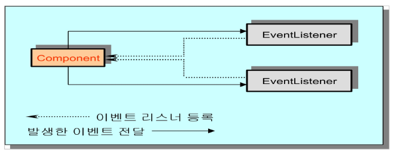

</span>

- 실제로 이벤트가 일어나는 것은 component이지만 거기서 처리되는 것이 아니라 이벤트 리스터를 등록시킨 후 위임받은 handler 클래스 내에서 이벤트 처리

<br />

#### 이벤트 처리 클래스
- XX Listener
  - 이벤트 처리에 대한 메서드들을 정의한 인터페이스로 handler는 이 인터페이스를 구현
  - 하나의 component에 여러 개의 event handle을 붙일 수 있다.

- XXEventAdapter
  - Listener를 implements 할 경우 사용하지도 않은 이벤트 핸들러까지 다 구현해야 하는 단점
    - 필요한 메서드만 구현할 수 있다면?
  - `-xxxEventAdapter implements XXListener`
    - 해당 메서드들을 모조리 구현해놓은 class. 구현내용은 비어있는 `{}`
    - 상속 받은 후 필요한 것만 override 하면 된다.

- 예제 코드
```java
package com.ssafy.live5.gui;

import java.awt.BorderLayout;
import java.awt.event.ActionEvent;
import java.awt.event.ActionListener;
import java.awt.event.MouseAdapter;
import java.awt.event.MouseEvent;
import java.awt.event.MouseListener;
import java.util.List;
import javax.swing.JButton;
import javax.swing.JFrame;
import javax.swing.JOptionPane;
import javax.swing.JScrollPane;
import javax.swing.JTable;
import javax.swing.table.DefaultTableModel;

import com.ssafy.live5.parse.BoxOffice;
import com.ssafy.live5.parse.dom.BoxOfficeDomParser;

public class BoxOfficeUi extends JFrame {

    private static final long serialVersionUID = 1L;
    // 컴포넌트 선언
    JButton button = null;
    JTable table = null;

    // table의 데이터를 관리하는 객체
    DefaultTableModel model = null;

    public static void main(String[] args) {
        BoxOfficeUi ui = new BoxOfficeUi();
        ui.launchUi();
    }

    private void launchUi() {
        button = new JButton("읽기");

        // 테이블 구성
        table = new JTable();
        String[] header = {"랭킹", "제목", "개봉일", "누적관객"};
        model = (DefaultTableModel) table.getModel();
        model.setColumnIdentifiers(header);

        // 이벤트 listener 등록 처리
        addEventListener();

        // 요소 배치
        this.add(new JScrollPane(table), BorderLayout.CENTER);
        this.add(button, BorderLayout.SOUTH);

        this.setTitle("오늘의 영화 랭킹 Top 10");
        this.setDefaultCloseOperation(JFrame.EXIT_ON_CLOSE);
        this.setSize(500, 300);
        this.setVisible(true);
    }

    private void addEventListener() {
        button.addActionListener(new ActionListener() {
            @Override
            public void actionPerformed(ActionEvent e) {
                // 기존 자료 삭제
                model.setRowCount(0);
                // 새로운 자료 조회
                BoxOfficeDomParser parser = new BoxOfficeDomParser();
                List<BoxOffice> list = parser.getBoxOffice();
                for (BoxOffice info : list) {
                    model.addRow(new Object[] {info.getRank(), info.getMovieNm(), info.getOpenDt(), info.getAudiAcc()});
                }
                // model의 데이터가 변경되었음을 알림
                model.fireTableDataChanged();
            }
        });

        // TODO:테이블에서 발생하는 click event 처리를 위한 listener 등록
        table.addMouseListener(new MouseAdapter() {
        	@Override
        	public void mouseClicked(MouseEvent e) {
        		int row = table.getSelectedRow();//행 정보를 추출해 정보가 저장되어있는 model에게 물어 데이터를 처리해야함
        		String name = model.getValueAt(row, 1).toString();
        		JOptionPane.showMessageDialog(BoxOfficeUi.this, "선택된 영화 정보 : " + name);
        	}
		});
        // END:
    }

}
```
<br />

---

### 교수님 설명 => I/O

- IO 를 이용해 프로그래밍을 할때에는 어떤 클래스를 사용해야 하는지 판단하는 것이 중요하다.
- 즉, 어떤 클래스를 사용해 처리할 것인지 판단이 서야한다.
- 여기서는 처리단위를 명확히 해야하는데 처리단위에는 `Byte(바이트)` 와 `문자`가 있다. 이들 중 어느 처리단위 클래스를 사용해야 하는지 구분할 줄 알아야한다.
  - 처리 단위 구분은 `어떤 도구의 도움 없이 해석이 가능`하다면 문자단위로 처리가 가능하고, 만일 다른 도구의 도움을 필요로 한다면 `Byte`단위로 처리가 가능하다.

<br />

#### 처리단위 예시
- `pdf` => byte 단위 처리가능 => pdf를 해석하는 도구가 필요함.
- `mp3` => byte 단위 처리가능 => mp3도 직접 해석이 안되어 해석하는 도구가 필요함
- `.doc` => byte단위 처리가능 => doc파일도 word와 같은 툴이 있어야 해석이되므로 
- `사진, .jpg등 이미지` => byte 단위 처리가능 => 이미지를 볼때 도구가 필요함
- `.txt, .java` => 문자, byte 단위로 처리가 가능함 => 상황에 따라 사용되는 단위가 다르다(둘다 가능하긴 하지만) => 예를들어 txt를 읽어와 화면에 뿌려야할때 만일 내용에 한글이 있으면 문자단위로 가져와야함

<br />

#### 메서드명

|구분|입력|출력|
|:--:|:--:|:--:|
|Byte|InputStream|OutputStream|
|문자|Reader|Writer|

- 추가적으로 `File`InputStream, `Buffered`Reader, `Object`InputStream 등 앞에 붙는 단어들은 대상 혹은 용도를 말한다.
- `File` => 파일을 대상으로함
- `Buffered` => 버퍼를 이용한 속도개선
- `Object` => 메모리에 저장혹은 내용을 읽어들임 => 메모리는 Byte단위만을 처리하기 때문에 Object의 경우 InputStream, OutputStream 밖에 없다. 
- 이외에도 다양한 경우가 존재하며 대상에 따라 있는 메서드가 있고 없는 메서드가 있을 수도 있다.


<br />

-`InputStreamReader` => 문자단위 => InputStream(=byte 단위)을 문자로 읽겠다는 메서드

<span align="center">

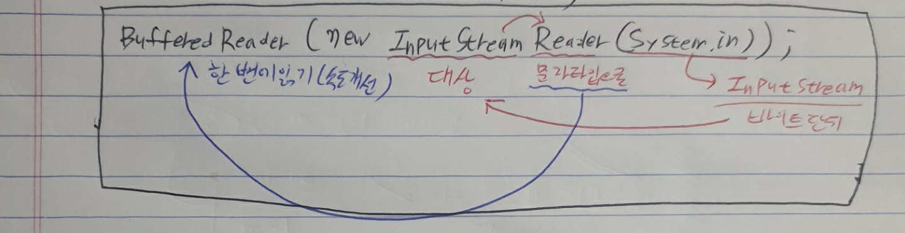

</span>

- `.java` 파일을 읽고 씀에는 Reader/Writer, InputStream/OutputStream을 사용해도 상관없지만 만일 조건으로 화면에 파일내용을 출력해야할때 파일에 한글이 있다면 바이트 단위가 아닌 문자단위로 출력해야 한글이 깨지지 않는다. 즉 => 상황에 맞게 사용하자
- 추가적으로 각 클래스의 `read(), write()` 메서드와 메서드명에 포함된 ``Reader/Writer` 와는 헷갈리지 말자.

<br />
---

## 앞으로 Java 에서 꼭 공부해야할 키워드


- annotation(@)
- reflection(API)
- StreamAPI

<br />
---