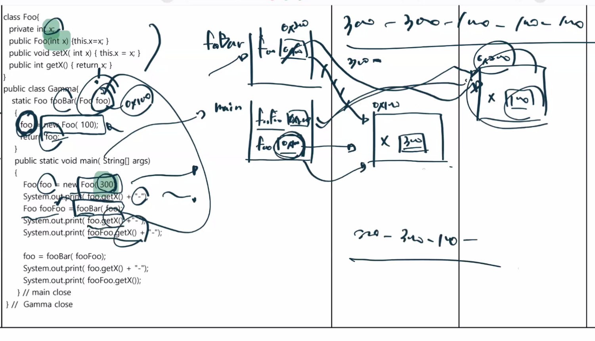

SAX & DOM 의 차이점 => 동작 과정이해 필요

---

기본 생성자가 선언이 안되었는데 생성자 호출

---

String 타입 변수의 값 변경 관련 => charAt

---

String 객체 주소 비교

---

클래스 상속 불가능하게 하는 것 => final

---

메서드 인자(int x) 와 클래스 멤버(int x) 연산
메서드 호출시 파라미터값의 변경 처리(실행시 메모리 그려보면 좋을것 같아요)
void call(int x) {
  x += x;
  System.out.println( x );  ->  이건 메서드에 새롭게 선언된 x 변수 : 10 출력
}

main () {
    int x = 5;
    call(x);
    System.out.println(x);  -> 이건 메인 메서드에 선언된 x 변수 : 5 출력
}

---

클래스 멤버에 접근제한자 생략 => default

---

메모리 관련 (Foo Bar) => 새로운 객체를 생성하면서 덮어쓰일 줄 알았지만 call stack에 새로운 메서드가 생기고 해당 Foofoo 새로 생성된 인스턴스를 가리키면서 300-300-100-100-100

---

파일 입출력 관련 => 파일 입출력 시 write(int) 일 경우 어떤 값이 출력되는지의 의미

---

숫자 타입의 산술연산의 특징
5 / 2 -> 2
5.0 / 2 -> 2.5
(double)(5 / 2) -> 2.0

---

Parent p = new Child();
p.show() 했을때 자식이 오버라이딩 했을때 실제 호출되는 메서드는?